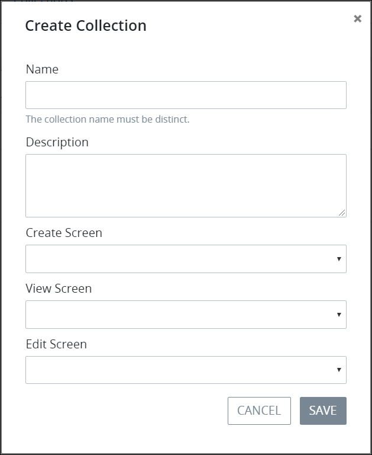

# Create a New Collection

## Create a New ProcessMaker Collection

A ProcessMaker [Collection](../what-is-a-collection.md) uses at least two [Screens](../../designing-processes/design-forms/what-is-a-form.md) to create, edit, and view a record:

* **Create a record:** Have available a [Form-type](../../designing-processes/design-forms/screens-builder/types-for-screens.md#form) ProcessMaker Screen to create a record in the Collection.
* **Edit a record:** Either use the same ProcessMaker Screen that creates a record, or have available a second Form-type Screen to edit any record in the Collection. If you want to use a second ProcessMaker Screen, optionally [make a copy](../../designing-processes/design-forms/manage-forms/duplicate-a-screen.md#duplicate-a-processmaker-screen) of the Screen intended to create a record, and then make changes to it without needing to design a new Screen.
* **View a record:** Have available a [Display-type](../../designing-processes/design-forms/screens-builder/types-for-screens.md#display) ProcessMaker Screen to view any record in the Collection.

Ensure these ProcessMaker Screens are available before creating a new ProcessMaker Collection.


### ProcessMaker Package Required

The [Collections package](../../package-development-distribution/package-a-connector/collections.md) must be installed in your ProcessMaker instance. The Collections package is not available in the ProcessMaker open-source edition. Contact [ProcessMaker Sales](mailto:sales@processmaker.com) or ask your ProcessMaker sales representative how the Collections package can be installed in your ProcessMaker instance.

### Permissions Required

Your ProcessMaker user account or group membership must have the following permissions to create a ProcessMaker Collection unless your user account has the **Make this user a Super Admin** setting selected:

* Collections: View Collections
* Collections: Create Collections

These permissions are different than record-level permissions in a ProcessMaker Collection that allow you to view or create records in that Collection.

See the ProcessMaker [Collections](../../processmaker-administration/permission-descriptions-for-users-and-groups.md#collections) permissions or ask your ProcessMaker Administrator for assistance.


Follow these steps to create a ProcessMaker Collection:

1. [View your ProcessMaker Collections](view-collections.md#view-all-collections). The **Collections** page displays.
2. Click the **+Collection** button. The **Create Collection** screen displays.  
3. In the **Title** field, enter the name of the ProcessMaker Collection. This name must be unique from all other ProcessMaker Collections. This is a required field.
4. In the **Description** field, enter the description of the ProcessMaker Collection. This is a required field.
5. From the **Create Screen** drop-down menu, select the ProcessMaker Screen from which new records in this Collection are created. This must be a [form-type](../../designing-processes/design-forms/screens-builder/types-for-screens.md#form) ProcessMaker Screen. This is a required field.
6. From the **View Screen** drop-down menu, select the ProcessMaker Screen from which to view records in this Collection. Use this ProcessMaker Screen to only display all or parts of a record in the Collection. For example, the ProcessMaker Screen selected from the **View Screen** drop-down menu may be designed to not display sensitive information that all Collection stakeholders should have access. This must be a [display-type](../../designing-processes/design-forms/screens-builder/types-for-screens.md#display) ProcessMaker Screen. This is a required field.
7. From the **Edit Screen** drop-down menu, select the ProcessMaker Screen from which to edit or update records in this Collection. This can be the same or a different ProcessMaker Screen as selected from the **Create Screen** drop-down menu. This is a required field.
8. Click **Save**. The ProcessMaker Collection displays an empty list of records for that Collection so you may create your first record. See [Create a Collection Record](../manage-records-in-a-collection/create-a-collection-record.md).

## Related Topics

