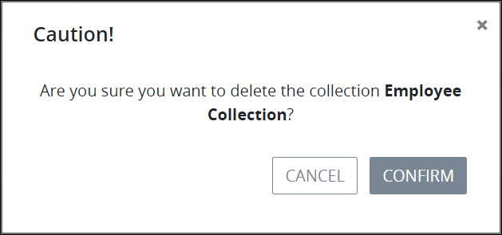

# Delete a Collection

## Delete a ProcessMaker Collection


### ProcessMaker Package Required

The [Collections package](../../package-development-distribution/package-a-connector/collections.md) must be installed in your ProcessMaker instance. The [Collections](../what-is-a-collection.md) package is not available in the ProcessMaker open-source edition. Contact [ProcessMaker Sales](https://www.processmaker.com/contact/) or ask your ProcessMaker sales representative how the Collections package can be installed in your ProcessMaker instance.

### Permissions Required

Your ProcessMaker user account or group membership must have the following permissions to create a ProcessMaker Collection unless your user account has the **Make this user a Super Admin** setting selected:

* Collections: Delete Collections
* Collections: View Collections

These permissions are different than [record permissions](configure-a-collection.md#configure-record-permissions-for-processmaker-users) in a ProcessMaker Collection that allow you to view or delete records in that Collection.

See the ProcessMaker [Collections](../../processmaker-administration/permission-descriptions-for-users-and-groups.md#collections) permissions or ask your ProcessMaker Administrator for assistance.



When a ProcessMaker Collection is deleted, all records in that Collection are also permanently deleted. However, the ProcessMaker Screens used in that Collection are not affected.

Deleting a ProcessMaker Collection from the **Collections** page cannot be undone.


Follow these steps to delete a ProcessMaker Collection:

1. [View your ProcessMaker Collections](view-collections.md#view-all-collections). The **Collections** page displays.
2. Click the **Delete** iconfor your ProcessMaker Collection to delete. The **Caution** screen displays to confirm the deletion of the ProcessMaker Collection.  
3. Click **Confirm**.

## Related Topics





















