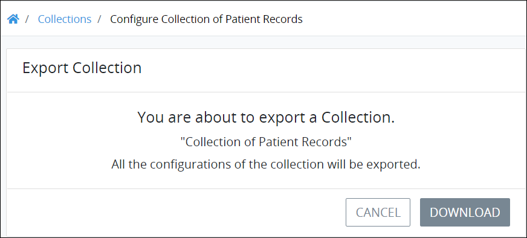

# Export a Collection

## Overview

Export a ProcessMaker Collection to your local computer. The exported ProcessMaker Collection may then be imported to the same or another ProcessMaker instance of the same [ProcessMaker version](../../using-processmaker/application-version-details.md#view-processmaker-version-information). An exported ProcessMaker Collection may then be shared with others so they can import your ProcessMaker Collection.

When a ProcessMaker Collection is exported, the following also exports:

* **Records:** All [records](../manage-records-in-a-collection/view-all-records-in-a-collection.md#view-all-records-in-a-collection) within that ProcessMaker Collection export.
* **ProcessMaker Screens:** The [ProcessMaker Screens](../../designing-processes/design-forms/what-is-a-form.md) used to create, view, and edit records in that ProcessMaker Collection also export.

The exported ProcessMaker Collection has the `.json` file extension.

## Export a ProcessMaker Screen


Your ProcessMaker user account or group membership must have the following permissions to export a ProcessMaker Collection unless your user account has the **Make this user a Super Admin** setting selected:

* Collections: View Collections
* Collections: Export Collections

See the ProcessMaker [Collections](../../processmaker-administration/permission-descriptions-for-users-and-groups.md#collections) permissions or ask your ProcessMaker Administrator for assistance.


Follow these steps to export a ProcessMaker Collection:

1. [View your ProcessMaker Collections](view-collections.md#view-all-collections). The **Collections** page displays.
2. Click the **Export** iconfor your ProcessMaker Collection to export. The **Export Collection** page displays.  
3. Click **Download**, and then browse for the location on your local computer to save the exported ProcessMaker Collection.
   1. By default, ProcessMaker exports the ProcessMaker Screen using the original Screen name except spaces in the name are replaced with underscores \(`_`\). The file has the file extension `.json`. Rename the default file name if necessary, though do not change the file extension. As a best practice, specify in the file name that this is an exported ProcessMaker Collection and not an [exported ProcessMaker Process](../../designing-processes/viewing-processes/view-the-list-of-processes/export-a-bpmn-compliant-process.md#export-a-bpmn-2-0-compliant-process) or an [exported ProcessMaker Screen](../../designing-processes/design-forms/manage-forms/export-a-screen.md).
   2. Specify a directory location to save the file. ProcessMaker exports the `.json` file to your local computer. The following message displays when the ProcessMaker Screen exports successfully: **The collection was exported.**

## Related Topics





















