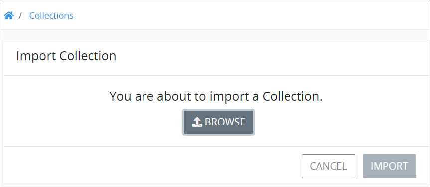
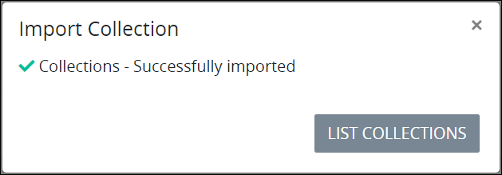
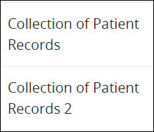

# Import a Collection

## Overview

Import a ProcessMaker Collection that has been [exported](export-a-collection.md) from the same [ProcessMaker version](../../using-processmaker/application-version-details.md#view-processmaker-version-information). The imported ProcessMaker Screen contains the [records](../manage-records-in-a-collection/view-all-records-in-a-collection.md#view-all-records-in-a-collection) and the [ProcessMaker Screens](../../designing-processes/design-forms/what-is-a-form.md) from the exported Collection. Exported ProcessMaker Collections have the `.json` file extension.

## Import a ProcessMaker Screen


Your ProcessMaker user account or group membership must have the following permissions to import a ProcessMaker Collection unless your user account has the **Make this user a Super Admin** setting selected:

* Collections: View Collections
* Collections: Export Collections

See the ProcessMaker [Collections](../../processmaker-administration/permission-descriptions-for-users-and-groups.md#collections) permissions or ask your ProcessMaker Administrator for assistance.


Follow these steps to import a ProcessMaker Collection:

1. [View your ProcessMaker Collections](view-collections.md#view-all-collections). The **Collections** page displays.
2. Click the **Import** button. The **Import Collection** screen displays.  
3. Click **Browse** to locate the ProcessMaker Collection to import. ProcessMaker Collections have the `.json` file extension.
4. Click **Import**. The **Import Collection** screen displays to indicate that the ProcessMaker Collection imported correctly.  
5. Click **List Collections**. The **Collections** page displays the imported ProcessMaker Collection with the same name as the original ProcessMaker Collection except with a number "2" suffix. 

## Related Topics





















