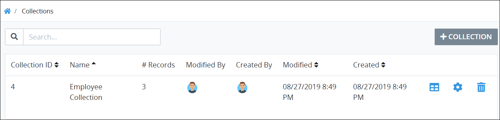

# View Collections

## View All Collections

ProcessMaker displays all the ProcessMaker [Collections](../what-is-a-collection.md) in one table. This makes it easy to manage ProcessMaker Collections.


### ProcessMaker Package Required

The [Collections package](../../package-development-distribution/package-a-connector/collections.md) must be installed in your ProcessMaker instance. The Collections package is not available in the ProcessMaker open-source edition. Contact [ProcessMaker Sales](https://www.processmaker.com/contact/) or ask your ProcessMaker sales representative how the Collections package can be installed in your ProcessMaker instance.

### Permission Required

Your ProcessMaker user account or group membership must have the "Collections: View Collections" permission to view the list of ProcessMaker Collections unless your user account has the **Make this user a Super Admin** setting selected. This permission is different than [record permissions](configure-a-collection.md#configure-record-level-permissions-for-users) in a ProcessMaker Collection that allow you to view the records in that Collection.

See the ProcessMaker [Collections](../../processmaker-administration/permission-descriptions-for-users-and-groups.md#collections) permissions or ask your ProcessMaker Administrator for assistance.


Follow these steps to view all ProcessMaker Collections in your organization:

1. Ensure that you are [logged on](../../using-processmaker/log-in.md#log-in) to ProcessMaker.
2. Click the **Collections** option from the top menu. The **Collections** page displays the ProcessMaker Collections that you are allowed to view.

The **Collections** page displays the following information in tabular format about ProcessMaker Collections:

* **Collection ID:** The **Collection ID** column displays the ProcessMaker Collection's ID. ProcessMaker automatically generates the ID value when the Collection is created and represents a sequential number of how many total Collections have been created to that time.
* **Name:** The **Name** column displays the ProcessMaker Collection's name.
* **\# Records:** The **\# Records** column displays how many records are in each ProcessMaker Collection.
* **Modified By:** The **Modified By** column displays the ProcessMaker user who last modified the Collection. Hover your cursor over the user's avatar to view that person's full name.
* **Created By:** The **Created By** column displays the ProcessMaker user who created the Collection. Hover your cursor over the user's avatar to view that person's full name.
* **Modified:** The **Modified** column displays the date and time the ProcessMaker Collection was last modified. The time zone setting to display the time is according to the ProcessMaker instance unless your [user profile's](../../using-processmaker/profile-settings.md#change-your-profile-settings) **Time zone** setting is specified.
* **Created:** The **Created** column displays the date and time the ProcessMaker Collection was created. The time zone setting to display the time is according to the ProcessMaker instance unless your [user profile's](../../using-processmaker/profile-settings.md#change-your-profile-settings) **Time zone** setting is specified.


### Search for a ProcessMaker Collection

Use the [Search](search-for-a-collection.md) field to filter ProcessMaker Collections that display.

### Create a ProcessMaker Collection

Click the **+Collection** button. See [Create a New Collection](create-a-new-collection.md).

### View Records in a ProcessMaker Collection

Click the **Records** icon. See [View All Records in a Collection](../manage-records-in-a-collection/view-all-records-in-a-collection.md#view-all-records-in-a-collection).

### Configure a ProcessMaker Collection

Click the **Edit** icon. See [Edit a Collection](../edit-a-collection.md).

### Delete a ProcessMaker Collection

Click the **Delete** icon. See [Delete a Collection Record](../manage-records-in-a-collection/delete-a-collection-record.md#delete-a-processmaker-collection-record).

### No ProcessMaker Collections?

If no ProcessMaker Collections exist, or you do not have permission to view any, the following message displays: **No Data Available**.

### Display Information the Way You Want It

[Control how tabular information displays](../../using-processmaker/control-how-requests-display-in-a-tab.md), including how to sort columns or how many items display per page.


## Related Topics





















