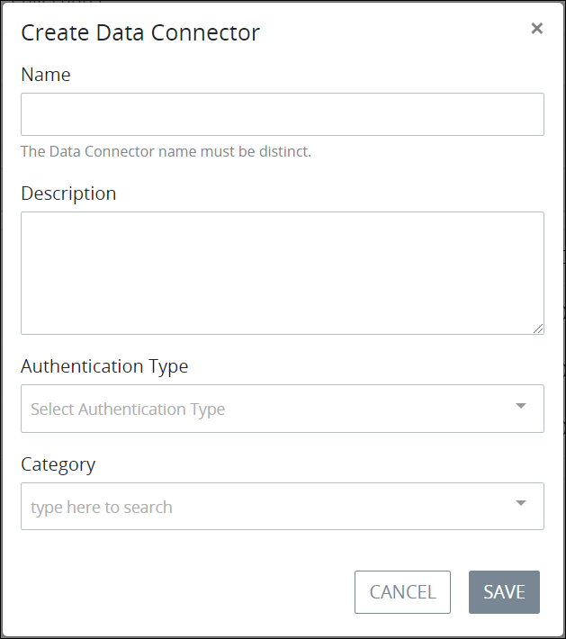
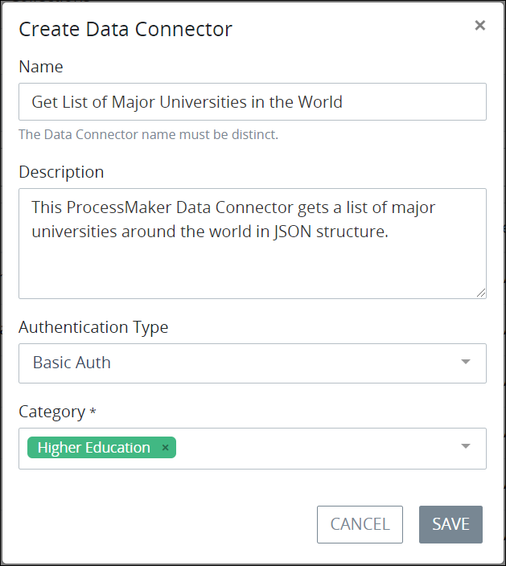
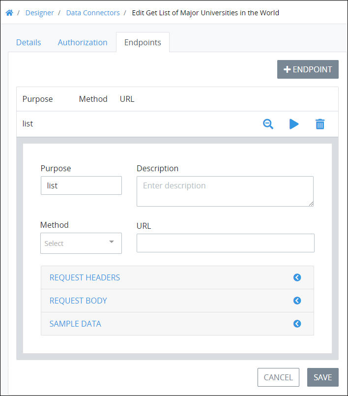
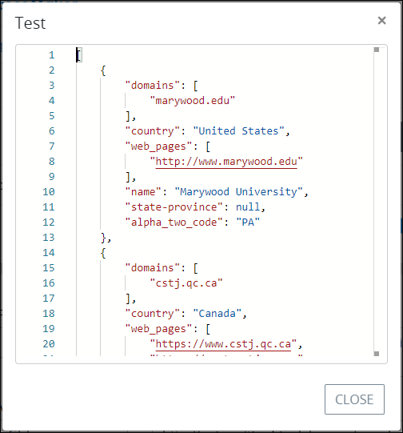
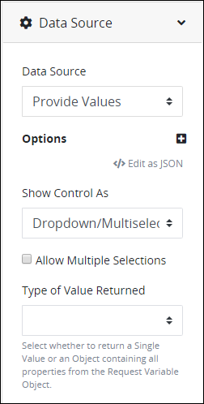
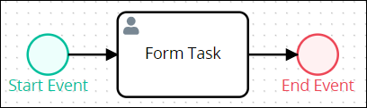
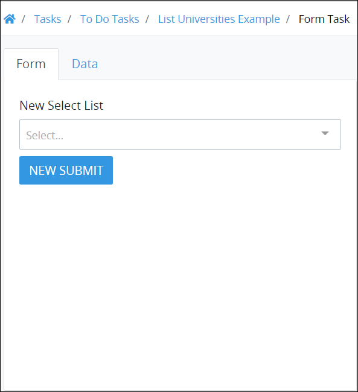
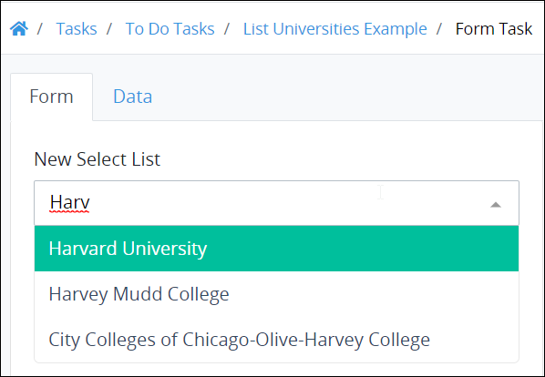

# Data Connector Example

## Overview

This example demonstrates how a Select List control in a ProcessMaker Screen can display the names of major universities around the world as its options in a drop-down menu. The options in this Select List control come from a ProcessMaker Data Connector that calls a third-party Application Program Interface \(API\) when the ProcessMaker Screen containing the Select List control opens. Click in the Select List control's drop-down menu to select an option or start typing into the control to filter those university names that match the text entered into the control.

Note that after creating this ProcessMaker Data Connector, it may be used for any ProcessMaker asset in your ProcessMaker instance that can use a Data Connector. It is not limited to being used with a Select List control.

Click the video below to watch a demonstration of this example.



This example contains the following procedures in this order:

1. **Create the ProcessMaker Data Connector:** Create the ProcessMaker Data Connector that calls the API containing the list of universities. This is a public API that has been made available for demonstration purposes, so it does not require host authentication. The list of universities is in a JSON object. Though the host provides the domains, names, and countries of origin for each university in its list,  this example references only the university name. [The host provides public information about this API.](https://github.com/Hipo/university-domains-list-api) See [Create the ProcessMaker Data Connector](data-connector-example.md#create-the-processmaker-data-connector).
2. **Configure the Select List control:** After the ProcessMaker Data Connector is created, create a ProcessMaker Screen that contains a configure a Select List control. Configure the Select List control to use this ProcessMaker Data Connector as its data source to get the list of universities as the Select List control's options. See [Configure the Select List Control](data-connector-example.md#configure-the-select-list-control).
3. **Create the Process model:** Create the Process model to include a Form Task element that references the ProcessMaker Screen containing the Select List control. See [Create the Process Model](data-connector-example.md#create-the-process-model).
4. **Start a Request:** Start a Request for the Process as designed in the Process model for this example. See [Start a Request for the Example Process](data-connector-example.md#start-a-request-for-the-example-process).

## Create the ProcessMaker Data Connector

Follow these steps to create the ProcessMaker Data Connector as [described in this example](data-connector-example.md#overview):

1. [Log on](../../using-processmaker/log-in.md#log-in) to ProcessMaker.
2. Click the **Designer** option from the top menu. The **Processes** page displays.
3. Click the **Data Connectors** iconfrom the left sidebar. The **Data Connectors** tab displays all ProcessMaker Data Connectors in the **Data Connectors** page.
4. Verify the ProcessMaker Data Connector Category exists in which to assign this Data Connector. If this Category does not exist, see [Create a New Data Connector Category](manage-data-connectors/manage-data-connector-categories/create-a-new-data-connector-category.md).
5. Click the **+Data Connector** button. The **Create Data Connector** screen displays.  
6. In the **Name** setting, enter a name of the ProcessMaker Data Connector. This example uses the name `Get List of Major Universities in the World`.
7. In the **Description** setting, enter a description of this ProcessMaker Data Connector.
8. From the **Authentication Type** drop-down menu, select the **No Auth** option. This example uses this option because the host does not require authentication from their publicly accessible API. Note that the video of this example uses **Basic Auth**, which is not necessary for this example since the data source is publicly accessible.
9. From the **Category** drop-down menu, select the ProcessMaker Data Connector Category to assign this Data Connector.

   This example uses the following settings.  
    

10. Click **Save**. The **Details** tab displays to edit the settings for this ProcessMaker Data Connector.
11. Click the **Endpoints** tab. This example requires no changes to the **Authorization** tab.
12. Click the **+Endpoint** button. The Endpoint settings display.  
13. In the **Purpose** setting, optionally edit the purpose for this Endpoint. The value the **Purpose** setting contains displays from the ProcessMaker asset when configuring the data source from that ProcessMaker asset. In this example, this setting value displays from the Select List control to select this Endpoint to get the list of universities. Therefore, provide a concise but relevant purpose for this Endpoint so other ProcessMaker designers understand its function. This example uses `list universities` for this setting.
14. In the **Description** setting, enter a description of this Endpoint. This example uses the following description: `This Endpoint gets a JSON list of worldwide universities.`.
15. From the **Method** drop-down menu, select the **GET** option. The GET method reads data.
16. In the **URL** setting, enter the following URL for this example: `http://universities.hipolabs.com/search?`. This URL is truncated from the host's [documented example](https://github.com/Hipo/university-domains-list-api) how to search its public API.  
17. Click the **Test** iconto verify that the Endpoint functions as intended. If configured correctly, the **Test** screen displays the Endpoint response.  
18. Notice which element in each JSON object within the Endpoint response contains the name of the university. Look at the first JSON object in the array that is the list of universities:  
    `{` 

        `"domains": [` 

            `"marywood.edu"` 

        `],` 

        `"country": "United States",` 

        `"web_pages": [` 

            `"`[`http://www.marywood.edu`](http://www.marywood.edu)`"` 

        `],` 

        `"name": "Marywood University",` 

        `"state-province": null,` 

        `"alpha_two_code": "PA"` 

    `},`

    The `name` element contains the name of each university in this JSON object. Make note of the element's name that contains relevant data from a data source, as the ProcessMaker asset requires this element name when configuring which data that asset requires from the ProcessMaker Data Connector's Endpoint response. In this example, the ProcessMaker Screen containing the Select List control is the ProcessMaker asset.

19. Click **Close** to close the **Test** screen, and then click **Save** to save the Endpoint. The ProcessMaker Data Connector is configured for this example.

## Configure the Select List Control

Follow these steps to configure the Select List control as [described in this example](data-connector-example.md#overview):

1. [Create a ProcessMaker Screen for this example](../design-forms/manage-forms/create-a-new-form.md#create-a-new-processmaker-screen). This example uses the name `Data Connector Example Using a Select List Control` for the ProcessMaker Screen.
2. [Add the Select List control to a ProcessMaker Screen page](../design-forms/screens-builder/control-descriptions/select-list-control-settings.md#add-the-control-to-a-processmaker-screen).
3. Most settings for the Select List control are outside the scope of this example. The default settings can be used for require settings, and optional settings do not need to be configured.
4. Expand the **Data Source** panel.  
5. From the **Data Source** drop-down menu, select the **Data Connector** option. Settings in the **Data Source** panel display to configure which ProcessMaker Data Connector and Endpoint this control uses as its data source.
6. In the **Existing Request Data Variable** setting, keep the default `response` value. This setting represents the name of the JSON object that contains the response from the ProcessMaker Data Connector's Endpoint. In this example, `response` will contain the JSON array of universities.
7. From the **Type of Value Returned** drop-down menu, select the **Single Value** option because this example requires only one element value from the JSON response.
8. From the **Data Connector** drop-down menu, select the ProcessMaker Data Connector the Select List control uses to access the data source. For this example, select **Get List of Major Universities in the World**.
9. From the **End Point** drop-down menu, select which Endpoint in the selected ProcessMaker Data Connector to access the data source. For this example, select **list universities**.
10. In the **Value** setting, enter the JSON element name that contains the value to use as the Select List option in each JSON object of the Endpoint response. In this example, enter `name` because the `name` JSON element contains the name of each university in each JSON object.
11. In the **Content** setting enter `name` for the same reason as above.
12. [Add a Submit Button control to the ProcessMaker Screen page](../design-forms/screens-builder/control-descriptions/submit-button-control-settings.md#add-the-control-to-a-processmaker-screen) so that the Screen can be submitted.
13. In the Submit Button control, enter a value for the [**Variable Name** setting](../design-forms/screens-builder/control-descriptions/submit-button-control-settings.md#variable-name). This example uses `submit` for the **Variable Name** setting value.
14. [Save your ProcessMaker Screen](../design-forms/screens-builder/save-a-screen.md#save-a-processmaker-screen). The Select List control is configured for this example.

## Create the Process Model

Follow these steps to create the Process model as [described in this example](data-connector-example.md#overview):

1. [Create a new Process](../viewing-processes/view-the-list-of-processes/create-a-process.md#create-a-new-process). This example uses the Process name `List Universities Example`.
2. Add the following BPMN elements to the Process model in that order, and then connect them with [Sequence Flow elements](../process-design/model-your-process/the-quick-toolbar.md):
   * [Start Event](../process-design/model-your-process/add-and-configure-an-event-element.md#add-a-start-event-element)
   * [Form Task](../process-design/model-your-process/add-and-configure-task-elements.md#add-a-task-element)
   * [End Event](../process-design/model-your-process/add-and-configure-end-event-elements.md#add-an-end-event-element)  
3. From the Form Task element, [select the ProcessMaker Screen](../process-design/model-your-process/add-and-configure-task-elements.md#select-the-processmaker-screen-to-do-that-task) for this example. This example uses the ProcessMaker Screen named `Data Connector Example Using a Select List Control`.
4. [Save your Process model](../process-design/toolboxes.md#save-your-process-model). None of the other Process model settings are in the scope of this example. The Process is configured for this example.

## Start a Request for the Example Process

The example is ready to demonstrate. To demonstrate this example, start a Request of this Process.

Follow these steps to start a Request of this Process as [described in this example](data-connector-example.md#overview):

1. [Start a Request of this Process](../../using-processmaker/requests/make-a-request.md#start-a-request). Remember that the Process name is `List Universities Example`.
2. Open the Form Task from your [To Do Tasks](../../using-processmaker/task-management/view-tasks-you-need-to-do.md#view-your-assigned-tasks). The Process model is configured by default that the Requester is the Task assignee. After opening the Form Task, the ProcessMaker Screen with the Select List control in the example displays.
3. Click the Select List control. The list of universities displays in the same order as they are listed in the host's JSON array. When the ProcessMaker Screen opens for the Form Task, the Select List control uses the ProcessMaker Data Connector to call the host's Application Program Interface \(API\) and get the complete JSON array, but only display the `name` element value for each JSON object in that array.  
4. Type in the Select List control to filter the list of universities that display for selection in the control. For example, start to type `Harvard` to select Harvard University.  

## Related Topics

















