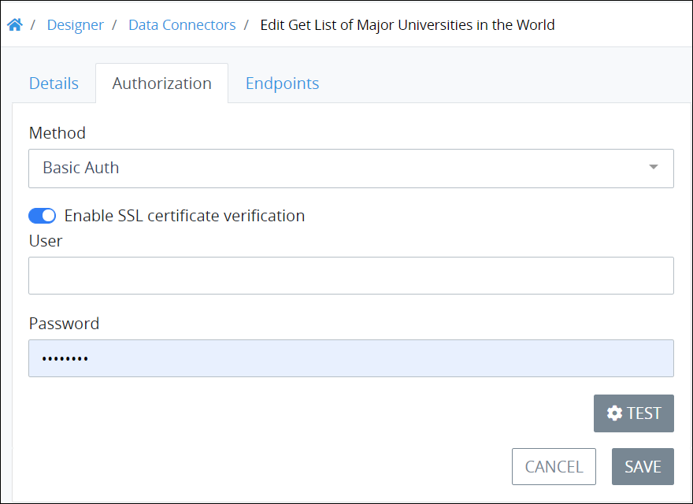

# Data Connector Example

## Overview

This example demonstrates how a Select List control in a ProcessMaker Screen can display the names of major universities around the world as its options in a drop-down menu. The options in this Select List control come from a ProcessMaker Data Connector that calls a third-party Application Program Interface \(API\) when the ProcessMaker Screen containing the Select List control opens. Click in the Select List control's drop-down menu to select an option or start typing into the control to filter those university names that match the text entered into the control.

Note that after creating this ProcessMaker Data Connector, it may be used for any ProcessMaker asset in your ProcessMaker instance that can use a Data Connector. It is not limited to being used with a Select List control.

This example contains the following parts:

* **Create the ProcessMaker Data Connector:** Create the ProcessMaker Data Connector that calls the API containing the list of universities. This is a public API that has been made available for demonstration purposes, so it does not require host authentication. The list of universities is in JSON. Though the host provides the domains, names, and countries of origin for each university in its list,  this example references only the university name. [The host provides public information about this API.](https://github.com/Hipo/university-domains-list-api) See [Create the ProcessMaker Data Connector](data-connector-example.md#create-the-processmaker-data-connector).
* **Configure the Select List control:** After the ProcessMaker Data Connector is created, create a ProcessMaker Screen that contains a configure a Select List control. Configure the Select List control to use this ProcessMaker Data Connector as its data source to get the list of universities as the Select List control's options. See [Configure the Select List Control](data-connector-example.md#configure-the-select-list-control).
* **Create the Process model:** Create the Process model to include a Form Task element that references the ProcessMaker Screen containing the Select List control. See [Create the Process Model](data-connector-example.md#create-the-process-model).

## Create the ProcessMaker Data Connector

Follow these steps to create the ProcessMaker Data Connector as [described in this example](data-connector-example.md#overview):

1. [Log on](../../using-processmaker/log-in.md#log-in) to ProcessMaker.
2. Click the **Designer** option from the top menu. The **Processes** page displays.
3. Click the **Data Connectors** iconfrom the left sidebar. The **Data Connectors** tab displays all ProcessMaker Data Connectors in the **Data Connectors** page.
4. Verify the ProcessMaker Data Connector Category exists in which to assign this Data Connector. If this Category does not exist, see [Create a New Data Connector Category](manage-data-connectors/manage-data-connector-categories/create-a-new-data-connector-category.md).
5. Click the **+Data Connector** button. The **Create Data Connector** screen displays.  
6. In the **Name** setting, enter a name of the ProcessMaker Data Connector. This example uses the name `Get List of Major Universities in the World`.
7. In the **Description** setting, enter a description of this ProcessMaker Data Connector.
8. From the **Authentication Type** drop-down menu, select the **Basic Auth** option. This example uses this option because the host does not require authentication from their publicly accessible API. This option uses your ProcessMaker user account credentials you configure later in this procedure.
9. From the **Category** drop-down menu, select the ProcessMaker Data Connector Category to assign this Data Connector.

   This example uses the following settings.  
    

10. Click **Save**.
11. Click the **Authorization** tab.  
12. In the **User** setting, enter your ProcessMaker username. ProcessMaker uses these credentials to authenticate your ProcessMaker user account.
13. Click the **Endpoints** tab, and then click the **+Endpoint** button. The Endpoint settings display.  
14. In the **Purpose** setting, optionally edit the purpose for this Endpoint. The value the **Purpose** setting contains displays from the ProcessMaker asset when configuring the data source from that ProcessMaker asset. In this example, this setting value displays from the Select List control to select this Endpoint to get the list of universities. Therefore, provide a concise but relevant purpose for this Endpoint so other ProcessMaker designers understand its function. This example uses `list universities` for this setting.
15. In the **Description** setting, enter a description of this Endpoint. This example uses the following description: `This Endpoint gets a JSON list of worldwide universities.`.
16. From the **Method** drop-down menu, select the **GET** option. The GET method reads data.
17. In the **URL** setting, enter the following URL for this example: `http://universities.hipolabs.com/search?`. This URL is truncated from the host's [documented example](https://github.com/Hipo/university-domains-list-api) how to search its public API.  
18. Click the **Test** iconto verify that the Endpoint functions as intended. If configured correctly, the **Test** screen displays the Endpoint response.  
19. Click **Close** to close the **Test** screen, and then click **Save** to save the Endpoint. The ProcessMaker Data Connector is configured for this example.

## Configure the Select List Control

Follow these steps to configure the Select List control as [described in this example](data-connector-example.md#overview):

1. [Add the Select List control to a ProcessMaker Screen page](../design-forms/screens-builder/control-descriptions/select-list-control-settings.md#add-the-control-to-a-processmaker-screen).
2. Most settings for the Select List control are outside the scope of this example. The default settings can be used for require settings, and optional settings do not need to be configured.
3. Expand the **Data Source** panel.  
4. From the **Data Source** drop-down menu, select the **Data Connector** option. Settings in the **Data Source** panel display to configure which ProcessMaker Data Connector and Endpoint this control uses as its data source.
5. 6. [Add a Submit Button control to the ProcessMaker Screen page](../design-forms/screens-builder/control-descriptions/submit-button-control-settings.md#add-the-control-to-a-processmaker-screen) so that the Screen can be submitted.
7. [Save the ProcessMaker Screen](../design-forms/screens-builder/save-a-screen.md#save-a-processmaker-screen).

## Create the Process Model

