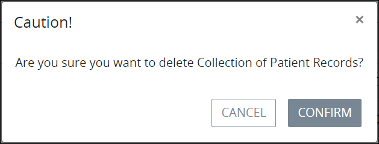

# Delete a Data Connector

## Delete a ProcessMaker Data Connector


### ProcessMaker Package Required

The [Data Connector package](../../package-development-distribution/package-a-connector/data-connector-package.md) must be installed in your ProcessMaker instance. The [Data Connector](what-is-a-data-connector.md) package is not available in the ProcessMaker open-source edition. Contact [ProcessMaker Sales](https://www.processmaker.com/contact/) or ask your ProcessMaker sales representative how the Data Connectors package can be installed in your ProcessMaker instance.

### Permissions Required

Your user account or group membership must have the following permissions to delete a Data Connector unless your user account has the **Make this user a Super Admin** setting selected:

* Data Connectors: Delete Data Connectors
* Data Connectors: View Data Connectors

See the ProcessMaker [Data Connectors](../../processmaker-administration/permission-descriptions-for-users-and-groups.md#data-connectors) permissions or ask your ProcessMaker Administrator for assistance.



When a ProcessMaker Data Connector is deleted, ProcessMaker assets that use that ProcessMaker Data Connector are not affected. However, that ProcessMaker Data Connector can no longer be referenced from other ProcessMaker assets.

Deleting a ProcessMaker Screen from the **Data Connectors** page cannot be undone.


Follow these steps to delete a ProcessMaker Data Connector:

1. [View your ProcessMaker Data Connectors](view-data-connectors.md#view-all-scripts). The **Data Connectors** page displays.
2. Click the **Delete** iconfor the ProcessMaker Data Connector to delete. The **Caution** screen displays to confirm the deletion of the ProcessMaker Data Connector.  
3. Click **Confirm**. The following message displays: **The Data Connector was deleted.**

## Related Topics

