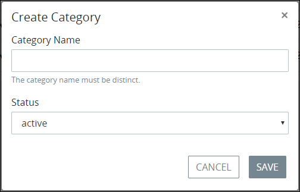

# Create a New Data Connector Category

## Create a New Data Connector Category


### ProcessMaker Package Required

The [Data Connector package](../../../../package-development-distribution/package-a-connector/data-connector-package.md) must be installed in your ProcessMaker instance. The [Data Connector](../../what-is-a-data-connector.md) package is not available in the ProcessMaker open-source edition. Contact [ProcessMaker Sales](https://www.processmaker.com/contact/) or ask your ProcessMaker sales representative how the Data Connectors package can be installed in your ProcessMaker instance.

### Permissions Required

Your user account or group membership must have the following permissions to create a new Data Connector Category unless your user account has the **Make this user a Super Admin** setting selected:

* Data Connectors: Create Data Connector Categories
* Data Connectors: View Data Connector Categories
* Data Connectors: View Data Connectors

See the [Data Connectors](../../../../processmaker-administration/permission-descriptions-for-users-and-groups.md#data-connectors) permissions or ask your ProcessMaker Administrator for assistance.


Follow these steps to create a new [Data Connector Category](../../what-is-a-data-connector.md):

1. View your [Data Connector Categories](view-data-connector-categories.md#view-data-connector-categories).
2. Click the **+Category** button. The **Create Category** screen displays.  
3. 
## Related Topics











