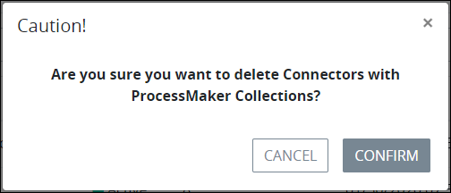

# Delete a Data Connector Category

## Delete a Data Connector Category


### ProcessMaker Package Required

The [Data Connector package](../../../../package-development-distribution/package-a-connector/data-connector-package.md) must be installed in your ProcessMaker instance. The [Data Connector](../../what-is-a-data-connector.md) package is not available in the ProcessMaker open-source edition. Contact [ProcessMaker Sales](https://www.processmaker.com/contact/) or ask your ProcessMaker sales representative how the Data Connectors package can be installed in your ProcessMaker instance.

### Permissions Required

Your user account or group membership must have the following permissions to delete a Data Connector Category unless your user account has the **Make this user a Super Admin** setting selected:

* Data Connectors: Delete Data Connector Categories
* Data Connectors: View Data Connector Categories
* Data Connectors: View Data Connectors

See the ProcessMaker [Data Connectors](../../../../processmaker-administration/permission-descriptions-for-users-and-groups.md#data-connectors) permissions or ask your ProcessMaker Administrator for assistance.



To delete a Data Connector Category, no ProcessMaker Data Connectors can be assigned to it. If any ProcessMaker Data Connectors are assigned to the Data Connector Category, its **Delete** icondoes not display. [Reassign those ProcessMaker Data Connectors to another Data Connector Category](../../edit-a-data-connector.md#edit-details-for-a-processmaker-data-connector).

Deleting a Data Connector Category cannot be undone.


Follow these steps to delete a [Data Connector Category](../../what-is-a-data-connector.md):

1. View your [Data Connector Categories](view-data-connector-categories.md#view-data-connector-categories).
2. Select the **Delete** iconfor the Data Connector Category to delete. A message displays to confirm deletion of the Data Connector Category.  
3. Click **Confirm**. The following message displays: **The category was deleted**.

## Related Topics











