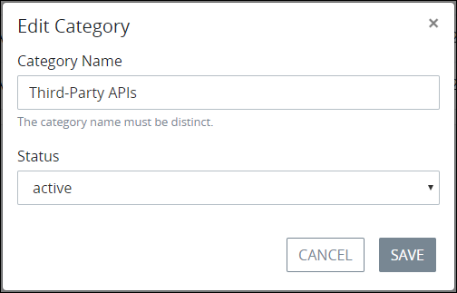

# Edit a Data Connector Category

## Edit a Data Connector Category


### ProcessMaker Package Required

The [Data Connector package](../../../../package-development-distribution/package-a-connector/data-connector-package.md) must be installed in your ProcessMaker instance. The [Data Connector](../../what-is-a-data-connector.md) package is not available in the ProcessMaker open-source edition. Contact [ProcessMaker Sales](https://www.processmaker.com/contact/) or ask your ProcessMaker sales representative how the Data Connectors package can be installed in your ProcessMaker instance.

### Permissions Required

Your user account or group membership must have the following permissions to edit a Data Connector Category unless your user account has the **Make this user a Super Admin** setting selected:

* Data Connectors: Create Data Connector Categories
* Data Connectors: Edit Data Connector Categories
* Data Connectors: View Data Connector Categories
* Data Connectors: View Data Connectors

See the ProcessMaker [Data Connectors](../../../../processmaker-administration/permission-descriptions-for-users-and-groups.md#data-connectors) permissions or ask your ProcessMaker Administrator for assistance.


Follow these steps to edit a [Data Connector Category](../../what-is-a-data-connector.md):

1. View your [Data Connector Categories](view-data-connector-categories.md#view-data-connector-categories).
2. Select the **Edit** icon for the Data Connector Category to edit. The **Edit Category** screen displays.  
3. Edit the following information about the Data Connector Category as necessary:
   * In the **Category Name** setting, edit the name of the new Data Connector Category. The Data Connector Category name must be unique from all other Data Connector Category names in your organization and can only use apostrophe characters \(`'`\) and spaces. This is a required setting.
   * From the **Status** drop-down menu, select one of the following options for the Data Connector Category's status:

     * **Active:** Active Data Connector Categories can have ProcessMaker Data Connectors assigned to them.
     * **Inactive:** Inactive Data Connector Categories cannot have ProcessMaker Data Connectors assigned to them.

     This is a required setting.
4. Click **Save**.

## Related Topics











