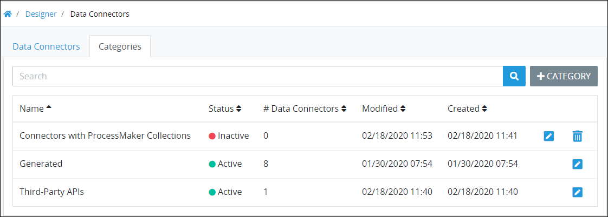

# What is a Data Connector Category?

## Overview

Use Data Connector Categories to organize your ProcessMaker [Data Connectors](../../what-is-a-data-connector.md). Organizing your ProcessMaker Data Connectors into Categories makes it easier to search for a Data Connector based on its assigned Category. Assign multiple Data Connector Categories to a ProcessMaker Data Connector if necessary. For example, assign a ProcessMaker Data Connector named "Database Call" to the "Database Scripts" and "Data Management" Data Connector Categories.


### ProcessMaker Package Required

Data Connector Categories are available only when the [Data Connector package](../../../../package-development-distribution/package-a-connector/data-connector-package.md) must be installed in your ProcessMaker instance. The Data Connector package is not available in the ProcessMaker open-source edition. Contact [ProcessMaker Sales](https://www.processmaker.com/contact/) or ask your ProcessMaker sales representative how the Collections package can be installed in your ProcessMaker instance.


Data Connector Categories can be in active or inactive status. Following is a description of each status:

* **Active:** Active Data Connector Categories can have ProcessMaker Data Connectors assigned to them.
* **Inactive:** Inactive Data Connector Categories cannot have ProcessMaker Data Connectors assigned to them.


ProcessMaker has multiple Category types for different types of assets. Each Category type is distinct from the others and can only be used for its type of ProcessMaker asset. Following is a description of each Category type:

* [Process Categories](../../../viewing-processes/view-the-list-of-processes/manage-process-categories/what-is-a-process-category.md): Organize your ProcessMaker [Processes](../../../viewing-processes/what-is-a-process.md).
* [Script Categories](../../../scripts/manage-scripts/manage-script-categories/): Organize your ProcessMaker [Scripts](../../../scripts/what-is-a-script.md).
* [Screen Categories](../../../design-forms/manage-forms/manage-screen-categories/): Organize your ProcessMaker [Screens](../../../design-forms/what-is-a-form.md).
* Data Connector Categories: Organize your ProcessMaker [Data Connectors](../../what-is-a-data-connector.md).


## Related Topics











