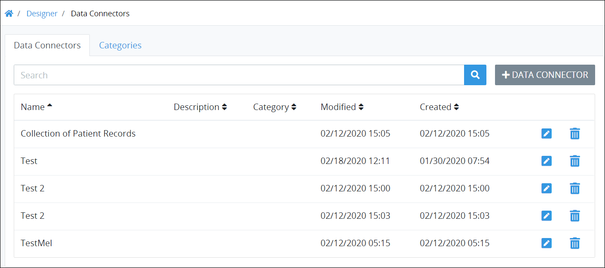

# View Data Connectors

## View All ProcessMaker Data Connectors 

ProcessMaker displays all Data Connectors in one location. This makes it easy to manage ProcessMaker Screens.


### ProcessMaker Package Required

The [Data Connector package](../../package-development-distribution/package-a-connector/data-connector-package.md) must be installed in your ProcessMaker instance. The [Data Connector](what-is-a-data-connector.md) package is not available in the ProcessMaker open-source edition. Contact [ProcessMaker Sales](https://www.processmaker.com/contact/) or ask your ProcessMaker sales representative how the Data Connectors package can be installed in your ProcessMaker instance.

### Permission Required

Your ProcessMaker user account or group membership must have the "Data Connectors: View Data Connectors" permission to view the list of ProcessMaker Data Connectors unless your user account has the **Make this user a Super Admin** setting selected.

See the ProcessMaker [Data Connectors](../../processmaker-administration/permission-descriptions-for-users-and-groups.md#data-connectors) permissions or ask your ProcessMaker Administrator for assistance.


Follow these steps to view all ProcessMaker Data Connectors in your organization:

1. [Log on](../../using-processmaker/log-in.md#log-in) to ProcessMaker.
2. Click the **Designer** option from the top menu. The **Processes** page displays.
3. Click the **Data Connectors** iconfrom the left sidebar. The **Data Connectors** tab displays all ProcessMaker Data Connectors in the **Data Connectors** page.

The **Data Connectors** page displays the following information in tabular format about ProcessMaker Data Connectors:

* **Name:** The **Name** column displays the name of the ProcessMaker Data Connector. If a [ProcessMaker Collection](../../collections/what-is-a-collection.md) is created, the automatically created Data Connector that connects to that Collection has the same name as that Collection.
* **Description:** The **Description** column displays the description of the ProcessMaker Data Connector. See [Edit Details for a ProcessMaker Data Connector](edit-a-data-connector.md#edit-details-for-a-processmaker-data-connector) for more information.
* **Category:** The **Category** column displays to which [Data Connector Category](manage-data-connectors/manage-data-connector-categories/what-is-a-data-connector-category.md) the ProcessMaker Data Connector is assigned. If a ProcessMaker Collection is created, the automatically created Data Connector that connects to that Collection is assigned to the **Generated** Category by default.
* **Modified:** The **Modified** column displays the date and time the ProcessMaker Data Connector was last modified. The time zone setting to display the time is according to the ProcessMaker instance unless your [user profile's](../../using-processmaker/profile-settings.md#change-your-profile-settings) **Time zone** setting is specified.
* **Created:** The **Created** column displays the date and time the ProcessMaker Data Connector was created. The time zone setting to display the time is according to the ProcessMaker instance unless your [user profile's](../../using-processmaker/profile-settings.md#change-your-profile-settings) **Time zone** setting is specified.


### Search for a ProcessMaker Data Connector

Use the [Search](search-for-a-data-connector.md) setting to filter ProcessMaker Data Connectors that display.

### Create a ProcessMaker Data Connector

Click the **+Data Connector** button. See [Create a New Data Connector](create-a-new-data-connector.md#create-a-new-processmaker-data-connector).

### Edit a ProcessMaker Data Connector

Click the **Edit** icon. See [Edit a Data Connector](manage-data-connectors/manage-data-connector-categories/edit-a-data-connector-category.md#edit-a-data-connector-category).

### Delete a ProcessMaker Screen

Click the **Delete** icon. See [Delete a Data Connector](delete-a-data-connector.md).

### No ProcessMaker Data Connectors?

If no ProcessMaker Connectors exist, the following message displays: **No Data Available**.

### Display Information the Way You Want It

[Control how tabular information displays](../../using-processmaker/control-how-requests-display-in-a-tab.md), including how to sort columns or how many items display per page.


## Related Topics

