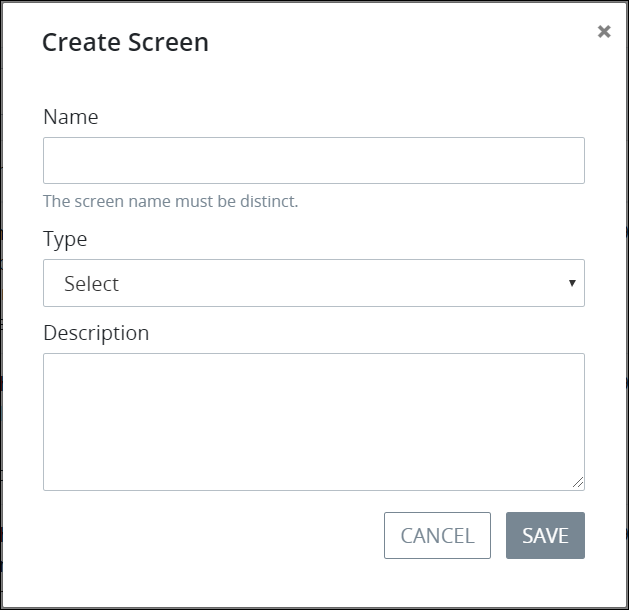

# Create a New Screen

## Create a New ProcessMaker Screen


Your ProcessMaker user account or group membership must have the following permissions to create a ProcessMaker Screen unless your user account has the **Make this user a Super Admin** setting selected:

* Screens: View Screens
* Screens: Create Screens

See the ProcessMaker [Screens](../../../processmaker-administration/permission-descriptions-for-users-and-groups.md#screens) permissions or ask your ProcessMaker Administrator for assistance.


Follow these steps to create a new ProcessMaker Screen:

1. [View your ProcessMaker Screens.](view-all-forms.md) The **Screens** page displays.
2. Click the **+Screen** button. The **Create Screen** page displays.  

   

3. In the **Name** field, enter the name of the ProcessMaker Screen. This is a required field.
4. From the **Type** drop-down menu, select one of the following ProcessMaker Screen types:

   * **Form:** Use the Form type to design interactive and complex forms. See [Form](../screens-builder/types-for-screens.md#form).
   * **Display:** Use the Display type to display information or allow [Request](../../../using-processmaker/requests/what-is-a-request.md) participants to download files. The Display type has limited functionality compared the Form type. See [Display](../screens-builder/types-for-screens.md#display).
   * **Email:** Use the Email type to compose the email body for email messages to be used with the Send Email connector. Note that the Send Email connector must be installed in your ProcessMaker instance for this option to display. See [Send Email Connector](../../process-design/model-processes-using-connectors/available-connectors-from-processmaker/email-connector.md) and [Screen Types](../screens-builder/types-for-screens.md#email).

   This is a required field.

5. Enter in the **Description** field a description for the ProcessMaker Screen. This is a required field.
6. In the **Category** field, enter the name for the category to associate with the ProcessMaker Screen. In doing so, maintain consistent naming with similarly functional ProcessMaker Screens so that they may be more easily sorted from the [**Screens** page](view-all-forms.md#view-all-scripts). This is a required field.
7. Click **Save**. Screens Builder displays the new ProcessMaker Screen in [Design mode](../screens-builder/screens-builder-modes.md#editor-mode). See [Screens Builder](../screens-builder/).

## Related Topics























