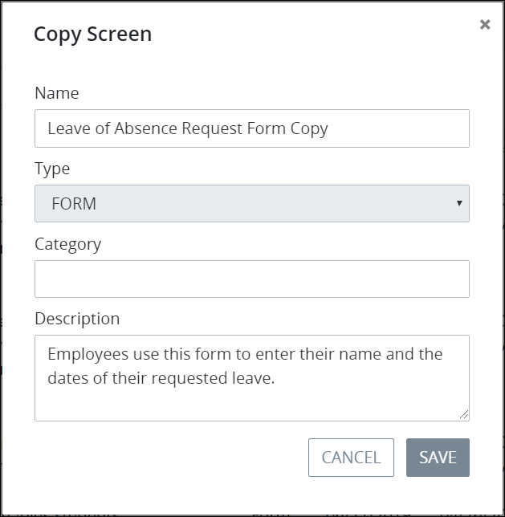

# Copy a Screen

## Copy a ProcessMaker Screen


Your ProcessMaker user account or group membership must have the following permissions to copy a ProcessMaker Screen unless your user account has the **Make this user a Super Admin** setting selected:

* Screens: View Screens
* Screens: Create Screens

See the ProcessMaker [Screens](../../../processmaker-administration/permission-descriptions-for-users-and-groups.md#screens) permissions or ask your ProcessMaker Administrator for assistance.


Follow these steps to copy a ProcessMaker Screen:

1. [View your ProcessMaker Screens.](view-all-forms.md) The **Screens** page displays.
2. Click the **Copy** iconfor your ProcessMaker Screen. The **Copy Screen** screen displays.  

   

3. Edit the following information from the original ProcessMaker Screen as necessary:
   * In the **Name** field, edit the name of the copied ProcessMaker Screen. After the original ProcessMaker Screen is copied, the word **Copy** is suffixed to the original Screen's name. This is a required field.
   * In the **Description** field, edit the description of the original ProcessMaker Screen.
4. Click **Save**.


The **Type** field shows which [type](../screens-builder/types-for-screens.md) the original ProcessMaker Screen is. The copied ProcessMaker Screen must be of the same Screen type as the original.


## Related Topics





















