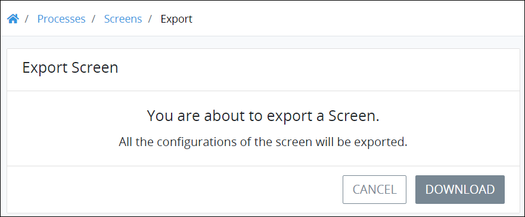

# Export a Screen

## Overview

Export a ProcessMaker Screen to your local computer. The exported ProcessMaker Screen may then be imported to the same or another ProcessMaker instance of the same [ProcessMaker version](../../../using-processmaker/application-version-details.md#view-processmaker-version-information). An exported ProcessMaker Screen may then be shared with others so they can import your ProcessMaker Screen for their Processes.

An exported ProcessMaker Screen contains all the [controls](../screens-builder/control-descriptions/) as the original at the time the original Screen was exported.

The exported ProcessMaker Screen has the `.json` file extension.

## Export a ProcessMaker Screen


Your ProcessMaker user account or group membership must have the following permissions to export a ProcessMaker Screen unless your user account has the **Make this user a Super Admin** setting selected:

* Screens: Export Screens
* Screens: View Screens

See the ProcessMaker [Screens](../../../processmaker-administration/permission-descriptions-for-users-and-groups.md#screens) permissions or ask your ProcessMaker Administrator for assistance.


Follow these steps to export a ProcessMaker Screen:

1. [View your ProcessMaker Screens.](view-all-forms.md) The **Screens** page displays.
2. Click the **Export** iconfor your ProcessMaker Screen. The following message displays: **You are about to export a Screen. All the configurations of the screen will be exported.**  

   

3. Click **Download**, and then browse for the location on your local computer to save the exported ProcessMaker Screen.
4. By default, ProcessMaker exports the ProcessMaker Screen using the original Screen name except spaces in the name are replaced with underscores \(`_`\). The file has the file extension `.json`. Rename the default file name if necessary, though do not change the file extension. As a best practice, specify in the file name that this is an exported ProcessMaker Screen and not an [exported ProcessMaker Process](../../viewing-processes/view-the-list-of-processes/export-a-bpmn-compliant-process.md#export-a-bpmn-2-0-compliant-process) or an [exported ProcessMaker Collection](../../../collections/manage-collections/export-a-collection.md).
5. Specify a directory location to save the file. ProcessMaker exports the `.json` file to your local computer. The following message displays when the ProcessMaker Screen exports successfully: **The screen was exported.**

## Related Topics























