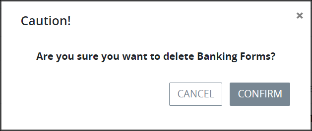

# Delete a Screen Category

## Delete a Screen Category


Your user account or group membership must have the following permissions to delete a Screen Category unless your user account has the **Make this user a Super Admin** setting selected:

* Screens: Delete Screen Categories
* Screens: View Screen Categories
* Screens: View Screens

See the ProcessMaker [Screens](../../../../processmaker-administration/permission-descriptions-for-users-and-groups.md#screens) permissions or ask your ProcessMaker Administrator for assistance.



To delete a Screen Category, no ProcessMaker Screens can be assigned to it. If any ProcessMaker Screens are assigned to the Screen Category, its **Delete** icondoes not display. [Reassign those ProcessMaker Screens to another Screen Category](../edit-a-screen.md#configure-a-processmaker-screen).

Deleting a Screen Category cannot be undone.


Follow these steps to delete a [Screen Category](what-is-a-screen-category.md):

1. [View your Screen Categories](view-screen-categories.md#view-screen-categories).
2. Select the **Delete** iconfor the Screen Category to delete. A message displays to confirm deletion of the Screen Category.  
3. Click **Confirm**. The following message displays: **The category was deleted.**

## Related Topics











