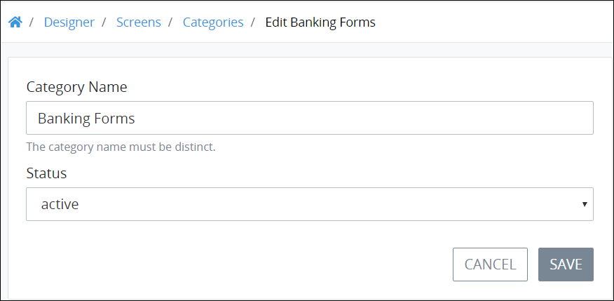

# Edit a Screen Category

## Edit a Screen Category


Your user account or group membership must have the following permissions to edit a Screen Category:

* Categories: View Categories
* Categories: Create Categories
* Categories: Edit Categories

See the [Categories](../../../../processmaker-administration/permission-descriptions-for-users-and-groups.md#categories) permissions or ask your ProcessMaker Administrator for assistance.


Follow these steps to edit a [Screen Category](what-is-a-screen-category.md):

1. [View your Screen Categories](view-screen-categories.md#view-screen-categories).
2. Select the **Edit** icon. The **Edit Screen Category** page displays.  
3. Edit the following information about the Screen Category as necessary:
   * In the **Category Name** field, edit the name of the Screen Category if necessary. The Screen Category name must be unique from all other Screen Category names in your organization. This is a required field.
   * From the **Status** drop-down menu, change the status of the Screen Category, if necessary, from the following options:

     * **Active:** Active Screen Categories can have ProcessMaker Screens assigned to them.
     * **Inactive:** Inactive Screen Categories cannot have ProcessMaker Screens assigned to them.

     This is a required field.
4. Click **Save**.

## Related Topics











