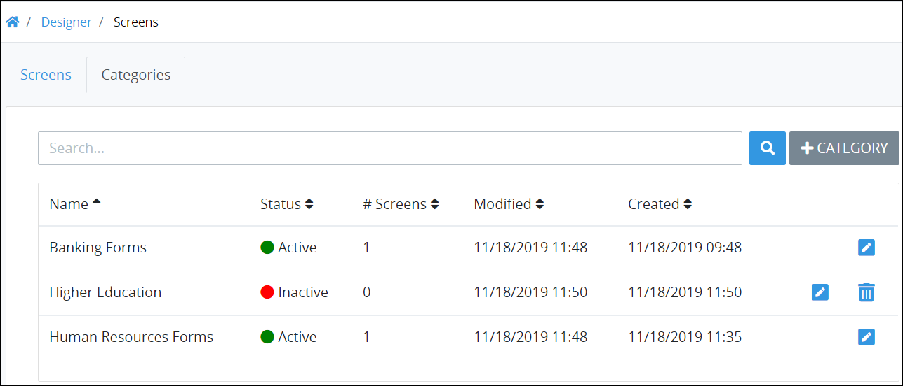

# What is a Screen Category?

## Overview

Use Screen Categories to organize your ProcessMaker Screens. Organizing your ProcessMaker Screens into Categories makes it easier to search for a Screen based on its assigned Category. Assign multiple Screen Categories to a ProcessMaker Screen if necessary. For example, assign a ProcessMaker Screen named "Personal Information Form" to the "Banking Forms" and "Human Resources Forms" Screen Categories.

Screen Categories can be in active or inactive status. Following is a description of each status:

* **Active:** Active Screen Categories can have ProcessMaker Screens assigned to them.
* **Inactive:** Inactive Screen Categories cannot have ProcessMaker Screens assigned to them.


ProcessMaker has three Category types for different types of assets. Each Category type is distinct from the others and can only be used for its type of ProcessMaker asset. Following is a description of each Category type:

* [Process Categories](../../../viewing-processes/view-the-list-of-processes/manage-process-categories/what-is-a-process-category.md): Organize your ProcessMaker [Processes](../../../viewing-processes/what-is-a-process.md).
* [Script Categories](../../../scripts/manage-scripts/manage-script-categories/what-is-a-script-category.md): Organize your ProcessMaker [Scripts](../../../scripts/what-is-a-script.md).
* Screen Categories: Organize your ProcessMaker [Screens](../../what-is-a-form.md).


