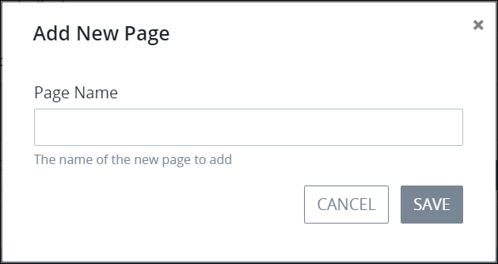
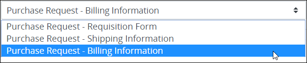
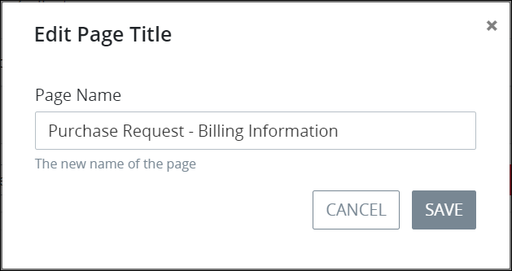

# Add, Delete or Rename a Page

## Add a New Page to a ProcessMaker Screen

Process Owners can create multi-page ProcessMaker Screens. By default, a ProcessMaker Screen contains one page that has the same name as the ProcessMaker Screen.

Each page has its own name. Multiple pages in the same ProcessMaker Screen can have identical page names.


Your ProcessMaker user account or group membership must have the following permissions to add a new page to a ProcessMaker Screen unless your user account has the **Make this user a Super Admin** setting selected:

* Screens: Edit Screens
* Screens: View Screens

See the ProcessMaker [Screens](../../../processmaker-administration/permission-descriptions-for-users-and-groups.md#screens) permissions or ask your ProcessMaker Administrator for assistance.


Follow these steps to add a new page to a ProcessMaker Screen:

1. [Create](../manage-forms/create-a-new-form.md) or [open](../manage-forms/view-all-forms.md) the ProcessMaker Screen in which to add a new page. The ProcessMaker Screen is in [Design mode](screens-builder-modes.md#editor-mode).
2. Click thebutton. The **Add New Page** screen displays.  

   

3. In the **Page Name** setting, enter the name of the new page.
4. Click **Save**. The new page displays in the drop-down menu of pages for that ProcessMaker Screen.

Access each page from the drop-down menu of pages for that ProcessMaker Screen.

## Delete a Page from a ProcessMaker Screen


Your user account or group membership must have the following permissions to delete a new page to a ProcessMaker Screen:

* Screens: Edit Screens
* Screens: View Screens

See the ProcessMaker [Screens](../../../processmaker-administration/permission-descriptions-for-users-and-groups.md#screens) permissions or ask your ProcessMaker Administrator for assistance.



Deleting a page from a ProcessMaker Screen cannot be undone.


Follow these steps to delete a page from a ProcessMaker Screen:

1. [Open](../manage-forms/view-all-forms.md) the ProcessMaker Screen in which to delete a page. The ProcessMaker Screen is in [Design mode](screens-builder-modes.md#editor-mode).
2. Select the page from its the drop-down menu of pages for that ProcessMaker Screen.  

   

3. Click thebutton. The page is deleted.

## Rename a Page


Your user account or group membership must have the following permissions to rename a new page to a ProcessMaker Screen:

* Screens: Edit Screens
* Screens: View Screens

See the ProcessMaker [Screens](../../../processmaker-administration/permission-descriptions-for-users-and-groups.md#screens) permissions or ask your ProcessMaker Administrator for assistance.


Follow these steps to rename a page on a ProcessMaker Screen:

1. [Create](../manage-forms/create-a-new-form.md) or [open](../manage-forms/view-all-forms.md) the ProcessMaker Screen in which to add a new page. The ProcessMaker Screen is in [Design mode](screens-builder-modes.md#editor-mode).
2. Select the page from its the drop-down menu of pages for that ProcessMaker Screen.  

   

3. Click thebutton. The **Edit Page Title** screen displays.  

   

4. Edit in the **Page Name** setting the name of the page.
5. Click **Save**.

## Related Topics





























