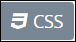
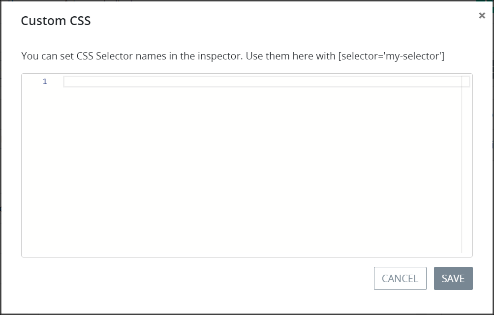

# Add Custom CSS to a Screen

## Add Custom CSS to a ProcessMaker Screen

Use the Custom CSS mode to add custom CSS styles to a ProcessMaker Screen. ProcessMaker supports standard Cascading Style Sheet language \(CSS\) syntax with a few [exceptions](add-custom-css-to-a-screen.md#usage-exceptions-from-standard-css-syntax).


### ProcessMaker Permissions

Your ProcessMaker user account or group membership must have the following permissions to add custom CSS to a ProcessMaker Screen unless your user account has the **Make this user a Super Admin** setting selected:

* Screens: Edit Screens
* Screens: View Screens

See the ProcessMaker [Screens](../../../processmaker-administration/permission-descriptions-for-users-and-groups.md#screens) permissions or ask your ProcessMaker Administrator for assistance.

### Need to Learn CSS?

Start with [W3School's free CSS tutorial](https://www.w3schools.com/css/).


Follow these steps to add custom CSS to a ProcessMaker Screen:

1. [Open](../manage-forms/view-all-forms.md) the ProcessMaker Screen in which to add custom CSS. The ProcessMaker Screen is in [Design mode](screens-builder-modes.md#editor-mode).
2. Click the **Custom CSS** button. The **Custom CSS** screen displays.  

   

3. Enter your custom CSS syntax.
4. Optionally, reference the **CSS Selector Name** setting value for specific ProcessMaker Screen controls to indicate that CSS styling applies to those controls. Enter the value to represent this control in custom CSS syntax when in [Custom CSS](add-custom-css-to-a-screen.md#add-custom-css-to-a-processmaker-screen) mode. The reference is case sensitive in the CSS syntax. See [Apply CSS to Specific ProcessMaker Screen Controls](add-custom-css-to-a-screen.md#apply-css-to-specific-processmaker-screen-controls). Example: `[selector='Submit Form']`.
5. Address any syntax errors or changes as necessary, then click **Save**.
6. Click the **Preview** button to view your CSS syntax for your ProcessMaker Screen in [Preview](screens-builder-modes.md#preview-mode) mode. Custom CSS does not display in Design mode.
7. Click the **Design** button to return to Design mode, and then repeat Steps 2 through 6 as necessary.

## Usage Exceptions from Standard CSS Syntax

ProcessMaker supports standard Cascading Style Sheet language \(CSS\) syntax except for the following.

### Apply CSS to Specific ProcessMaker Screen Controls

Use the following syntax to apply CSS styling to a specific control in this ProcessMaker Screen by referencing its **CSS Selector Name** setting value. Use single quotes \(`'`\) around the control reference. The reference is case sensitive in the CSS syntax. As a best practice, use the same **CSS Selector Name** setting value on different controls of the same type to apply the same custom CSS style to all those controls.

`[selector='CSS Selector Name Setting that is case sensitive']`

Example for a ProcessMaker Screen control with the **CSS Selector Name** setting value of `Submit Form`:

```css
/ * Style a control by referencing its CSS Selector Name setting value * /
[selector='Submit Form'] {
    color: blueviolet;
}
```

### Apply CSS to All Pages in a ProcessMaker Screen

Use `div.page` to apply CSS styling to all pages in a ProcessMaker Screen.

Example:

```css
/* Setting CSS for all pages on a ProcessMaker Screen */
div.page{
    background-color: lightblue;
}
```

## Related Topics


























