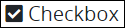
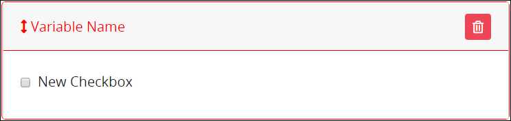
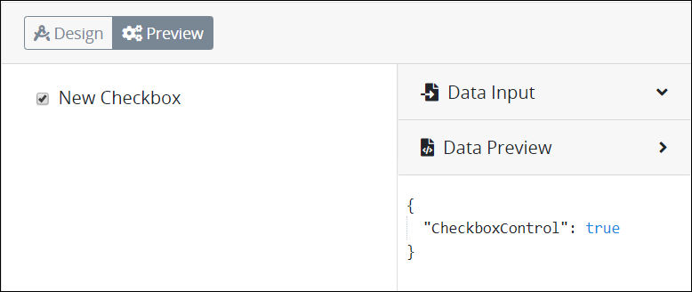

# Checkbox Control Settings

## Control Description

The Checkbox control adds a checkbox from which the [Request](../../../../using-processmaker/requests/what-is-a-request.md) participant can select or deselect an option. Multiple Checkbox controls can be grouped together to function as one set of options whereby separate Checkbox controls with the same name maintain the same selected or deselected state.


This control is not available for [Display](../types-for-screens.md#display)-type ProcessMaker Screens. See [Screen Types](../types-for-screens.md).


## Add the Control to a ProcessMaker Screen


Your ProcessMaker user account or group membership must have the following permissions to add a control to a ProcessMaker Screen unless your user account has the **Make this user a Super Admin** setting selected:

* Screens: Edit Screens
* Screens: View Screens

See the ProcessMaker [Screens](../../../../processmaker-administration/permission-descriptions-for-users-and-groups.md#screens) permissions or ask your ProcessMaker Administrator for assistance.


Follow these steps to add this control to the ProcessMaker Screen:

1. [Create a new ProcessMaker Screen](../../manage-forms/create-a-new-form.md) or click the **Edit** iconto edit the selected Screen. The ProcessMaker Screen is in [Design mode](../screens-builder-modes.md#editor-mode).
2. View the ProcessMaker Screen page to which to add the control.
3. Locate the **Checkbox** iconin the panel to the left of the Screen Builder canvas.
4. Drag the **Checkbox** icon into the Screen Builder canvas. Existing controls on the Screen Builder canvas adjust positioning based on where you drag the control.
5. Place into the Screen Builder canvas where you want the control to display on the ProcessMaker Screen.  

   

6. Configure the Checkbox control. See [Settings](checkbox-control-settings.md#inspector-settings).
7. Validate that the control is configured correctly. See [Validate Your Screen](../validate-your-screen.md#validate-a-processmaker-screen).

Below are two Checkbox controls in [Preview mode](../screens-builder-modes.md#preview-mode).

## Delete the Control from a ProcessMaker Screen


Deleting a control also deletes configuration for that control. If you add another control, it will have default settings.


Click the **Delete** iconfor the control to delete it.

## Settings 


### Permissions Required

Your user account or group membership must have the following permissions to edit a ProcessMaker Screen control:

* Screens: Edit Screens
* Screens: View Screens

See the ProcessMaker [Screens](../../../../processmaker-administration/permission-descriptions-for-users-and-groups.md#screens) permissions or ask your ProcessMaker Administrator for assistance.

### Topic Update

This topic is updated for ProcessMaker version 4.0.1. See the [Release Notes](https://processmaker.gitbook.io/processmaker-release-notes/processmaker-4.0.x/processmaker-4.0.1-release-notes#screen-builder-1).


The Checkbox control has the following panels that contain settings:

* \*\*\*\*[**Variable** panel](checkbox-control-settings.md#variable-panel-settings)
* \*\*\*\*[**Configuration** panel](checkbox-control-settings.md#configuration-panel-settings)
* \*\*\*\*[**Design** panel](checkbox-control-settings.md#design-panel-settings)
* \*\*\*\*[**Advanced** panel](checkbox-control-settings.md#advanced-panel-settings)

### Variable Panel Settings

Click the control while in [Design](../screens-builder-modes.md#design-mode) mode, and then click the **Variable** panel that is on the right-side of the Screen Builder canvas.

Below are settings for the Checkbox control in the **Variable** panel:

* [Variable Name](checkbox-control-settings.md#variable-name)
* [Label](checkbox-control-settings.md#label)
* [Validation Rules](checkbox-control-settings.md#validation-rules)
* [Checked by Default](checkbox-control-settings.md#checked-by-default)
* [Read Only](checkbox-control-settings.md#read-only)

#### Variable Name

Edit the default **Variable Name** setting value for this control if necessary. The **Variable Name** setting value represents data in this control during [Requests](../../../../using-processmaker/requests/what-is-a-request.md). Ensure that the **Variable Name** setting value is a unique name from other controls in this [ProcessMaker Screen](../../what-is-a-form.md) and contains at least one letter. Use the **Variable Name** setting value in the following ways:

* Reference this control by its **Variable Name** setting's value. The **Data Preview** panel in [Preview mode](../screens-builder-modes.md#preview-mode) represents the state of the Checkbox control using its **Variable Name** value in the Request's JSON data model in the following ways:
  * **The Checkbox control is selected:** The key's value is `true` \(shown below\).
  * **The Checkbox control is not selected:** The key's value is `false`.  
* Reference this control's value in a different Screen Builder control. To do so, use [mustache syntax](https://mustache.github.io/mustache.5.html) and reference this control's **Variable Name** value in the target control. Example: `{{ CheckboxControl }}`.
* Reference this value in [**Visibility Rule** setting expressions](expression-syntax-components-for-show-if-control-settings.md).

This is a required setting.

#### Label

Edit the default label that displays for this control if necessary. **New Checkbox** is the default value.

#### Validation Rules

Enter the validation rule\(s\) the Request participant must comply with to properly enter a valid value into this control. This setting has no default value. If there are no configured validation rules the following message displays: **No validation rule\(s\)**. See [Validation Rules for "Validation" Control Settings](validation-rules-for-validation-control-settings.md).

Follow these steps to add a validation rule to this control:

1. Access the [**Variable** panel for this control](select-list-control-settings.md#variable-panel-settings) while in [Design](../screens-builder-modes.md#design-mode) mode, and then locate the **Validation Rules** setting.
2. Click the **Add Rule** button. The **Select** drop-down menu displays.
3. Select the rule that this control validates against.
4. Click **Save**. Parameters for the selected rule display. Parameter settings display which ones are required to properly configure the rule.
5. Enter the parameter settings that this control uses to validate against. See [Validation Rules for "Validation Rules" Control Settings](validation-rules-for-validation-control-settings.md).

Follow these steps to edit a validation rule for this control:

1. Access the [**Variable** panel for this control](select-list-control-settings.md#variable-panel-settings) while in [Design](../screens-builder-modes.md#design-mode) mode, and then locate the **Validation Rules** setting.
2. Click the **Edit** iconfor the validation rule to edit if that rule can be edited. Validation rules that do not have parameters cannot be edited. The parameter settings for that validation rule displays.
3. Edit the parameter settings that this control uses to validate against. See [Validation Rules for "Validation Rules" Control Settings](validation-rules-for-validation-control-settings.md).

Follow these steps to delete a validation rule for this control:

1. Access the [**Variable** panel for this control](select-list-control-settings.md#variable-panel-settings) while in [Design](../screens-builder-modes.md#design-mode) mode, and then locate the **Validation Rules** setting.
2. Click the **Delete** iconfor the validation rule to delete. A message displays to confirm deletion of the validation rule.
3. Click **Delete**.

#### Checked by Default

Select to indicate that this control is selected by default such that its key's value is `true`. This option is not selected by default.

#### Read Only

Select to indicate that this control cannot be edited. This option is not selected by default.

### Configuration Panel Settings

Click the control while in [Design](../screens-builder-modes.md#design-mode) mode, and then click the **Configuration** panel that is on the right-side of the Screen Builder canvas.

Below is the setting for the Checkbox control in the **Configuration** panel:

* [Helper Text](checkbox-control-settings.md#helper-text)

#### Helper Text

Enter text that provides additional guidance on this control's use. This setting has no default value.

### Design Panel Settings

Click the control while in [Design](../screens-builder-modes.md#design-mode) mode, and then click the **Design** panel that is on the right-side of the Screen Builder canvas.

Below are settings for the Checkbox control in the **Design** panel:

* [Text Color](checkbox-control-settings.md#text-color)
* [Background Color](checkbox-control-settings.md#background-color)
* [Toggle Style](checkbox-control-settings.md#toggle-style)

#### Text Color

Select the text color that displays for this control. Optionally, click the **Clear Color Selection** option to remove the selected color.

#### Background Color

Select the background color that displays for this control. Optionally, click the **Clear Color Selection** option to remove the selected color.

#### Toggle Style

Select to display a toggle key control instead of a checkbox control for each checkbox option.

### Advanced Panel Settings

Click the control while in [Design](../screens-builder-modes.md#design-mode) mode, and then click the **Advanced** panel that is on the right-side of the Screen Builder canvas.

Below are settings for the Checkbox control in the **Advanced** panel:

* [Visibility Rule](checkbox-control-settings.md#visibility-rule)
* [CSS Selector Name](checkbox-control-settings.md#css-selector-name)

#### Visibility Rule

Specify an expression that indicates the condition\(s\) under which this control displays. See [Expression Syntax Components for "Visibility Rule" Control Settings](expression-syntax-components-for-show-if-control-settings.md#expression-syntax-components-for-show-if-control-settings). If this setting does not have an expression, then this control displays by default.

#### CSS Selector Name

Enter the value to represent this control in custom CSS syntax when in [Custom CSS](../add-custom-css-to-a-screen.md#add-custom-css-to-a-processmaker-screen) mode. As a best practice, use the same **CSS Selector Name** value on different controls of the same type to apply the same custom CSS style to all those controls.

## Related Topics 









































