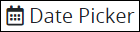
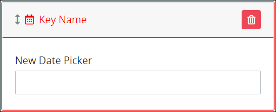
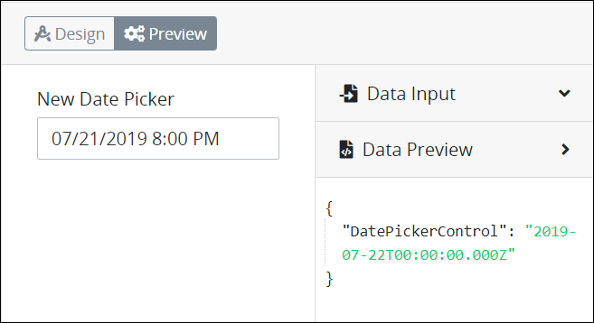

# Date Picker Control Settings

## Control Description 

The Date Picker control allows the [Request](../../../../using-processmaker/requests/what-is-a-request.md) participant to click the control and select a date from a calendar pop-up. After the user selects a date from the control, the calendar hides and the control shows the selected date using the `mm/dd/yyyy hh:mm` text format.


This control is not available for [Display](../types-for-screens.md#display)-type ProcessMaker Screens. See [Screen Types](../types-for-screens.md).


## Add the Control to a ProcessMaker Screen 


Your ProcessMaker user account or group membership must have the following permissions to add a control to a ProcessMaker Screen unless your user account has the **Make this user a Super Admin** setting selected:

* Screens: View Screens
* Screens: Edit Screens

See the ProcessMaker [Screens](../../../../processmaker-administration/permission-descriptions-for-users-and-groups.md#screens) permissions or ask your ProcessMaker Administrator for assistance.


Follow these steps to add this control to the ProcessMaker Screen:

1. [Create a new ProcessMaker Screen](../../manage-forms/create-a-new-form.md) or click the **Edit** iconto edit the selected Screen. The ProcessMaker Screen is in [Design mode](../screens-builder-modes.md#editor-mode).
2. View the ProcessMaker Screen page to which to add the control.
3. Locate the **Date Picker** iconin the panel to the left of the Screens Builder canvas.
4. Drag the **Date Picker** icon into the Screens Builder canvas. Existing controls on the Screens Builder canvas adjust positioning based on where you drag the control.
5. Place into the Screens Builder canvas where you want the control to display on the ProcessMaker Screen.

   

6. Configure the Date Picker control. See [Settings](date-picker-control-settings.md#inspector-settings).
7. Validate that the control is configured correctly. See [Validate Your Screen](../validate-your-screen.md#validate-a-processmaker-screen).

Below is a Date Picker control in [Preview mode](../screens-builder-modes.md#preview-mode).

## Delete the Control from a ProcessMaker Screen


Deleting a control also deletes configuration for that control. If you add another control, it will have default settings.


Click the **Delete** iconfor the control to delete it.

## Settings 


Your user account or group membership must have the following permissions to edit a ProcessMaker Screen control:

* Screens: View Screens
* Screens: Edit Screens

See the ProcessMaker [Screens](../../../../processmaker-administration/permission-descriptions-for-users-and-groups.md#screens) permissions or ask your ProcessMaker Administrator for assistance.


The Date Picker control has the following panels that contain settings:

* \*\*\*\*[**Variable** panel](date-picker-control-settings.md#variable-panel-settings)
* \*\*\*\*[**Design** panel](date-picker-control-settings.md#design-panel-settings)

### Variable Panel Settings

Click the control while in [Design](../screens-builder-modes.md#design-mode) mode, and then click the **Variable** panel that is on the right-side of the Screens Builder canvas.

Below are settings for the Date Picker control in the **Variable** panel:

* **Variable Name:** Enter a unique name containing at least one letter that represents this control's value. Use the **Variable Name** value in the following ways:

  * Reference this control by its **Variable Name** setting's value. The **Data Preview** panel in [Preview mode](../screens-builder-modes.md#preview-mode) corresponds with the Date Picker control's entered datetime with that Date Picker control's **Variable Name** value. In the example below, `DatePickerControl` is the **Variable Name** setting's value.  
  * Reference this control's value in a different Screens Builder control. To do so, use mustache syntax and reference this control's **Variable Name** value in the target control. Example: `{{ DatePickerControl }}`.
  * Reference this value in [**Visibility Rule** setting expressions](expression-syntax-components-for-show-if-control-settings.md).

  This is a required setting.

### Design Panel Settings

Click the control while in [Design](../screens-builder-modes.md#design-mode) mode, and then click the **Design** panel that is on the right-side of the Screens Builder canvas.

Below are settings for the Date Picker control in the **Design** panel:

* **Field Label:** Enter the field label text that displays. **New Date Picker** is the default value.
* **Placeholder:** Enter the placeholder text that displays in the field when no value has been provided. This setting has no default value.
* **Element Background Color:** Select to specify the background color of this control.
* **Text Color:** Select to specify the text color that displays in this control.
* **Visibility Rule:** Enter an expression that indicates the condition\(s\) under which this control displays. See [Expression Syntax Components for "Visibility Rule" Control Settings](expression-syntax-components-for-show-if-control-settings.md#expression-syntax-components-for-show-if-control-settings). If this setting does not have an expression, then this control displays by default.
* **CSS Selector Name:** Enter the value to represent this control in custom CSS syntax when in [Custom CSS](../add-custom-css-to-a-screen.md#add-custom-css-to-a-processmaker-screen) mode. As a best practice, use the same **CSS Selector Name** value on different controls of the same type to apply the same custom CSS style to all those controls.

## Related Topics 







































