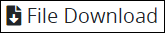
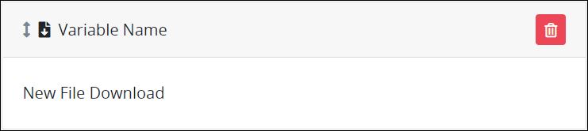
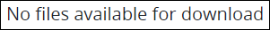

# File Download Control Settings

## Control Description

The File Download control adds an area in the ProcessMaker [Screen](../../what-is-a-form.md) from which the [Request](../../../../using-processmaker/requests/what-is-a-request.md) participant can download a file to a local computer that was attached to the Request via a [File Upload](file-upload-control-settings.md) control in a different Screen in that Request.

## Add the Control to a ProcessMaker Screen 


Your ProcessMaker user account or group membership must have the following permissions to add a control to a ProcessMaker Screen unless your user account has the **Make this user a Super Admin** setting selected:

* Screens: View Screens
* Screens: Edit Screens

See the ProcessMaker [Screens](../../../../processmaker-administration/permission-descriptions-for-users-and-groups.md#screens) permissions or ask your ProcessMaker Administrator for assistance.


Follow these steps to add this control to the ProcessMaker Screen:

1. [Create a new ProcessMaker Screen](../../manage-forms/create-a-new-form.md) or click the **Edit** iconto edit the selected Screen. The ProcessMaker Screen is in [Design mode](../screens-builder-modes.md#editor-mode).
2. View the ProcessMaker Screen page to which to add the control.
3. Locate the **File Download** iconin the panel to the left of the Screens Builder canvas.
4. Drag the **File Download** icon into the Screens Builder canvas. Existing controls on the Screens Builder canvas adjust positioning based on where you drag the control.
5. Place into the Screens Builder canvas where you want the control to display on the ProcessMaker Screen.  

   

6. Configure the File Download control. See [Settings](file-download-control-settings.md#inspector-settings).

Below is a File Download control in [Preview mode](../screens-builder-modes.md#preview-mode). The File Download control displays **No files available for download** until this control references a downloadable file in the Process or during a Process's Request.

## Delete the Control from a ProcessMaker Screen


Deleting a control also deletes configuration for that control. If you add another control, it will have default settings.


Click the **Delete** iconfor the control to delete it.

## Settings 


Your user account or group membership must have the following permissions to edit a ProcessMaker Screen control:

* Screens: View Screens
* Screens: Edit Screens

See the ProcessMaker [Screens](../../../../processmaker-administration/permission-descriptions-for-users-and-groups.md#screens) permissions or ask your ProcessMaker Administrator for assistance.


The File Download control has the following panels that contain settings:

* \*\*\*\*[**Variable** panel](file-download-control-settings.md#variable-panel-settings)
* \*\*\*\*[**Configuration** panel](file-download-control-settings.md#configuration-panel-settings)
* \*\*\*\*[**Design** panel](file-download-control-settings.md#design-panel-settings)
* \*\*\*\*[**Advanced** panel](file-download-control-settings.md#advanced-panel-settings)

### Variable Panel Settings

Click the control while in [Design](../screens-builder-modes.md#design-mode) mode, and then click the **Variable** panel that is on the right-side of the Screens Builder canvas.

Below are settings for the File Download control in the **Variable** panel:

* **Variable Name:** Enter the **Variable Name** setting value from a [File Upload](file-upload-control-settings.md) control to reference the file uploaded through that control within a different ProcessMaker Screen; during a Request, a file is attached to a different ProcessMaker Screen via a File Upload control. Use the **Variable Name** value in the following other ways:

  * Reference this control by its **Variable Name** setting's value. The **Data Preview** panel in [Preview mode](../screens-builder-modes.md#preview-mode) corresponds with the File Download control's entered datetime with that Image control's **Variable Name** value. In the example below, `FileUploadControl` is the **Variable Name** setting's value.
  * Reference this control's value in a different Screens Builder control. To do so, use mustache syntax and reference this control's **Variable Name** value in the target control. Example: `{{ FileUploadControl }}`.
  * Reference this value in [**Visibility Rule** setting expressions](expression-syntax-components-for-show-if-control-settings.md).

  This is a required setting.

* **Validation Rules:** Enter the validation rules the Request participant must comply with to properly enter a valid value into this control. This setting has no default value. See [Validation Rules for "Validation" Control Settings](validation-rules-for-validation-control-settings.md).

### Configuration Panel Settings

Click the control while in [Design](../screens-builder-modes.md#design-mode) mode, and then click the **Configuration** panel that is on the right-side of the Screens Builder canvas.

Below are settings for the File Download control in the **Configuration** panel:

* **Field Label:** Enter the text label that displays for this control. **New File Download** is the default value.
* **Helper Text:** Enter text that provides additional guidance on this control's use. This setting has no default value.

### Design Panel Settings

Click the control while in [Design](../screens-builder-modes.md#design-mode) mode, and then click the **Design** panel that is on the right-side of the Screens Builder canvas.

Below are settings for the File Download control in the **Design** panel:

* **Text Color:** Select to specify the text color that displays in this control.
* **Background Color:** Select to specify the background color of this control.

### Advanced Panel Settings

Click the control while in [Design](../screens-builder-modes.md#design-mode) mode, and then click the **Advanced** panel that is on the right-side of the Screens Builder canvas.

Below are settings for the File Download control in the **Advanced** panel:

* **Visibility Rule:** Enter an expression that indicates the condition\(s\) under which this control displays. See [Expression Syntax Components for "Visibility Rule" Control Settings](expression-syntax-components-for-show-if-control-settings.md#expression-syntax-components-for-show-if-control-settings). If this setting does not have an expression, then this control displays by default.
* **CSS Selector Name:** Enter the value to represent this control in custom CSS syntax when in [Custom CSS](../add-custom-css-to-a-screen.md#add-custom-css-to-a-processmaker-screen) mode. As a best practice, use the same **CSS Selector Name** value on different controls of the same type to apply the same custom CSS style to all those controls.


Do you need to export this ProcessMaker Screen? Click the **Export Screen** button. See [Export a Screen](../../manage-forms/export-a-screen.md#overview) for more information.


## Related Topics 







































