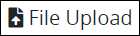
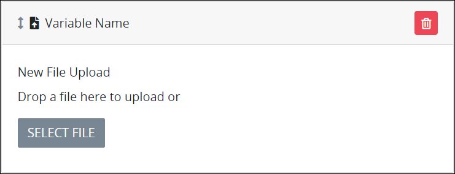
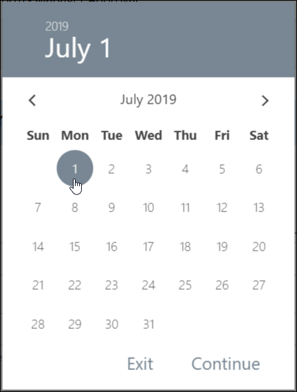

# File Upload Control Settings

## Control Description

The File Upload control adds an area in the ProcessMaker [Screen](../../what-is-a-form.md) to which the [Request](../../../../using-processmaker/requests/what-is-a-request.md) participant can upload one file from a local computer or accessible network location. The Request participant can drag and place the file on the control or select a button from which to locate the file for upload. The uploaded file can be referenced in a later step in a Request.


This control is not available for [Display](../types-for-screens.md#display)-type ProcessMaker Screens. See [Screen Types](../types-for-screens.md).


## Add the Control to a ProcessMaker Screen 


Your ProcessMaker user account or group membership must have the following permissions to add a control to a ProcessMaker Screen unless your user account has the **Make this user a Super Admin** setting selected:

* Screens: View Screens
* Screens: Edit Screens

See the ProcessMaker [Screens](../../../../processmaker-administration/permission-descriptions-for-users-and-groups.md#screens) permissions or ask your ProcessMaker Administrator for assistance.


Follow these steps to add this control to the ProcessMaker Screen:

1. [Create a new ProcessMaker Screen](../../manage-forms/create-a-new-form.md) or click the **Edit** iconto edit the selected Screen. The ProcessMaker Screen is in [Design mode](../screens-builder-modes.md#editor-mode).
2. View the ProcessMaker Screen page to which to add the control.
3. Locate the **File Upload** iconin the panel to the left of the Screen Builder canvas.
4. Drag the **File Upload** icon into the Screen Builder canvas. Existing controls on the Screen Builder canvas adjust positioning based on where you drag the control.
5. Place into the Screen Builder canvas where you want the control to display on the ProcessMaker Screen.  

   

6. Configure the File Upload control. See [Settings](file-upload-control-settings.md#inspector-settings).

Below is a File Upload control in [Preview mode](../screens-builder-modes.md#preview-mode).

## Delete the Control from a ProcessMaker Screen


Deleting a control also deletes configuration for that control. If you add another control, it will have default settings.


Click the **Delete** iconfor the control to delete it.

## Settings 


### Permissions Required

Your user account or group membership must have the following permissions to edit a ProcessMaker Screen control:

* Screens: View Screens
* Screens: Edit Screens

See the ProcessMaker [Screens](../../../../processmaker-administration/permission-descriptions-for-users-and-groups.md#screens) permissions or ask your ProcessMaker Administrator for assistance.

### Topic Update

This topic is updated for ProcessMaker version 4.0.1. See the [Release Notes](https://processmaker.gitbook.io/processmaker-release-notes/processmaker-4.0.x/processmaker-4.0.1-release-notes#screen-builder-1).


The File Upload control has the following panels that contain settings:

* \*\*\*\*[**Variable** panel](file-upload-control-settings.md#variable-panel-settings)
* \*\*\*\*[**Configuration** panel](file-upload-control-settings.md#configuration-panel-settings)
* \*\*\*\*[**Advanced** panel](file-upload-control-settings.md#advanced-panel-settings)

### Variable Panel Settings

Click the control while in [Design](../screens-builder-modes.md#design-mode) mode, and then click the **Variable** panel that is on the right-side of the Screen Builder canvas.

Below are settings for the File Upload control in the **Variable** panel:

* [Variable Name](file-upload-control-settings.md#variable-name)
* [Label](file-upload-control-settings.md#label)

#### Variable Name

Edit the default **Variable Name** setting value for this control if necessary. The **Variable Name** setting value represents data in this control during [Requests](../../../../using-processmaker/requests/what-is-a-request.md). Ensure that the **Variable Name** setting value is a unique name from other controls in this [ProcessMaker Screen](../../what-is-a-form.md) and contains at least one letter. Use the **Variable Name** setting value in the following ways:

* Reference this control by its **Variable Name** setting's value. The **Data Preview** panel in [Preview mode](../screens-builder-modes.md#preview-mode) corresponds with the File Upload control's entered datetime with that Image control's **Variable Name** value. In the example below, `FileUploadControl` is the **Variable Name** setting's value.  
* Reference this control's value in a different Screen Builder control. To do so, use [mustache syntax](https://mustache.github.io/mustache.5.html) and reference this control's **Variable Name** value in the target control. Example: `{{ FileUploadControl }}`.
* Reference this value in [**Visibility Rule** setting expressions](expression-syntax-components-for-show-if-control-settings.md).

This is a required setting.

#### Label

Edit the default label that displays for this control if necessary. **New File Upload** is the default value.

### Configuration Panel Settings

Click the control while in [Design](../screens-builder-modes.md#design-mode) mode, and then click the **Configuration** panel that is on the right-side of the Screen Builder canvas.

Below is the setting for the File Upload control in the **Configuration** panel:

* [File Accepted](file-upload-control-settings.md#file-accepted)

#### File Accepted

Enter the file type\(s\) this control accepts to upload by referencing its [MIME type](https://en.wikipedia.org/wiki/Media_type#Common_examples). Separate multiple file types with commas \(`,`\). One space after each comma is acceptable. Example: `application/msword, image/gif, image/jpeg, application/pdf, application/vnd.ms-powerpoint, application/vnd.ms-excel, text/plain`

### Advanced Panel Settings

Click the control while in [Design](../screens-builder-modes.md#design-mode) mode, and then click the **Advanced** panel that is on the right-side of the Screen Builder canvas.

Below are settings for the File Upload control in the **Advanced** panel:

* [Visibility Rule](file-upload-control-settings.md#visibility-rule)
* [CSS Selector Name](file-upload-control-settings.md#css-selector-name)

#### Visibility Rule

Specify an expression that indicates the condition\(s\) under which this control displays. See [Expression Syntax Components for "Visibility Rule" Control Settings](expression-syntax-components-for-show-if-control-settings.md#expression-syntax-components-for-show-if-control-settings). If this setting does not have an expression, then this control displays by default.

#### CSS Selector Name

Enter the value to represent this control in custom CSS syntax when in [Custom CSS](../add-custom-css-to-a-screen.md#add-custom-css-to-a-processmaker-screen) mode. As a best practice, use the same **CSS Selector Name** value on different controls of the same type to apply the same custom CSS style to all those controls.

## Related Topics 



































