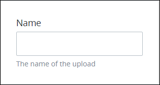
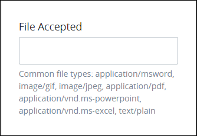

# File Upload Control Settings

## Control Description

The File Upload control adds an area in the ProcessMaker [Screen](../../what-is-a-form.md) to which the [Request](../../../../using-processmaker/requests/what-is-a-request.md) participant can upload one file from a local computer or accessible network location. The Request participant can drag and place the file on the control or select a button from which to locate the file for upload. The uploaded file can be referenced in a later step in a Request.

When a file is uploaded to a ProcessMaker Screen during an in-progress Request, then submitted, that file can be downloaded from the [**Files** tab in that Request's summary](../../../../using-processmaker/requests/request-details/summary-for-in-progress-requests.md#files-associated-with-the-request). The file remains available from that Request's summary regardless of that Request's status.


This control is not available for [Display](../types-for-screens.md#display)-type ProcessMaker Screens. See [Screen Types](../types-for-screens.md).


## Add the Control to a ProcessMaker Screen 


Your ProcessMaker user account or group membership must have the following permissions to add a control to a ProcessMaker Screen unless your user account has the **Make this user a Super Admin** setting selected:

* Screens: Edit Screens
* Screens: View Screens

See the ProcessMaker [Screens](../../../../processmaker-administration/permission-descriptions-for-users-and-groups.md#screens) permissions or ask your ProcessMaker Administrator for assistance.


Follow these steps to add this control to the [ProcessMaker Screen](../../what-is-a-form.md):

1. [Create a new ProcessMaker Screen](../../manage-forms/create-a-new-form.md) or click the **Edit** iconto edit the selected Screen. The ProcessMaker Screen is in [Design mode](../screens-builder-modes.md#editor-mode).
2. View the ProcessMaker Screen page to which to add the control.
3. Locate the **File Upload** iconin the panel to the left of the Screen Builder canvas.
4. Drag the **File Upload** icon into the Screen Builder canvas. Existing controls on the Screen Builder canvas adjust positioning based on where you drag the control.
5. Place into the Screen Builder canvas where you want the control to display on the ProcessMaker Screen.  

   

6. Configure the File Upload control. See [Settings](file-upload-control-settings.md#inspector-settings).

Below is a File Upload control in [Preview mode](../screens-builder-modes.md#preview-mode).

## Move the Control on the Page


Your ProcessMaker user account or group membership must have the following permissions to move a control in a ProcessMaker Screen page unless your user account has the **Make this user a Super Admin** setting selected:

* Screens: Edit Screens
* Screens: View Screens

See the ProcessMaker [Screens](../../../../processmaker-administration/permission-descriptions-for-users-and-groups.md#screens) permissions or ask your ProcessMaker Administrator for assistance.


After [adding a control to a ProcessMaker Screen page](file-upload-control-settings.md#add-the-control-to-a-processmaker-screen), you may move it to another location on that page such that it is above or below other controls placed on that page. A control cannot be moved to another [ProcessMaker Screen](../../what-is-a-form.md) page.

Follow these steps to move a control to another location on that ProcessMaker Screen page:

1. Place your cursor anywhere on the control not displaying the **Duplicate Control**or **Delete Control**buttons.
2. Hold your cursor, then drag the control above or below other controls on that ProcessMaker Screen page. Screen Builder previews where the control would display on the page based on how you position the control above or below other controls. If the control cannot be placed in a location because your cursor is above an existing control or too far to the left or right of the page, theicon displays in the preview.
3. Place the control at the location on the page you want it. The other control\(s\) on the page automatically adjust position.

## Copy the Control with its Settings


Your ProcessMaker user account or group membership must have the following permissions to copy a control in a ProcessMaker Screen unless your user account has the **Make this user a Super Admin** setting selected:

* Screens: Edit Screens
* Screens: View Screens

See the ProcessMaker [Screens](../../../../processmaker-administration/permission-descriptions-for-users-and-groups.md#screens) permissions or ask your ProcessMaker Administrator for assistance.


Copying a control also copies the current settings of that control. The copied control displays below other controls placed on that [ProcessMaker Screen](../../what-is-a-form.md) page.


As a best practice, after copying a control, change the [**Variable Name** setting](file-upload-control-settings.md#variable-name) value for the copied control to its own unique variable value. Otherwise, in-progress [Requests](../../../../using-processmaker/requests/what-is-a-request.md) that use this ProcessMaker Screen read from and send data to both controls.


Follow these steps to copy a control:

1. Select the control to be copied.
2. Click the **Duplicate Control** button. The control copies with its current settings, and then displays below other controls placed on that page.

## Delete the Control from a ProcessMaker Screen


Your ProcessMaker user account or group membership must have the following permissions to delete a control from a ProcessMaker Screen unless your user account has the **Make this user a Super Admin** setting selected:

* Screens: Edit Screens
* Screens: View Screens

See the ProcessMaker [Screens](../../../../processmaker-administration/permission-descriptions-for-users-and-groups.md#screens) permissions or ask your ProcessMaker Administrator for assistance.



Deleting a control also deletes configuration for that control. If you add another control, it will have default settings.


Follow these steps to delete a control from a [ProcessMaker Screen](../../what-is-a-form.md) page:

1. Select the control to be deleted.
2. Click the **Delete** button. The control deletes. Other controls on that ProcessMaker Screen page adjust their locations automatically.

## Settings 


### Permissions Required

Your user account or group membership must have the following permissions to edit a ProcessMaker Screen control:

* Screens: Edit Screens
* Screens: View Screens

See the ProcessMaker [Screens](../../../../processmaker-administration/permission-descriptions-for-users-and-groups.md#screens) permissions or ask your ProcessMaker Administrator for assistance.

### Topic Update

This topic is updated for ProcessMaker version 4.0.1. See the [Release Notes](https://processmaker.gitbook.io/processmaker-release-notes/processmaker-4.0.x/processmaker-4.0.1-release-notes#screen-builder-1).


The File Upload control has the following panels that contain settings:

* \*\*\*\*[**Variable** panel](file-upload-control-settings.md#variable-panel-settings)
* \*\*\*\*[**Configuration** panel](file-upload-control-settings.md#configuration-panel-settings)
* \*\*\*\*[**Advanced** panel](file-upload-control-settings.md#advanced-panel-settings)

### Variable Panel Settings

Click the control while in [Design](../screens-builder-modes.md#design-mode) mode, and then click the **Variable** panel that is on the right-side of the Screen Builder canvas.

Below are settings for the File Upload control in the **Variable** panel:

* [Name](file-upload-control-settings.md#name)
* [Label](file-upload-control-settings.md#label)

#### Name

Enter the name of the uploaded file. This setting has no default value.  
 

#### Label

Edit the default label that displays for this control if necessary. **New File Upload** is the default value.  
 

### Configuration Panel Settings

Click the control while in [Design](../screens-builder-modes.md#design-mode) mode, and then click the **Configuration** panel that is on the right-side of the Screen Builder canvas.

Below is the setting for the File Upload control in the **Configuration** panel:

* [File Accepted](file-upload-control-settings.md#file-accepted)

#### File Accepted

Enter the file type\(s\) this control accepts to upload by referencing its [MIME type](https://en.wikipedia.org/wiki/Media_type#Common_examples).  
 

Separate multiple file types with commas \(`,`\). One space after each comma is acceptable. Example: `application/msword, image/gif, image/jpeg, application/pdf, application/vnd.ms-powerpoint, application/vnd.ms-excel, text/plain`

### Advanced Panel Settings

Click the control while in [Design](../screens-builder-modes.md#design-mode) mode, and then click the **Advanced** panel that is on the right-side of the Screen Builder canvas.

Below are settings for the File Upload control in the **Advanced** panel:

* [Visibility Rule](file-upload-control-settings.md#visibility-rule)
* [CSS Selector Name](file-upload-control-settings.md#css-selector-name)

#### Visibility Rule

Specify an expression that indicates the condition\(s\) under which this control displays. See [Expression Syntax Components for "Visibility Rule" Control Settings](expression-syntax-components-for-show-if-control-settings.md#expression-syntax-components-for-show-if-control-settings). If this setting does not have an expression, then this control displays by default.  
 


To make this control hidden until another control contains a value, enter the **Variable Name** setting value of that control to this control's **Visibility Rule** setting.


#### CSS Selector Name

Enter the value to represent this control in custom CSS syntax when in [Custom CSS](../add-custom-css-to-a-screen.md#add-custom-css-to-a-processmaker-screen) mode. As a best practice, use the same **CSS Selector Name** value on different controls of the same type to apply the same custom CSS style to all those controls.  
 

## Related Topics 







































