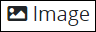
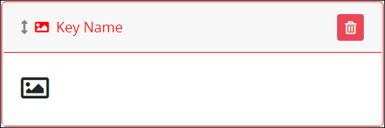

# Image Control Settings

## Control Description

The Image control displays an image that is PNG, GIF, or JPG file types.

## Add the Control to a ProcessMaker Screen


Your ProcessMaker user account or group membership must have the following permissions to add a control to a ProcessMaker Screen unless your user account has the **Make this user a Super Admin** setting selected:

* Screens: View Screens
* Screens: Edit Screens

See the ProcessMaker [Screens](../../../../processmaker-administration/permission-descriptions-for-users-and-groups.md#screens) permissions or ask your ProcessMaker Administrator for assistance.


Follow these steps to add this control to the ProcessMaker Screen:

1. [Create a new ProcessMaker Screen](../../manage-forms/create-a-new-form.md) or click the **Edit** iconto edit the selected Screen. The ProcessMaker Screen is in [Design mode](../screens-builder-modes.md#editor-mode).
2. View the ProcessMaker Screen page to which to add the control.
3. Locate the **Image** iconin the panel to the left of the Screens Builder canvas.
4. Drag the **Image** icon into the Screens Builder canvas. Existing controls on the Screens Builder canvas adjust positioning based on where you drag the control.
5. Place into the Screens Builder canvas where you want the control to display on the ProcessMaker Screen.  

   

6. Configure the Image control. See [Settings](image-control-settings.md#settings).
7. Validate that the control is configured correctly. See [Validate Your Screen](../validate-your-screen.md#validate-a-processmaker-screen).

Below is an Image control in [Preview mode](../screens-builder-modes.md#preview-mode).

## Delete the Control from a ProcessMaker Screen


Deleting a control also deletes configuration for that control. If you add another control, it will have default settings.


Click the **Delete** iconfor the control to delete it.

## Settings


Your user account or group membership must have the following permissions to edit a ProcessMaker Screen control:

* Screens: View Screens
* Screens: Edit Screens

See the ProcessMaker [Screens](../../../../processmaker-administration/permission-descriptions-for-users-and-groups.md#screens) permissions or ask your ProcessMaker Administrator for assistance.


The Image control has the following panels that contain settings:

* \*\*\*\*[**Configuration** panel](image-control-settings.md#configuration-panel-settings)
* \*\*\*\*[**Design** panel](image-control-settings.md#design-panel-settings)
* \*\*\*\*[**Advanced** panel](image-control-settings.md#advanced-panel-settings)

### Configuration Panel Settings

Click the control while in [Design](../screens-builder-modes.md#design-mode) mode, and then click the **Configuration** panel that is on the right-side of the Screens Builder canvas.

Below are settings for the Image control in the **Configuration** panel:

* **Name:** Enter the alphanumeric name that identifies the image in the ProcessMaker Screen.
* **Upload Image:** Click the **Upload** button to browse for the PNG, GIF, or JPG file type image to upload to the Image control.
* **Preview:** This setting displays a preview of the uploaded image.
* **Helper Text:** Enter text that provides additional guidance on this control's use. This setting has no default value.

### Design Panel Settings

Click the control while in [Design](../screens-builder-modes.md#design-mode) mode, and then click the **Design** panel that is on the right-side of the Screens Builder canvas.

Below are settings for the Image control in the **Design** panel:

* **Height:** Specify the width of the uploaded image in pixels. If the **Width** setting has no value, the Image control adjusts the uploaded image to the **Height** setting value.
* **Width:** Specify the width of the uploaded image in pixels. If the **Height** setting has no value, the Image control adjusts the uploaded image to the **Width** setting value.

### Advanced Panel Settings

Click the control while in [Design](../screens-builder-modes.md#design-mode) mode, and then click the **Advanced** panel that is on the right-side of the Screens Builder canvas.

Below are settings for the Image control in the **Advanced** panel:

* **Visibility Rule:** Enter an expression that indicates the condition\(s\) under which this control displays. See [Expression Syntax Components for "Visibility Rule" Control Settings](expression-syntax-components-for-show-if-control-settings.md#expression-syntax-components-for-show-if-control-settings). If this setting does not have an expression, then this control displays by default.
* **CSS Selector Name:** Enter the value to represent this control in custom CSS syntax when in [Custom CSS](../add-custom-css-to-a-screen.md#add-custom-css-to-a-processmaker-screen) mode. As a best practice, use the same **CSS Selector Name** value on different controls of the same type to apply the same custom CSS style to all those controls.

## Related Topics 











































