# Line Input Control Settings

## Control Description


This topic is updated for ProcessMaker version 4.0.1. See the [Release Notes](https://processmaker.gitbook.io/processmaker-release-notes/processmaker-4.0.x/processmaker-4.0.1-release-notes#screen-builder-1).


The Line Input control is a text field that the [Request](../../../../using-processmaker/requests/what-is-a-request.md) participant can enter information. Configure the Line Input control to accept one of the following data types:

* **Text:** The control only accepts alphanumeric characters.
* **Integer:** The control only accepts integers. 
* **Currency:** The control only accepts a currency value.
* **Percentage:** The control only accepts a percentage value.
* **Decimal:** The control only accepts any number, both positive and negative.
* **Datetime:** The control only accepts a datetime, which is includes both date and time components.
* **Date:** The control only accepts a date.
* **Password:** The control accepts a password. Entered text is hidden.


This control is not available for [Display](../types-for-screens.md#display)-type ProcessMaker Screens. See [Screen Types](../types-for-screens.md).


## Add the Control to a ProcessMaker Screen


Your ProcessMaker user account or group membership must have the following permissions to add a control to a ProcessMaker Screen unless your user account has the **Make this user a Super Admin** setting selected:

* Screens: Edit Screens
* Screens: View Screens

See the ProcessMaker [Screens](../../../../processmaker-administration/permission-descriptions-for-users-and-groups.md#screens) permissions or ask your ProcessMaker Administrator for assistance.


Follow these steps to add this control to the [ProcessMaker Screen](../../what-is-a-form.md):

1. [Create a new ProcessMaker Screen](../../manage-forms/create-a-new-form.md) or click the **Edit** iconto edit the selected Screen. The ProcessMaker Screen is in [Design mode](../screens-builder-modes.md#editor-mode).
2. View the ProcessMaker Screen page to which to add the control.
3. Locate the **Line Input** icon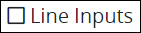in the panel to the left of the Screen Builder canvas.
4. Drag the **Line Input** icon into the Screen Builder canvas. Existing controls on the Screen Builder canvas adjust positioning based on where you drag the control.
5. Place into the Screen Builder canvas where you want the control to display on the ProcessMaker Screen.  

   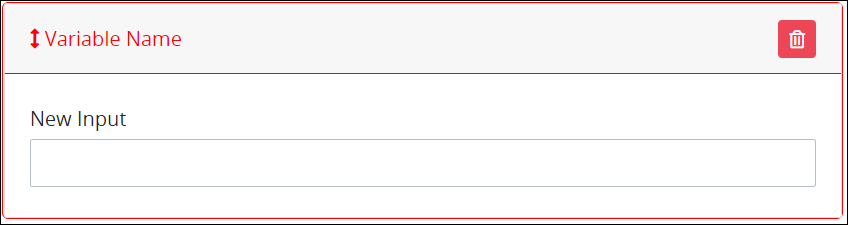

6. Configure the Line Input control. See [Settings](line-input-control-settings.md#settings).
7. Validate that the control is configured correctly. See [Validate Your Screen](../validate-your-screen.md#validate-a-processmaker-screen).

Below is a Line Input control in [Preview mode](../screens-builder-modes.md#preview-mode).

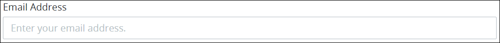

## Move the Control on the Page


Your ProcessMaker user account or group membership must have the following permissions to move a control in a ProcessMaker Screen page unless your user account has the **Make this user a Super Admin** setting selected:

* Screens: Edit Screens
* Screens: View Screens

See the ProcessMaker [Screens](../../../../processmaker-administration/permission-descriptions-for-users-and-groups.md#screens) permissions or ask your ProcessMaker Administrator for assistance.


After [adding a control to a ProcessMaker Screen page](line-input-control-settings.md#add-the-control-to-a-processmaker-screen), you may move it to another location on that page such that it is above or below other controls placed on that page. A control cannot be moved to another [ProcessMaker Screen](../../what-is-a-form.md) page.

Follow these steps to move a control to another location on that ProcessMaker Screen page:

1. Place your cursor anywhere on the control not displaying the **Duplicate Control**or **Delete Control**buttons.
2. Hold your cursor, then drag the control above or below other controls on that ProcessMaker Screen page. Screen Builder previews where the control would display on the page based on how you position the control above or below other controls. If the control cannot be placed in a location because your cursor is above an existing control or too far to the left or right of the page, theicon displays in the preview.
3. Place the control at the location on the page you want it. The other control\(s\) on the page automatically adjust position.

## Copy the Control with its Settings


Your ProcessMaker user account or group membership must have the following permissions to copy a control in a ProcessMaker Screen unless your user account has the **Make this user a Super Admin** setting selected:

* Screens: Edit Screens
* Screens: View Screens

See the ProcessMaker [Screens](../../../../processmaker-administration/permission-descriptions-for-users-and-groups.md#screens) permissions or ask your ProcessMaker Administrator for assistance.


Copying a control also copies the current settings of that control. The copied control displays below other controls placed on that [ProcessMaker Screen](../../what-is-a-form.md) page.


As a best practice, after copying a control, change the [**Variable Name** setting](line-input-control-settings.md#variable-name) value for the copied control to its own unique variable value. Otherwise, in-progress [Requests](../../../../using-processmaker/requests/what-is-a-request.md) that use this ProcessMaker Screen read from and send data to both controls.


Follow these steps to copy a control:

1. Select the control to be copied.
2. Click the **Duplicate Control** button. The control copies with its current settings, and then displays below other controls placed on that page.

## Delete the Control from a ProcessMaker Screen


Your ProcessMaker user account or group membership must have the following permissions to delete a control from a ProcessMaker Screen unless your user account has the **Make this user a Super Admin** setting selected:

* Screens: Edit Screens
* Screens: View Screens

See the ProcessMaker [Screens](../../../../processmaker-administration/permission-descriptions-for-users-and-groups.md#screens) permissions or ask your ProcessMaker Administrator for assistance.



Deleting a control also deletes configuration for that control. If you add another control, it will have default settings.


Follow these steps to delete a control from a [ProcessMaker Screen](../../what-is-a-form.md) page:

1. Select the control to be deleted.
2. Click the **Delete** button. The control deletes. Other controls on that ProcessMaker Screen page adjust their locations automatically.

## Settings


### Permissions Required

Your user account or group membership must have the following permissions to edit a ProcessMaker Screen control:

* Screens: Edit Screens
* Screens: View Screens

See the ProcessMaker [Screens](../../../../processmaker-administration/permission-descriptions-for-users-and-groups.md#screens) permissions or ask your ProcessMaker Administrator for assistance.

### Topic Update

This topic is updated for ProcessMaker version 4.0.1. See the [Release Notes](https://processmaker.gitbook.io/processmaker-release-notes/processmaker-4.0.x/processmaker-4.0.1-release-notes#screen-builder-1).


The Line Input control has the following panels that contain settings:

* [**Variable** panel](line-input-control-settings.md#variable-panel-settings)
* \*\*\*\*[**Configuration** panel](line-input-control-settings.md#configuration-panel-settings)
* \*\*\*\*[**Design** panel](line-input-control-settings.md#design-panel-settings)
* \*\*\*\*[**Advanced** panel](line-input-control-settings.md#advanced-panel-settings)

### Variable Panel Settings

Click the control while in [Design](../screens-builder-modes.md#design-mode) mode, and then click the **Variable** panel that is on the right-side of the Screen Builder canvas.

Below are settings for the Line Input control in the **Variable** panel:

* [Variable Name](line-input-control-settings.md#variable-name)
* [Label](line-input-control-settings.md#label)
* [Data Type](line-input-control-settings.md#data-type)
* [Validation Rules](line-input-control-settings.md#validation-rules)
* [Read Only](line-input-control-settings.md#read-only)

#### Variable Name

Edit the default **Variable Name** setting value for this control if necessary. The **Variable Name** setting value represents data in this control during [Requests](../../../../using-processmaker/requests/what-is-a-request.md). Ensure that the **Variable Name** setting value is a unique name from other controls in this [ProcessMaker Screen](../../what-is-a-form.md) and contains at least one letter. This is a required setting.  
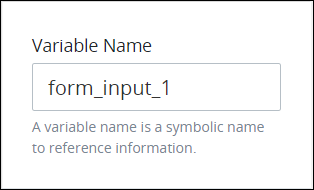 

Use the **Variable Name** setting value in the following ways:

* Reference this control by its **Variable Name** setting's value. The **Data Preview** panel in [Preview mode](../screens-builder-modes.md#preview-mode) corresponds the Line Input control's textual content with that Line Input control's **Variable Name** value. In the example below, `LineInputControl` is the **Variable Name** setting's value. 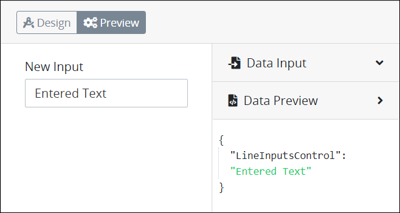 
* Reference this control's value in a different Screen Builder control. To do so, use [mustache syntax](https://mustache.github.io/mustache.5.html) and reference this control's **Variable Name** value in the target control. Example: `{{ LineInputControl }}`.
* Reference this value in [**Visibility Rule** setting expressions](expression-syntax-components-for-show-if-control-settings.md).

#### Label

Edit the default label that displays for this control if necessary. **New Input** is the default value.  
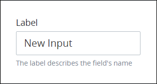 

#### Data Type

Select one of the following data type options this control accepts when the Request participant enters content into this control:

* **Text:** The control only accepts alphanumeric characters. **Text** is the default setting.
* **Integer:** The control only accepts integers. 
* **Currency:** The control only accepts a currency value.
* **Percentage:** The control only accepts a percentage value.
* **Decimal:** The control only accepts any number, both positive and negative.
* **Datetime:** The control only accepts a datetime, which is includes both date and time components.
* **Date:** The control only accepts a date.
* **Password:** The control accepts a password. Entered text is hidden.

This is a required setting.  
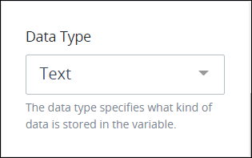 

The following message displays below the control if the Request participant enters content that does not comply with this control's data type: **The format is invalid.**.

#### Validation Rules

Enter the validation rule\(s\) the Request participant must comply with to properly enter a valid value into this control. This setting has no default value. If there are no configured validation rules the following message displays: **No validation rule\(s\)**. See [Validation Rules for "Validation" Control Settings](validation-rules-for-validation-control-settings.md).  
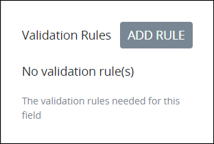 

Follow these steps to add a validation rule to this control:

1. Access the [**Variable** panel for this control](line-input-control-settings.md#variable-panel-settings) while in [Design](../screens-builder-modes.md#design-mode) mode, and then locate the **Validation Rules** setting.
2. Click the **Add Rule** button. The **Select** drop-down menu displays. 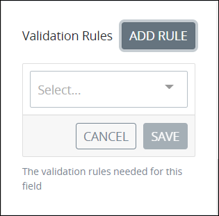 
3. Select the rule that this control validates against.
4. Click **Save**. Parameters for the selected rule display. Parameter settings display which ones are required to properly configure the rule.
5. Enter the parameter settings that this control uses to validate against. See [Validation Rule Settings](validation-rules-for-validation-control-settings.md#validation-rule-settings), and then locate the validation rule for its parameters.

Follow these steps to edit a validation rule for this control:

1. Access the [**Variable** panel for this control](line-input-control-settings.md#variable-panel-settings) while in [Design](../screens-builder-modes.md#design-mode) mode, and then locate the **Validation Rules** setting.
2. Click the **Edit** iconfor the validation rule to edit if that rule can be edited. Validation rules that do not have parameters cannot be edited. The parameter settings for that validation rule displays.
3. Edit the parameter settings that this control uses to validate against. See [Validation Rule Settings](validation-rules-for-validation-control-settings.md#validation-rule-settings), and then locate the validation rule for its parameters.

Follow these steps to delete a validation rule for this control:

1. Access the [**Variable** panel for this control](line-input-control-settings.md#variable-panel-settings) while in [Design](../screens-builder-modes.md#design-mode) mode, and then locate the **Validation Rules** setting.
2. Click the **Delete** iconfor the validation rule to delete. A message displays to confirm deletion of the validation rule.
3. Click **Delete**.

#### Read Only

Select to indicate that this control cannot be edited. This option is not selected by default.  
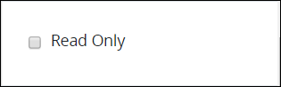 

### Configuration Panel Settings

Click the control while in [Design](../screens-builder-modes.md#design-mode) mode, and then click the **Configuration** panel that is on the right-side of the Screen Builder canvas.

Below are settings for the Line Input control in the **Configuration** panel:

* [Placeholder Text](line-input-control-settings.md#placeholder-text)
* [Helper Text](line-input-control-settings.md#helper-text)

#### Placeholder Text

Enter the placeholder text that displays in this control when no value has been provided. This setting has no default value.  
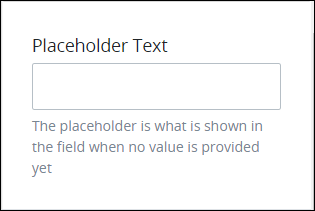 

#### Helper Text

Enter text that provides additional guidance on this control's use. This setting has no default value.  
 

### Design Panel Settings

Click the control while in [Design](../screens-builder-modes.md#design-mode) mode, and then click the **Design** panel that is on the right-side of the Screen Builder canvas.

Below are settings for the Line Input control in the **Design** panel:

* [Text Color](line-input-control-settings.md#text-color)
* [Background Color](line-input-control-settings.md#background-color)

#### Text Color

Select the text color that displays for this control. Optionally, click the **Clear Color Selection** option to remove the selected color.  
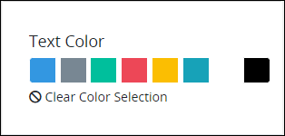 

#### Background Color

Select the background color that displays for this control. Optionally, click the **Clear Color Selection** option to remove the selected color.  
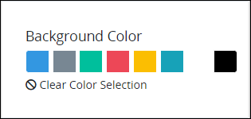 

### Advanced Panel Settings

Click the control while in [Design](../screens-builder-modes.md#design-mode) mode, and then click the **Advanced** panel that is on the right-side of the Screen Builder canvas.

Below are settings for the Line Input control in the **Advanced** panel:

* [Default Value](line-input-control-settings.md#default-value)
* [Visibility Rule](line-input-control-settings.md#visibility-rule)
* [CSS Selector Name](line-input-control-settings.md#css-selector-name)

#### Default Value


### Topic Update

This topic is updated for ProcessMaker version 4.0.1. See the [Release Notes](https://processmaker.gitbook.io/processmaker-release-notes/processmaker-4.0.x/processmaker-4.0.1-release-notes#screen-builder).


Enter the default value this control displays. If the **Default Value** setting has no value, then this control does not display a value when the ProcessMaker Screen displays. When the ProcessMaker Screen submits, the Request uses this control's default value unless the Request participant changed it.  
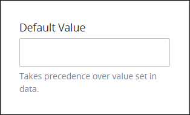 

#### Visibility Rule

Specify an expression that indicates the condition\(s\) under which this control displays. See [Expression Syntax Components for "Visibility Rule" Control Settings](expression-syntax-components-for-show-if-control-settings.md#expression-syntax-components-for-show-if-control-settings). If this setting does not have an expression, then this control displays by default.  
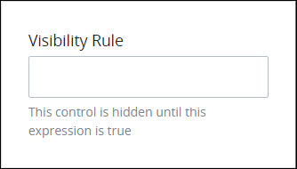 


To make this control hidden until another control contains a value, enter the **Variable Name** setting value of that control to this control's **Visibility Rule** setting.


#### CSS Selector Name

Enter the value to represent this control in custom CSS syntax when in [Custom CSS](../add-custom-css-to-a-screen.md#add-custom-css-to-a-processmaker-screen) mode. As a best practice, use the same **CSS Selector Name** value on different controls of the same type to apply the same custom CSS style to all those controls.  
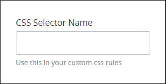 

## Related Topics











































