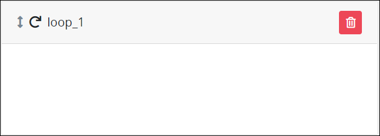
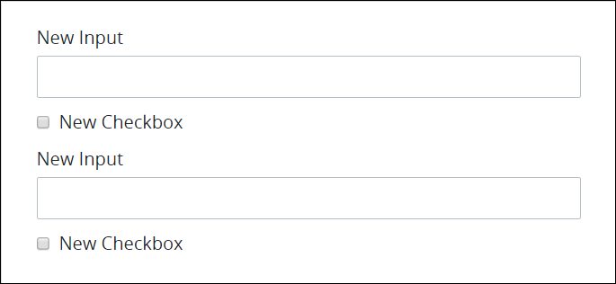

# Loop Control Settings

## Control Description


### New Topic

This topic is new for ProcessMaker version 4.0.1. See the [Release Notes](https://processmaker.gitbook.io/processmaker-release-notes/processmaker-4.0.x/processmaker-4.0.1-release-notes#screen-builder-1).


The Loop control contains one or more [ProcessMaker Screen](../../what-is-a-form.md) controls that during a [Request](../../../../using-processmaker/requests/what-is-a-request.md) loop a set number of times, thereby allowing the Request participant to enter multiple items, each of which require multiple pieces of information.

For example, use a Loop control when a university registrar's office must enter the following information for each new university student enrolling to the university:

| Information | ProcessMaker Screen Control |
| :--- | :--- |
| First Name | [Line Input](line-input-control-settings.md) control |
| Last Name | Line Input control |
| Age | Line Input control |
| Sex | [Select List](select-list-control-settings.md) control |
| Housing Dormitory | Select List control |

During the in-progress Request, the Loop control displays the set of controls contained in the Loop control a specified number of times so that the university registrar's office may enter the same information for each new student from one ProcessMaker Screen page. The [Submit Button](submit-button-control-settings.md) control to submit the ProcessMaker Screen must be placed outside of the Loop control. Otherwise, a Submit Button control displays in each set of controls placed into the Loop control.

Do not place another Loop control inside the first Loop control.


This control is not available for [Display](../types-for-screens.md#display)-type ProcessMaker Screens. See [Screen Types](../types-for-screens.md).


## Add the Control to a ProcessMaker Screen 


Your ProcessMaker user account or group membership must have the following permissions to add a control to a ProcessMaker Screen unless your user account has the **Make this user a Super Admin** setting selected:

* Screens: View Screens
* Screens: Edit Screens

See the ProcessMaker [Screens](../../../../processmaker-administration/permission-descriptions-for-users-and-groups.md#screens) permissions or ask your ProcessMaker Administrator for assistance.


Follow these steps to add this control to the ProcessMaker Screen:

1. [Create a new ProcessMaker Screen](../../manage-forms/create-a-new-form.md) or click the **Edit** iconto edit the selected Screen. The ProcessMaker Screen is in [Design mode](../screens-builder-modes.md#editor-mode).
2. View the ProcessMaker Screen page to which to add the control.
3. Locate the **Loop** iconin the panel to the left of the Screen Builder canvas.
4. Drag the **Loop** icon into the Screen Builder canvas. Existing controls on the Screens Builder canvas adjust positioning based on where you drag the control.
5. Place into the Screen Builder canvas where you want the control to display on the ProcessMaker Screen.  
6. Configure the Loop control. See [Settings](page-navigation-button-control-settings.md#inspector-settings).
7. Drag and place the ProcessMaker Screen control\(s\) into the Loop control that you intend the Request participant to enter information each time the Loop control repeats. As a best practice, do not do the following:

   * Do not place a [Submit Button](submit-button-control-settings.md) control inside the Loop control.
   * Do not place another Loop control inside the first Loop control.

   See [Control Description](loop-control-settings.md#control-description) for an example.

8. Configure each control placed into the Loop control.
9. Validate that the control is configured correctly. See [Validate Your Screen](../validate-your-screen.md#validate-a-processmaker-screen).

Below is a Loop control in [Preview mode](../screens-builder-modes.md#preview-mode).

## Delete the Control from a ProcessMaker Screen


Deleting a control also deletes configuration for that control. If you add another control, it will have default settings.


Click the **Delete** iconfor the control to delete it.

## Settings 


### Permissions Required

Your user account or group membership must have the following permissions to edit a ProcessMaker Screen control:

* Screens: View Screens
* Screens: Edit Screens

See the ProcessMaker [Screens](../../../../processmaker-administration/permission-descriptions-for-users-and-groups.md#screens) permissions or ask your ProcessMaker Administrator for assistance.

### New Topic

This topic is new for ProcessMaker version 4.0.1. See the [Release Notes](https://processmaker.gitbook.io/processmaker-release-notes/processmaker-4.0.x/processmaker-4.0.1-release-notes#screen-builder-1).


The Loop control has the following panels that contain settings:

* \*\*\*\*[**Variable** panel](page-navigation-button-control-settings.md#variable-panel-settings)
* \*\*\*\*[**Configuration** panel](page-navigation-button-control-settings.md#configuration-panel-settings)
* \*\*\*\*[**Design** panel](page-navigation-button-control-settings.md#design-panel-settings)
* \*\*\*\*[**Advanced** panel](page-navigation-button-control-settings.md#advanced-panel-settings)

