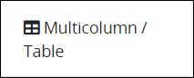
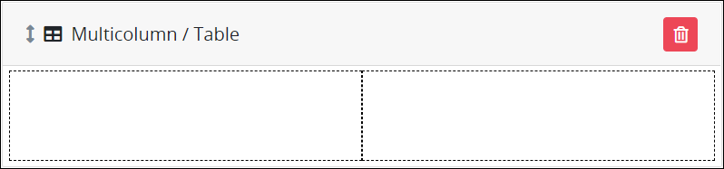
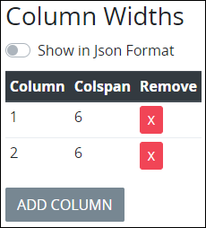
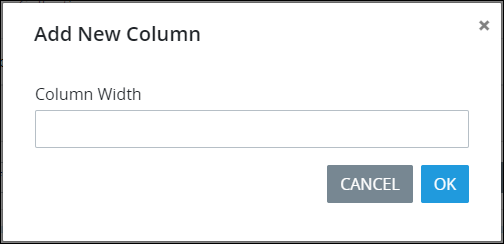

# Multicolumn / Table Control Settings

## Control Description 

The Multicolumn / Table control adds a layout element with two or more columns. Drag and place other controls into any of the columns to display them to the width of the Multicolumn / Table control column.

## Add the Control to a ProcessMaker Screen 


Your ProcessMaker user account or group membership must have the following permissions to add a control to a ProcessMaker Screen unless your user account has the **Make this user a Super Admin** setting selected:

* Screens: View Screens
* Screens: Edit Screens

See the ProcessMaker [Screens](../../../../processmaker-administration/permission-descriptions-for-users-and-groups.md#screens) permissions or ask your ProcessMaker Administrator for assistance.


Follow these steps to add this control to the ProcessMaker Screen:

1. [Create a new ProcessMaker Screen](../../manage-forms/create-a-new-form.md) or click the **Edit** iconto edit the selected Screen. The ProcessMaker Screen is in [Design mode](../screens-builder-modes.md#editor-mode).
2. View the ProcessMaker Screen page to which to add the control.
3. Locate the **Multicolumn / Table** iconin the panel to the left of the Screen Builder canvas.
4. Drag the **Multicolumn / Table** icon into the Screen Builder canvas. Existing controls on the Screens Builder canvas adjust positioning based on where you drag the control.
5. Place into the Screen Builder canvas where you want the control to display on the ProcessMaker Screen.
6. Configure the Multicolumn / Table control. See [Settings](multi-column-button-control-settings.md#inspector-settings).
7. Drag and place others controls into a column. Configure and validate each control's settings.  

Below is a Multicolumn / Table control in [Preview mode](../screens-builder-modes.md#preview-mode).

## Delete the Control from a ProcessMaker Screen


Deleting a control deletes configuration for that control as well as any controls placed into the Multicolumn / Table control. If you add another control, it will have default settings.


Click the **Delete** iconfor the control to delete it.

## Settings 


Your user account or group membership must have the following permissions to edit a ProcessMaker Screen control:

* Screens: View Screens
* Screens: Edit Screens

See the ProcessMaker [Screens](../../../../processmaker-administration/permission-descriptions-for-users-and-groups.md#screens) permissions or ask your ProcessMaker Administrator for assistance.


The Multicolumn / Table control has the following panels that contain settings:

* \*\*\*\*[**Configuration** panel](multi-column-button-control-settings.md#configuration-panel-settings)
* \*\*\*\*[**Design** panel](multi-column-button-control-settings.md#design-panel-settings)
* \*\*\*\*[**Advanced** panel](multi-column-button-control-settings.md#advanced-panel-settings)

### Configuration Panel Settings

Click the control while in [Design](../screens-builder-modes.md#design-mode) mode, and then click the **Configuration** panel that is on the right-side of the Screen Builder canvas.

Below is the setting for the Multicolumn / Table control in the **Configuration** panel:

* [Column Width](multi-column-button-control-settings.md#column-width)

#### Column Width

Specify the column width for each column in the control. Add each column and its width specification in the order they are to display from left to right in the control. Specify the width of each column in `colspan` [HTML attribute](https://www.w3schools.com/tags/att_colspan.asp) settings. The total of all `colspan` attribute settings must be divisible by 12. The control contains two columns of six \(6\) `colspan` HTML attribute setting each by default.

Use the **Show in Json Format** toggle to display these settings in JSON.  
 

Each option has the following settings:

* **Column:** **Column** is the internal designation for the column that only the form designer views at design time.
* **Colspan:** **Colspan** is the width of the column in `colspan` HTML attribute settings.
* **Remove:** Click the Removeicon to remove the column.

Follow these steps to add a column and specify its width: 

1. Click **Add Column** from below the **Column Width** setting. The **Add New Column** screen displays.   

   

2. In the **Column Width** setting, enter the width of the column \(as described above\).
3. Click **OK**. The column displays below the existing columns in **Column Width**.

### Design Panel Settings

Click the control while in [Design](../screens-builder-modes.md#design-mode) mode, and then click the **Design** panel that is on the right-side of the Screen Builder canvas.

Below are settings for the Multicolumn / Table control in the **Design** panel:

* [Text Color](multi-column-button-control-settings.md#text-color)
* [Background Color](multi-column-button-control-settings.md#background-color)

#### Text Color

Select the text color that displays for this control. Optionally, click the **Clear Color Selection** option to remove the selected color.

#### Background Color

Select the background color that displays for this control. Optionally, click the **Clear Color Selection** option to remove the selected color.

### Advanced Panel Settings

Click the control while in [Design](../screens-builder-modes.md#design-mode) mode, and then click the **Advanced** panel that is on the right-side of the Screen Builder canvas.

Below are settings for the Multicolumn / Table control in the **Advanced** panel:

* [Visibility Rule](multi-column-button-control-settings.md#visibility-rule)
* [CSS Selector Name](multi-column-button-control-settings.md#css-selector-name)

#### Visibility Rule

Specify an expression that indicates the condition\(s\) under which this control displays. See [Expression Syntax Components for "Visibility Rule" Control Settings](expression-syntax-components-for-show-if-control-settings.md#expression-syntax-components-for-show-if-control-settings). If this setting does not have an expression, then this control displays by default.

#### CSS Selector Name

Enter the value to represent this control in custom CSS syntax when in [Custom CSS](../add-custom-css-to-a-screen.md#add-custom-css-to-a-processmaker-screen) mode. As a best practice, use the same **CSS Selector Name** value on different controls of the same type to apply the same custom CSS style to all those controls.

## Related Topics 





































