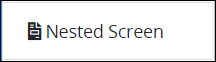
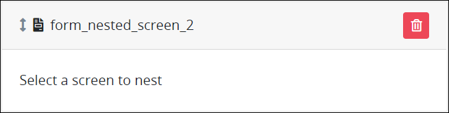
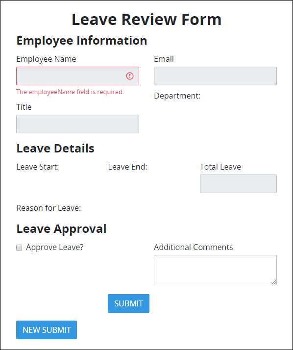

# Nested Screen Control Settings

## Control Description


### Topic Update

This topic is updated for ProcessMaker version 4.0.3 \(see the [Release Notes](https://processmaker.gitbook.io/processmaker-release-notes/processmaker-4.0.x/processmaker-4.0.3-release-notes#screen-builder-1)\) since this control was introduced in ProcessMaker version 4.0.1 \(see the [Release Notes](https://processmaker.gitbook.io/processmaker-release-notes/processmaker-4.0.x/processmaker-4.0.1-release-notes#screen-builder)\).


Use the Nested Screen control to nest a separate [ProcessMaker Screen](../../what-is-a-form.md) into that control. In doing so, the separate ProcessMaker Screen embeds into the Nested Screen control. The Nested Screen control is a placeholder for the embedded ProcessMaker Screen such that the [Request](../../../../using-processmaker/requests/what-is-a-request.md) participant experiences the nested Screen as designed. The nested ProcessMaker Screen must be in the same ProcessMaker instance as that using the Nested Screen control. When the [Task](../../../../using-processmaker/task-management/what-is-a-task.md) loads the ProcessMaker Screen using a Nested Screen control, the Nested Screen loads the latest version of the referenced Screen.

The ProcessMaker Screen containing the Nested Screen control is the parent Screen. The ProcessMaker Screen that is nested is the child Screen.

During an in-progress Requests, both Request and [Magic Variable](../../../reference-global-variables-in-your-processmaker-assets.md) data pass to a child Screen when it displays within the parent Screen. Furthermore, information that is entered into a child ProcessMaker Screen displays in [Request summaries](../../../../using-processmaker/requests/request-details/) that use the parent Screen.

A nested ProcessMaker Screen has the following attributes that vary from how it may have been designed:

* **CSS takes precedent:** Any CSS designed in [Custom CSS mode](../screens-builder-modes.md#custom-css-mode) in the parent ProcessMaker Screen takes precedent over any CSS designed in the child \(nested\) Screens. The Request participant experiences one design experience without a variety of design styles.
* **Submit Button control in nested ProcessMaker Screens is hidden:** During in-progress Requests, the [Submit Button](submit-button-control-settings.md) control is hidden in child ProcessMaker Screens so that the Request participant uses the parent Screen's Submit Button control to submit the Task.
* **Two ProcessMaker Screens cannot reference each other indefinitely:** A child ProcessMaker Screen that has already displayed within a parent ProcessMaker Screen cannot display again in the same Request. This prevents an infinite loop whereby two ProcessMaker Screens using Nested Screen controls reference each other indefinitely.

Any ProcessMaker Screen [type](../types-for-screens.md) may be selected for nesting into a Nested Screen control, including multi-page Screens. However, only [Form](../types-for-screens.md#form)- and [Display](../types-for-screens.md#display)-type ProcessMaker Screens preview in either [Design](../screens-builder-modes.md#design-mode) or [Preview](../screens-builder-modes.md#preview-mode) modes.

ProcessMaker Screen designers can easily build a Screen by placing modular components into one Screen. For example, in a ProcessMaker Screen designed for a purchase request, use Nested Screen controls as placeholders for the following components that are designed in separate Screens. Each of these ProcessMaker Screens are nested into its own Nested Screen control.

* Nested Screen control for Screen 1: Personal information
* Nested Screen control for Screen 2: Payment information
* Nested Screen control for Screen 3: Billing information
* Nested Screen control for Screen 4: Shipping information


This control is not available for [Display](../types-for-screens.md#display)-type ProcessMaker Screens. See [Screen Types](../types-for-screens.md).


## Add the Control to a ProcessMaker Screen 


Your ProcessMaker user account or group membership must have the following permissions to add a control to a ProcessMaker Screen unless your user account has the **Make this user a Super Admin** setting selected:

* Screens: Edit Screens
* Screens: View Screens

See the ProcessMaker [Screens](../../../../processmaker-administration/permission-descriptions-for-users-and-groups.md#screens) permissions or ask your ProcessMaker Administrator for assistance.


Follow these steps to add this control to the [ProcessMaker Screen](../../what-is-a-form.md):

1. [Create a new ProcessMaker Screen](../../manage-forms/create-a-new-form.md) or click the **Edit** iconto edit the selected parent Screen to which to add the Nested Screen control. The ProcessMaker Screen is in [Design mode](../screens-builder-modes.md#editor-mode).
2. View the ProcessMaker Screen page to which to add the control.
3. Locate the **Nested Screen** iconin the panel to the left of the Screen Builder canvas.
4. Drag the **Nested Screen** icon into the Screen Builder canvas. Existing controls on the Screens Builder canvas adjust positioning based on where you drag the control.
5. Place into the Screen Builder canvas where you want the control to display on the ProcessMaker Screen. Ensure that the control's placement accounts for the ProcessMaker Screen you intend to nest into this control.  
6. Configure the Nested Screen control. See [Settings](nested-screen-control-settings.md#inspector-settings).
7. Validate that the control is configured correctly. See [Validate Your Screen](../validate-your-screen.md#validate-a-processmaker-screen).

Below is a Nested Screen control in [Preview mode](../screens-builder-modes.md#preview-mode).

## Move the Control on the Page


Your ProcessMaker user account or group membership must have the following permissions to move a control in a ProcessMaker Screen page unless your user account has the **Make this user a Super Admin** setting selected:

* Screens: Edit Screens
* Screens: View Screens

See the ProcessMaker [Screens](../../../../processmaker-administration/permission-descriptions-for-users-and-groups.md#screens) permissions or ask your ProcessMaker Administrator for assistance.


After [adding a control to a ProcessMaker Screen page](nested-screen-control-settings.md#add-the-control-to-a-processmaker-screen), you may move it to another location on that page such that it is above or below other controls placed on that page. Consider when moving this control that it displays a child \(nested\) ProcessMaker Screen during in-progress [Requests](../../../../using-processmaker/requests/what-is-a-request.md). A control cannot be moved to another [ProcessMaker Screen](../../what-is-a-form.md) page.

Follow these steps to move a control to another location on that ProcessMaker Screen page:

1. Place your cursor anywhere on the control not displaying the **Duplicate Control**or **Delete Control**buttons.
2. Hold your cursor, then drag the control above or below other controls on that ProcessMaker Screen page. Screen Builder previews where the control would display on the page based on how you position the control above or below other controls. If the control cannot be placed in a location because your cursor is above an existing control or too far to the left or right of the page, theicon displays in the preview.
3. Place the control at the location on the page you want it. The other control\(s\) on the page automatically adjust position.

## Copy the Control with its Settings


Your ProcessMaker user account or group membership must have the following permissions to copy a control in a ProcessMaker Screen unless your user account has the **Make this user a Super Admin** setting selected:

* Screens: Edit Screens
* Screens: View Screens

See the ProcessMaker [Screens](../../../../processmaker-administration/permission-descriptions-for-users-and-groups.md#screens) permissions or ask your ProcessMaker Administrator for assistance.


Copying a control also copies the current settings of that control. The copied control displays below other controls placed on that [ProcessMaker Screen](../../what-is-a-form.md) page.

Follow these steps to copy a control:

1. Select the control to be copied.
2. Click the **Duplicate Control** button. The control copies with its current settings, and then displays below other controls placed on that page.

## Delete the Control from a ProcessMaker Screen


Your ProcessMaker user account or group membership must have the following permissions to delete a control from a ProcessMaker Screen unless your user account has the **Make this user a Super Admin** setting selected:

* Screens: Edit Screens
* Screens: View Screens

See the ProcessMaker [Screens](../../../../processmaker-administration/permission-descriptions-for-users-and-groups.md#screens) permissions or ask your ProcessMaker Administrator for assistance.



Consider the following when deleting a configured Nested Screen control:

* Deleting a Nested Screen control also deletes the nested ProcessMaker Screen.
* Deleting a control also deletes configuration for that control. If you add another control, it will have default settings.


Follow these steps to delete a control from a [ProcessMaker Screen](../../what-is-a-form.md) page:

1. Select the control to be deleted.
2. Click the **Delete** button. The control deletes. Other controls on that ProcessMaker Screen page adjust their locations automatically.

## Settings 


### Permissions Required

Your user account or group membership must have the following permissions to edit a ProcessMaker Screen control:

* Screens: Edit Screens
* Screens: View Screens

See the ProcessMaker [Screens](../../../../processmaker-administration/permission-descriptions-for-users-and-groups.md#screens) permissions or ask your ProcessMaker Administrator for assistance.

### New Topic

This topic is new for ProcessMaker version 4.0.1. See the [Release Notes](https://processmaker.gitbook.io/processmaker-release-notes/processmaker-4.0.x/processmaker-4.0.1-release-notes#screen-builder-1).


The Nested Screen control has the following panels that contain settings:

* \*\*\*\*[**Variable** panel](nested-screen-control-settings.md#variable-panel-settings)
* \*\*\*\*[**Advanced** panel](nested-screen-control-settings.md#advanced-panel-settings)

### Variable Panel Settings

Click the control while in [Design](../screens-builder-modes.md#design-mode) mode, and then click the **Variable** panel that is on the right-side of the Screen Builder canvas.

Below is the setting for the Nested Screen control in the **Variable** panel:

* [Screen](nested-screen-control-settings.md#screen)

#### Screen

Select which ProcessMaker Screen to nest into this control. The nested ProcessMaker Screen becomes the child Screen to the parent Screen that uses the Nested Screen control. Any ProcessMaker Screen [type](../types-for-screens.md) may be selected for nesting into a Nested Screen control. However, only [Form](../types-for-screens.md#form)- and [Display](../types-for-screens.md#display)-type ProcessMaker Screens preview in either [Design](../screens-builder-modes.md#design-mode) or [Preview](../screens-builder-modes.md#preview-mode) modes.

### Advanced Panel Settings

Click the control while in [Design](../screens-builder-modes.md#design-mode) mode, and then click the **Advanced** panel that is on the right-side of the Screen Builder canvas.

Below are settings for the Nested Screen control in the **Advanced** panel:

* [Visibility Rule](nested-screen-control-settings.md#visibility-rule)
* [CSS Selector Name](nested-screen-control-settings.md#css-selector-name)

#### Visibility Rule

Specify an expression that indicates the condition\(s\) under which this control displays. See [Expression Syntax Components for "Visibility Rule" Control Settings](expression-syntax-components-for-show-if-control-settings.md#expression-syntax-components-for-show-if-control-settings). If this setting does not have an expression, then this control displays by default.


To make this control hidden until another control contains a value, enter the **Variable Name** setting value of that control to this control's **Visibility Rule** setting.


#### CSS Selector Name

Enter the value to represent this control in custom CSS syntax when in [Custom CSS](../add-custom-css-to-a-screen.md#add-custom-css-to-a-processmaker-screen) mode. As a best practice, use the same **CSS Selector Name** value on different controls of the same type to apply the same custom CSS style to all those controls.

## Related Topics







































