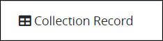
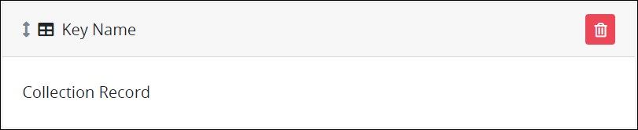
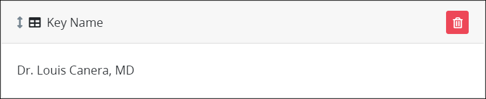

# Collection Record Control Settings

## Control Description

The Collection Record control displays record data from a ProcessMaker Collection. The Collection Select control functions on [Display](../../types-for-screens.md#display)-type ProcessMaker Screens.

If the ProcessMaker [Collections package](../../../../../package-development-distribution/package-a-connector/collections.md) is not installed to the ProcessMaker instance, then the Collection Select control is not available.


See [What is a Collection?](../../../../../collections/what-is-a-collection.md) for more information about what Collections and records are.


Specify the following when configuring a Collection Record control:

* Select from which ProcessMaker Collection to reference its records.
* Use plain text preceding and following the referenced record data to provide context to the record data. For example, if referencing names from a ProcessMaker Collection, optionally include honorifics \(such as "Mr." or "Mrs."\) or professional titles \(such as "Dr." or "MD"\). Example: `Dr. {{ data.FirstName }} {{ data.LastName }}, MD`, when referencing a doctor's first name and last name, respectively.
* Specify the record ID for the record in the ProcessMaker Collection to display. The record ID is a unique value to each record in a ProcessMaker Collection that is referenced in the **\#** column of a Collection. See [View Collections](../../../../../collections/manage-collections/view-collections.md).


If the record ID does not exist in the specified ProcessMaker Collection, the Collection Record control does not display record data. The record ID may not exist because the record with that ID has been deleted or has not yet been created. Therefore, preview the Collection Record control by clicking the **Update Record Data** button after you have configured the control.


## Add the Control to a ProcessMaker Screen


### ProcessMaker Package Required

The [Collections package](../../../../../package-development-distribution/package-a-connector/collections.md) must be installed in your ProcessMaker instance to use the Collection Record control. The Collections package is not available in the ProcessMaker open-source edition. Contact [ProcessMaker Sales](mailto:sales@processmaker.com) or ask your ProcessMaker sales representative how the Collections package can be installed in your ProcessMaker instance.

### Permissions Required

Your ProcessMaker user account or group membership must have the following permissions to add a control to a ProcessMaker Screen unless your user account has the **Make this user a Super Admin** setting selected:

* Screens: View Screens
* Screens: Edit Screens

See the ProcessMaker [Screens](../../../../../processmaker-administration/permission-descriptions-for-users-and-groups.md#screens) permissions or ask your ProcessMaker Administrator for assistance.


Follow these steps to add this control to the ProcessMaker Screen:

1. [Create a new ProcessMaker Screen](../../../manage-forms/create-a-new-form.md) or click the **Edit** iconto edit the selected Screen. The ProcessMaker Screen is in [Design mode](../../screens-builder-modes.md#editor-mode).
2. View the ProcessMaker Screen page to which to add the control.
3. Locate the **Collection Record** iconin the panel to the left of the Screens Builder canvas.
4. Drag the **Collection Record** icon into the Screens Builder canvas. Existing controls on the Screens Builder canvas adjust positioning based on where you drag the control.
5. Place into the Screens Builder canvas where you want the control to display on the ProcessMaker Screen.  
6. Configure the Collection Record control. See [Settings](collection-select-control-settings.md#settings).
7. Click the **Update Record Data** button to reference records in the specified ProcessMaker Collection. This is required to preview the Collection Record control.
8. Validate that the control is configured correctly. See [Validate Your Screen](../../validate-your-screen.md#validate-a-processmaker-screen).

Below is a Collection Record control in [Preview mode](../../screens-builder-modes.md#preview-mode).

## Delete the Control from a ProcessMaker Screen


Deleting a control also deletes configuration for that control. If you add another control, it will have default settings.


Click the **Delete** iconfor the control to delete it.

## Settings


### ProcessMaker Package Required

The [Collections package](../../../../../package-development-distribution/package-a-connector/collections.md) must be installed in your ProcessMaker instance to use the Collection Record control. The Collections package is not available in the ProcessMaker open-source edition. Contact [ProcessMaker Sales](mailto:sales@processmaker.com) or ask your ProcessMaker sales representative how the Collections package can be installed in your ProcessMaker instance.

### Permissions Required

Your ProcessMaker user account or group membership must have the following permissions to add a control to a ProcessMaker Screen unless your user account has the **Make this user a Super Admin** setting selected:

* Screens: View Screens
* Screens: Edit Screens

See the ProcessMaker [Screens](../../../../../processmaker-administration/permission-descriptions-for-users-and-groups.md#screens) permissions or ask your ProcessMaker Administrator for assistance.


The Collection Record control has the following panel that contain settings:

* **Configuration** panel

### Configuration Panel Settings

Click the control while in [Design](../../screens-builder-modes.md#design-mode) mode, and then click the **Configuration** panel that is on the right-side of the Screens Builder canvas.

Below are settings for the Collection Record control in the **Configuration** panel:

* **Text Label:** Enter the text label that displays for this control. **Collection Record** is the default value.
* **Collection:** Select from which ProcessMaker Collection to display its record\(s\) in the Collection Select control. If no ProcessMaker Collections exist, the **Collection** drop-down menu contains no options; [create](../../../../../collections/manage-collections/create-a-new-collection.md) at least one ProcessMaker Collection before using a Collection Record control.
* **Record ID:** Enter the record ID for the record in the ProcessMaker Collection to display. Follow these guidelines:
  * Enter the record ID value. The record ID is a unique value to each record in a ProcessMaker Collection that is referenced in the **\#** column of a Collection. See [View Collections](../../../../../collections/manage-collections/view-collections.md).
  * Enter the **Variable Name** setting value for a variable that represents the record ID value. Example: `data.id`.


Click the **Update Record Data** button to reference records in the specified ProcessMaker Collection. This is required to preview the Collection Record control.


## Related Topics







































