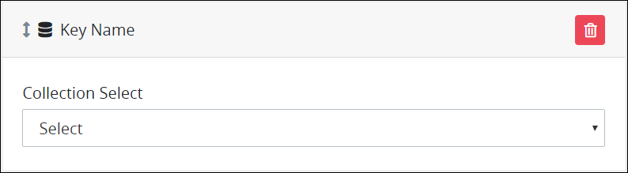
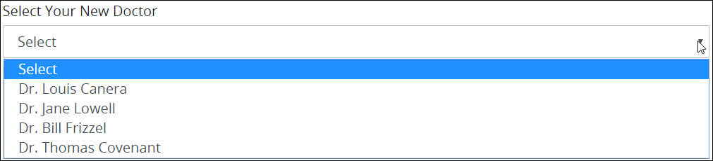
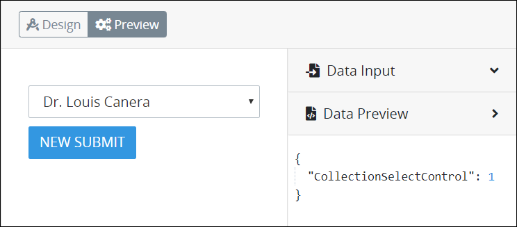

# Collection Select Control Settings

## Control Description

The Collection Select control functions similarly to a drop-down menu that allows a [Request](../../../../../using-processmaker/requests/what-is-a-request.md) participant to select record data from a ProcessMaker Collection. The Collection Select control functions on [Form](../../types-for-screens.md#form)-type ProcessMaker Screens.

If the ProcessMaker [Collections package](../../../../../package-development-distribution/package-a-connector/collections.md) is not installed to the ProcessMaker instance, then the Collection Select control is not available.


See [What is a Collection?](../../../../../collections/what-is-a-collection.md) for more information about what Collections and records are.


Specify the following when configuring a Collection Select control:

* Select from which ProcessMaker Collection to reference its records.
* Use plain text preceding and following the referenced record data to provide context to the record data. For example, if referencing names from a ProcessMaker Collection, optionally include honorifics \(such as "Mr." or "Mrs."\) or professional titles \(such as "Dr." or "MD"\).
* Configure the Collection Select control to reference all the records in the specified Collection or use [ProcessMaker Query Language \(PMQL\)](../../../../../using-processmaker/search-processmaker-data-using-pmql.md) to limit particular records to display as the optional items based on those records that meet the PMQL filtering criteria.

For example, suppose that you have a ProcessMaker Collection of doctors in a medical clinic. A new patient enters information into a ProcessMaker [Screen](../../../what-is-a-form.md) whether that patient has a gender preference for a doctor by selecting that preference from a [Select](../select-control-settings.md) control. Use the Collection Select control and PMQL syntax in the following ways:

* **No preference:** If the patient indicates no preference for the doctor's gender, then do not use PMQL to filter which records display. The Collection Select control displays all records from the ProcessMaker Collection \(all doctors in the clinic\).
* **Female preference:** If the patient indicates a preference to see a female doctor, then use a PMQL expression to filter only female doctors in the clinic. Use the PMQL expression`gender = "female"` if your records use a **Key Name** value of `gender`, and its setting is `female` for all female doctors. The Collection Select control displays only female doctors as optional items.
* **Male preference:** If the patient indicates a preference to see a male doctor, then use a PMQL expression to filter only male doctors in the clinic. Use the PMQL expression `gender = "male"` if your records use a **Key Name** value of `gender`, and its setting is `male` for all male doctors. The Collection Select control displays only male doctors as optional items.

## Add the Control to a ProcessMaker Screen


### ProcessMaker Package Required

The [Collections package](../../../../../package-development-distribution/package-a-connector/collections.md) must be installed in your ProcessMaker instance to use the Collection Select control. The Collections package is not available in the ProcessMaker open-source edition. Contact [ProcessMaker Sales](mailto:sales@processmaker.com) or ask your ProcessMaker sales representative how the Collections package can be installed in your ProcessMaker instance.

### Permissions Required

Your ProcessMaker user account or group membership must have the following permissions to add a control to a ProcessMaker Screen unless your user account has the **Make this user a Super Admin** setting selected:

* Screens: View Screens
* Screens: Edit Screens

See the ProcessMaker [Screens](../../../../../processmaker-administration/permission-descriptions-for-users-and-groups.md#screens) permissions or ask your ProcessMaker Administrator for assistance.


Follow these steps to add this control to the ProcessMaker Screen:

1. [Create a new ProcessMaker Screen](../../../manage-forms/create-a-new-form.md) or click the **Edit** iconto edit the selected Screen. The ProcessMaker Screen is in [Design mode](../../screens-builder-modes.md#editor-mode).
2. View the ProcessMaker Screen page to which to add the control.
3. Locate the **Collection Select** iconin the panel to the left of the Screens Builder canvas.
4. Drag the **Collection Select** icon into the Screens Builder canvas. Existing controls on the Screens Builder canvas adjust positioning based on where you drag the control.
5. Place into the Screens Builder canvas where you want the control to display on the ProcessMaker Screen.  
6. Configure the Collection Select control. See [Settings](collection-select-control-settings.md#settings).
7. Validate that the control is configured correctly. See [Validate Your Screen](../../validate-your-screen.md#validate-a-processmaker-screen).

Below is a Collection Select control in [Preview mode](../../screens-builder-modes.md#preview-mode).

## Delete the Control from a ProcessMaker Screen


Deleting a control also deletes configuration for that control. If you add another control, it will have default settings.


Click the **Delete** iconfor the control to delete it.

## Settings


### ProcessMaker Package Required

The [Collections package](../../../../../package-development-distribution/package-a-connector/collections.md) must be installed in your ProcessMaker instance to use the Collection Select control. The Collections package is not available in the ProcessMaker open-source edition. Contact [ProcessMaker Sales](mailto:sales@processmaker.com) or ask your ProcessMaker sales representative how the Collections package can be installed in your ProcessMaker instance.

### Permissions Required

Your ProcessMaker user account or group membership must have the following permissions to add a control to a ProcessMaker Screen unless your user account has the **Make this user a Super Admin** setting selected:

* Screens: View Screens
* Screens: Edit Screens

See the ProcessMaker [Screens](../../../../../processmaker-administration/permission-descriptions-for-users-and-groups.md#screens) permissions or ask your ProcessMaker Administrator for assistance.


The Collection Select control has the following panels that contain settings:

* \*\*\*\*[**Variable** panel](collection-select-control-settings.md#variable-panel-settings)
* \*\*\*\*[**Configuration** panel](collection-select-control-settings.md#configuration-panel-settings)
* \*\*\*\*[**Design** panel](collection-select-control-settings.md#design-panel-settings)
* \*\*\*\*[**Advanced** panel](collection-select-control-settings.md#advanced-panel-settings)

### Variable Panel Settings

Click the control while in [Design](../../screens-builder-modes.md#design-mode) mode, and then click the **Variable** panel that is on the right-side of the Screens Builder canvas.

Below are settings for the Collection Select control in the **Variable** panel:

* **Field Name:** Enter a unique name that represents this control's value. Use the **Field Name** value in the following ways:
  * Reference this control by its **Field Name** setting's value. The **Data Preview** panel in [Preview mode](../../screens-builder-modes.md#preview-mode) corresponds the Collection Select control's textual content with that Collection Select control's **Field Name** value. In the example below, `CollectionSelectControl` is the **Field Name** setting's value.  
  * Reference this control's value in a different Screens Builder control. To do so, use mustache syntax and reference this control's **Field Name** value in the target control. Example: `{{ CollectionSelectControl }}`.
  * Reference this value in [**Visibility Rule** setting expressions](../expression-syntax-components-for-show-if-control-settings.md).
* **Validation:** Enter the validation rules the form user must comply with to properly enter a valid value into this field. This setting has no default value. See [Validation Rules for "Validation" Control Settings](../validation-rules-for-validation-control-settings.md).

### Configuration Panel Settings

Click the control while in [Design](../../screens-builder-modes.md#design-mode) mode, and then click the **Configuration** panel that is on the right-side of the Screens Builder canvas.

Below are settings for the Collection Select control in the **Configuration** panel:

* **Field Label:** Enter the field label text that displays. This setting has no default value.
* **Help Text:** Enter text that provides additional guidance on the field's use. This setting has no default value.
* **Collection:** Select from which ProcessMaker Collection to display its record\(s\) in the Collection Select control. If no ProcessMaker Collections exist, the **Collection** drop-down menu contains no options; create at least one ProcessMaker Collection before using the Collection Select control.
* **Value:** Enter how records display in the Collection Select control. Follow these guidelines to format how record data displays:
  * **Reference record data from the Collection:** Use mustache syntax to reference record data from the specified ProcessMaker Collection. References to the record data are case sensitive. Precede each reference with `data.`. Example: `{{ data.FirstName }}`. Reference multiple record data in the **Value** setting if necessary. Example: `{{ data.FirstName }} {{ data.LastName }}` if the specified ProcessMaker Collection uses two controls to record the first name and last name in records.

    Follow these guidelines to determine which record data to reference from the specified ProcessMaker Collection:

    1. Determine which ProcessMaker Screens the specified Collection uses to create, update, and/or view records. See [Configure a Collection](../../../../../collections/manage-collections/configure-a-collection.md#configure-a-processmaker-collection). Note that your user account or group membership must have ProcessMaker [Collection](../../../../../processmaker-administration/permission-descriptions-for-users-and-groups.md#collections) permissions to access any Collection.
    2. Edit the appropriate ProcessMaker Screen from which to reference record data in the specified Collection.
    3. Select the ProcessMaker Screen control from which you want to reference record data, then note the **Variable Name** setting value in the **Variable** panel. Use this value to reference that record data in the **Value** setting of the Collection Select control.

  * **Use text to describe the referenced record data:** Enter text preceding and/or following the referenced record data to describe the data. This text displays in all options in the Collection Select control. Example: `Dr. {{ data.FirstName }} {{ data.LastName }}, MD`.
* **PMQL Query \(optional\):** Enter a ProcessMaker Query Language \(PMQL\) expression to limit particular records to display as the optional items based on those records that meet the PMQL filtering criteria, if necessary. See the Collection Select [control description](../image-control-settings.md#control-description) for an example. 

### Design Panel Settings

Click the control while in [Design](../../screens-builder-modes.md#design-mode) mode, and then click the **Design** panel that is on the right-side of the Screens Builder canvas.

Below are settings for the Collection Select control in the **Design** panel:

* **Background Color:** Select to specify the background color of this control.
* **Text Color:** Select to specify the text color that displays in this control.

### Advanced Panel Settings

Click the control while in [Design](../../screens-builder-modes.md#design-mode) mode, and then click the **Advanced** panel that is on the right-side of the Screens Builder canvas.

Below are settings for the Collection Select control in the **Advanced** panel:

* **Visibility Rule:** Specify an expression that indicates the condition\(s\) under which this control displays. See [Expression Syntax Components for "Visibility Rule" Control Settings](../expression-syntax-components-for-show-if-control-settings.md#expression-syntax-components-for-show-if-control-settings). If this setting does not have an expression, then this control displays by default.
* **CSS Selector Name:** Enter the value to represent this control in custom CSS syntax when in [Custom CSS](../../add-custom-css-to-a-screen.md#add-custom-css-to-a-processmaker-screen) mode. As a best practice, use the same **CSS Selector Name** value on different controls of the same type to apply the same custom CSS style to all those controls.

## Related Topics









































