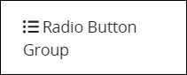
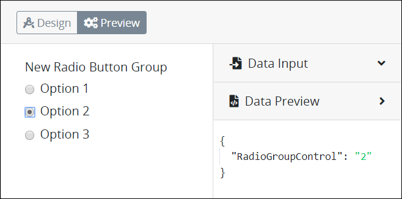

# Radio Button Group Control Settings

## Control Description

The Radio Button Group control provides a group of options from which the [Request](../../../../using-processmaker/requests/what-is-a-request.md) participant can select only one option. Configure the Radio Button Group control to accept one of the following data types:

* **Text:** The control accepts alphanumeric characters.
* **Integer:** The control accepts integers.
* **Decimal:** The control accepts any number, both positive and negative.
* **Datetime:** The control accepts a datetime, which is includes both date and time components.
* **Date:** The control accepts a date.


This control is not available for [Display](../types-for-screens.md#display)-type ProcessMaker Screens. See [Screen Types](../types-for-screens.md).


## Add the Control to a ProcessMaker Screen


Your ProcessMaker user account or group membership must have the following permissions to add a control to a ProcessMaker Screen unless your user account has the **Make this user a Super Admin** setting selected:

* Screens: View Screens
* Screens: Edit Screens

See the ProcessMaker [Screens](../../../../processmaker-administration/permission-descriptions-for-users-and-groups.md#screens) permissions or ask your ProcessMaker Administrator for assistance.


Follow these steps to add this control to the ProcessMaker Screen:

1. [Create a new ProcessMaker Screen](../../manage-forms/create-a-new-form.md) or click the **Edit** iconto edit the selected Screen. The ProcessMaker Screen is in [Design mode](../screens-builder-modes.md#editor-mode).
2. View the ProcessMaker Screen page to which to add the control.
3. Locate the **Radio Button Group** iconin the panel to the left of the Screens Builder canvas.
4. Drag the **Radio Button Group** icon into the Screens Builder canvas. Existing controls on the Screens Builder canvas adjust positioning based on where you drag the control.
5. Place into the Screens Builder canvas where you want the control to display on the ProcessMaker Screen.  

   

6. Configure the Radio Button Group control. See [Settings](radio-group-control-settings.md#inspector-settings).
7. Validate that the control is configured correctly. See [Validate Your Screen](../validate-your-screen.md#validate-a-processmaker-screen).

Below is a Radio Button Group control in [Preview mode](../screens-builder-modes.md#preview-mode).

## Delete the Control from a ProcessMaker Screen


Deleting a control also deletes configuration for that control. If you add another control, it will have default settings.


Click the **Delete** iconfor the control to delete it.

## Settings 


Your user account or group membership must have the following permissions to edit a ProcessMaker Screen control:

* Screens: View Screens
* Screens: Edit Screens

See the ProcessMaker [Screens](../../../../processmaker-administration/permission-descriptions-for-users-and-groups.md#screens) permissions or ask your ProcessMaker Administrator for assistance.


The Radio Button Group control has the following panels that contain settings:

* \*\*\*\*[**Variable** panel](radio-group-control-settings.md#variable-panel-settings)
* \*\*\*\*[**Configuration** panel](radio-group-control-settings.md#configuration-panel-settings)
* \*\*\*\*[**Data Source** panel](radio-group-control-settings.md#data-source-panel-settings)
* \*\*\*\*[**Design** panel](radio-group-control-settings.md#design-panel-settings)
* \*\*\*\*[**Advanced** panel](radio-group-control-settings.md#advanced-panel-settings)

### Variable Panel Settings

Click the control while in [Design](../screens-builder-modes.md#design-mode) mode, and then click the **Variable** panel that is on the right-side of the Screens Builder canvas.

Below are settings for the Radio Button Group control in the **Variable** panel:

* **Variable Name:** Enter a unique name containing at least one letter that represents this control's value. Use the **Variable Name** value in the following ways:

  * Reference this control by its **Variable Name** setting's value. The **Data Preview** panel in [Preview mode](../screens-builder-modes.md#preview-mode) corresponds the Radio Button Group control's selected option with that Radio Button Group control's **Variable Name** value. In the example below, `RadioGroupControl` is the **Variable Name** setting's value.  
  * Reference this control's value in a different Screens Builder control. To do so, use mustache syntax and reference this control's **Variable Name** value in the target control. Example: `{{ RadioButtonGroupControl }}`.
  * Reference this value in [**Visibility Rule** setting expressions](expression-syntax-components-for-show-if-control-settings.md).

  This is a required setting.

* **Data Type:** Select one of the following data type options this control accepts when the form user enters content into this control:
* * **Text:** This control accepts alphanumeric characters.
  * **Integer:** This control accepts integers.
  * **Decimal:** This control accepts any number, both positive and negative.
  * **Datetime:** This control accepts a datetime, which is includes both date and time components.
  * **Date:** The control accepts a date.

  This is a required setting. The following message displays below the control if the Request participant enters content that does not comply with this control's data type: **The format is invalid.**.
* **Validation Rules:** Enter the validation rules the Request participant must comply with to properly enter a valid value into this control. This setting has no default value. See [Validation Rules for "Validation" Control Settings](validation-rules-for-validation-control-settings.md).
* **Read Only:** Select the **Read Only** checkbox to indicate that the Line Input control cannot be edited. This option is not selected by default.

### Configuration Panel Settings

Click the control while in [Design](../screens-builder-modes.md#design-mode) mode, and then click the **Configuration** panel that is on the right-side of the Screens Builder canvas.

Below are settings for the Radio Button Group control in the **Configuration** panel:

### Data Source Panel Settings

Click the control while in [Design](../screens-builder-modes.md#design-mode) mode, and then click the **Data Source** panel that is on the right-side of the Screens Builder canvas.

Below are settings for the Radio Button Group control in the **Data Source** panel:

### Design Panel Settings

Click the control while in [Design](../screens-builder-modes.md#design-mode) mode, and then click the **Design** panel that is on the right-side of the Screens Builder canvas.

Below are settings for the Radio Button Group control in the **Design** panel:

* **Field Label:** Enter the field label text that displays. **New Radio Button Group** is the default value.
* **Help Text:** Enter text that provides additional guidance on the field's use. This setting has no default value.
* **Toggle Style?:** Select to display a toggle key control instead of a radio button control for each radio group option.
* **Element Background Color:** Select to specify the background color of this control.
* **Text Color:** Select to specify the text color that displays in this control.
* **Visibility Rule:** Enter an expression that indicates the condition\(s\) under which this control displays. See [Expression Syntax Components for "Visibility Rule" Control Settings](expression-syntax-components-for-show-if-control-settings.md#expression-syntax-components-for-show-if-control-settings). If this setting does not have an expression, then this control displays by default.
* **CSS Selector Name:** Enter the value to represent this control in custom CSS syntax when in [Custom CSS](../add-custom-css-to-a-screen.md#add-custom-css-to-a-processmaker-screen) mode. As a best practice, use the same **CSS Selector Name** value on different controls of the same type to apply the same custom CSS style to all those controls.

### Advanced Panel Settings

Click the control while in [Design](../screens-builder-modes.md#design-mode) mode, and then click the **Advanced** panel that is on the right-side of the Screens Builder canvas.

Below are settings for the Radio Button Group control in the **Advanced** panel:

## Related Topics 













































