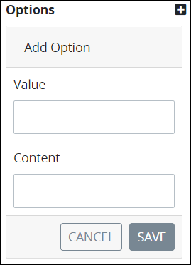
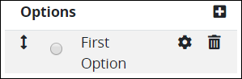
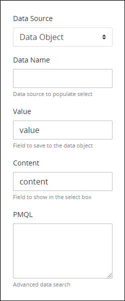

# Radio Button Group Control Settings

## Control Description

The Radio Button Group control provides a group of options from which the [Request](../../../../using-processmaker/requests/what-is-a-request.md) participant can select only one option. Configure the Radio Button Group control to accept one of the following data types for its options:

* **Text:** The control accepts alphanumeric characters.
* **Integer:** The control accepts integers.
* **Decimal:** The control accepts any number, both positive and negative.


This control is not available for [Display](../types-for-screens.md#display)-type ProcessMaker Screens. See [Screen Types](../types-for-screens.md).


## Add the Control to a ProcessMaker Screen


Your ProcessMaker user account or group membership must have the following permissions to add a control to a ProcessMaker Screen unless your user account has the **Make this user a Super Admin** setting selected:

* Screens: View Screens
* Screens: Edit Screens

See the ProcessMaker [Screens](../../../../processmaker-administration/permission-descriptions-for-users-and-groups.md#screens) permissions or ask your ProcessMaker Administrator for assistance.


Follow these steps to add this control to the ProcessMaker Screen:

1. [Create a new ProcessMaker Screen](../../manage-forms/create-a-new-form.md) or click the **Edit** iconto edit the selected Screen. The ProcessMaker Screen is in [Design mode](../screens-builder-modes.md#editor-mode).
2. View the ProcessMaker Screen page to which to add the control.
3. Locate the **Radio Button Group** iconin the panel to the left of the Screens Builder canvas.
4. Drag the **Radio Button Group** icon into the Screens Builder canvas. Existing controls on the Screens Builder canvas adjust positioning based on where you drag the control.
5. Place into the Screens Builder canvas where you want the control to display on the ProcessMaker Screen.  

   

6. Configure the Radio Button Group control. See [Settings](radio-group-control-settings.md#inspector-settings).
7. Validate that the control is configured correctly. See [Validate Your Screen](../validate-your-screen.md#validate-a-processmaker-screen).

Below is a Radio Button Group control in [Preview mode](../screens-builder-modes.md#preview-mode).


## Delete the Control from a ProcessMaker Screen


Deleting a control also deletes configuration for that control. If you add another control, it will have default settings.


Click the **Delete** iconfor the control to delete it.

## Settings <a id="inspector-settings"></a>


Your user account or group membership must have the following permissions to edit a ProcessMaker Screen control:

* Screens: View Screens
* Screens: Edit Screens

See the ProcessMaker [Screens](../../../../processmaker-administration/permission-descriptions-for-users-and-groups.md#screens) permissions or ask your ProcessMaker Administrator for assistance.


The Radio Button Group control has the following panels that contain settings:

* \*\*\*\*[**Variable** panel](radio-group-control-settings.md#variable-panel-settings)
* \*\*\*\*[**Configuration** panel](radio-group-control-settings.md#configuration-panel-settings)
* \*\*\*\*[**Data Source** panel](radio-group-control-settings.md#data-source-panel-settings)
* \*\*\*\*[**Design** panel](radio-group-control-settings.md#design-panel-settings)
* \*\*\*\*[**Advanced** panel](radio-group-control-settings.md#advanced-panel-settings)

### Variable Panel Settings

Click the control while in [Design](../screens-builder-modes.md#design-mode) mode, and then click the **Variable** panel that is on the right-side of the Screens Builder canvas.

Below are settings for the Radio Button Group control in the **Variable** panel:

* **Variable Name:** Enter a unique name containing at least one letter that represents this control's value. Use the **Variable Name** value in the following ways:

  * Reference this control by its **Variable Name** setting's value. The **Data Preview** panel in [Preview mode](../screens-builder-modes.md#preview-mode) corresponds the Radio Button Group control's selected option with that Radio Button Group control's **Variable Name** value. In the example below, `RadioGroupControl` is the **Variable Name** setting's value.  
  * Reference this control's value in a different Screens Builder control. To do so, use mustache syntax and reference this control's **Variable Name** value in the target control. Example: `{{ RadioButtonGroupControl }}`.
  * Reference this value in [**Visibility Rule** setting expressions](expression-syntax-components-for-show-if-control-settings.md).

  This is a required setting.

* **Data Type:** Select one of the following data type options this control accepts when the form user enters content into this control:

  * **Text:** This control accepts alphanumeric characters.
  * **Integer:** This control accepts integers.
  * **Decimal:** This control accepts any number, both positive and negative.

  This is a required setting. The following message displays below the control if the Request participant enters content that does not comply with this control's data type: **The format is invalid.**.

* **Validation Rules:** Enter the validation rules the Request participant must comply with to properly enter a valid value into this control. This setting has no default value. See [Validation Rules for "Validation" Control Settings](validation-rules-for-validation-control-settings.md).
* **Read Only:** Select the **Read Only** checkbox to indicate that the Line Input control cannot be edited. This option is not selected by default.

### Configuration Panel Settings

Click the control while in [Design](../screens-builder-modes.md#design-mode) mode, and then click the **Configuration** panel that is on the right-side of the Screens Builder canvas.

Below are settings for the Radio Button Group control in the **Configuration** panel:

* **Label:** Enter the text label that displays for this control. **New Radio Button Group** is the default value.
* **Helper Text:** Enter text that provides additional guidance on this control's use. This setting has no default value.

### Data Source Panel Settings

Click the control while in [Design](../screens-builder-modes.md#design-mode) mode, and then click the **Data Source** panel that is on the right-side of the Screens Builder canvas.

From the **Data Source** panel, select one of the following methods to specify options that display in the Radio Button Group control:

* [Provide options](select-list-control-settings.md#provide-options): For each option, enter a unique value that represents the option, and then enter the text that displays as the option. After your options are configured, sort the order in which they are to display in this control. Alternatively, provide options in this control in JSON format.
* [Reference a data object](select-list-control-settings.md#reference-a-data-object): Reference data from a data object that displays in this control as its options. This data object must be part of the JSON schema for a Process or a BPMN element in the Process, such as derived from a [ProcessMaker Vocabulary](../../../vocabularies-management/what-is-a-vocabulary.md). Specify the data name, value, and content from the data object. Optionally, use a [PMQL](../../../../using-processmaker/search-processmaker-data-using-pmql.md) expression to limit which data to use as options based on the PMQL expression's criteria. The order that data objects present in the data object determines the order these options display in the control; options cannot be manually reordered.

#### Provide Options

Follow these steps to provide options that display in this control:

1. Click the control while in [Design](../screens-builder-modes.md#design-mode) mode, and then click the **Data Source** panel that is on the right-side of the Screens Builder canvas.
2. From the **Data Source** drop-down menu, select **Provide Values**. This is the default setting.
3. Select one of the following options:
   * **Provide options in the user interface:**

     Follow these guidelines:

     1. Click the iconbeside the **Options** list label. The **Add Option** screen displays.  
     2. In the **Value** field, enter a value to represent the option in the JSON data model during in-progress Requests for Processes that use this ProcessMaker Screen. This value must be unique from other values in this control. If the value is not unique to other **Value** settings in this control, the following message displays: **An item with the same key already exists**.
     3. In the **Content** field, enter the option that displays in this control.
     4. Click **Save**. The option displays below the **Options** list label.  
     5. If necessary, click theicon for an option to change its settings, then click the **Update** button.  
     6. Click theicon to delete that option if necessary.
     7. Drag theicon for an option up or down to sort the order the options display in this control if necessary.
     8. Repeat Steps 1 through 7 until all options are configured for this control.
     9. Click the **Allow multiple selections** option to allow the form user to select more than one option.
     10. From the **Render Options As** drop-down menu, select one of the following options:
         * **Dropdown/Multiselect:** Select the **Dropdown/Multiselect** option to display the control as a drop-down menu.
         * **Radio/Checkbox Group:** Select the **Radio/Checkbox Group** option to display the control as a group of checkboxes.

   * **Provide options in JSON format:**

     Follow these guidelines:

     1. Click the **Edit as JSON** option.  
        

        The **JSON Data** setting displays. If a valid JSON schema has been configured previously, the **JSON Data** setting displays the JSON. Otherwise the setting is empty.

     2. Click the iconbeside the **JSON Data** option. The **Script Config Editor** displays.  

        

     3. Enter your control options in the order they are to display in this control using JSON format. Use the scroll panel to the right of the JSON to scroll to different sections of the JSON if necessary. This is useful especially when you are editing a long JSON.
     4. Click **Close** or the **Close** icon. The control options are saved.

#### Reference a Data Object

Follow these steps to reference data from a data object that displays in this control as its options:

1. Click the control while in [Design](../screens-builder-modes.md#design-mode) mode, and then click the **Data Source** panel that is on the right-side of the Screens Builder canvas.
2. From the **Data Source** drop-down menu, select **Data Object**.  
3. In the **Data Name** field, enter the name of the data object that contains the data from which to display as options in this control. Ensure that this data object meets the following criteria:
   * The data object is part of the JSON schema for a Process or a BPMN element in the Process, such as derived from a [ProcessMaker Vocabulary](../../../vocabularies-management/what-is-a-vocabulary.md).
   * The data object is an array from which its objects are in the order that they are to display as options in this control.
4. In the **Value** field, enter the name of the variable or key name value in the data object to contain the option\(s\) the form user selects. **value** is the default value.
5. In the **Content** field, enter the name of the variable or key name value in the data object that contains the options to display in this control. **content** is the default value.
6. In the **PMQL** field, optionally enter a [PMQL](../../../../using-processmaker/search-processmaker-data-using-pmql.md#overview) expression to filter which data in the data object to display as options in this control based on which objects in the array meet the PMQL expression's criteria.

Consider the following example of doctors who work in a clinic. 

```javascript
doctors = {
{id: 1, name: 'Adam Ardin', gender: 'male'},
{id: 2, name: 'Amanda Creek', gender: 'female'},
{id: 3, name: 'Lucy Morales', gender: 'female'},
{id: 4, name: 'Mindy Smith', gender: 'female'},
{id: 5, name: 'Toby Tomlinson', gender: 'male'}
}
```

Use the following settings to reference this data object as options for this control:

* **Data Name:** `doctors`
* **Value:** `id`
* **Content:** `name`

Suppose that a new patient at the clinic indicates that she wants to see a female doctor. To filter doctors who are female in the clinic so that they display as options in this control, use the following PMQL expression:

`gender = "female"`

### Design Panel Settings

Click the control while in [Design](../screens-builder-modes.md#design-mode) mode, and then click the **Design** panel that is on the right-side of the Screens Builder canvas.

Below are settings for the Radio Button Group control in the **Design** panel:

* **Text Color:** Select to specify the text color that displays in this control.
* **Background Color:** Select to specify the background color of this control.
* **Toggle Style:** Select to display a toggle key control instead of a radio button control for each radio group option in this control.

### Advanced Panel Settings

Click the control while in [Design](../screens-builder-modes.md#design-mode) mode, and then click the **Advanced** panel that is on the right-side of the Screens Builder canvas.

Below are settings for the Radio Button Group control in the **Advanced** panel:

* **Visibility Rule:** Enter an expression that indicates the condition\(s\) under which this control displays. See [Expression Syntax Components for "Visibility Rule" Control Settings](expression-syntax-components-for-show-if-control-settings.md#expression-syntax-components-for-show-if-control-settings). If this setting does not have an expression, then this control displays by default.
* **CSS Selector Name:** Enter the value to represent this control in custom CSS syntax when in [Custom CSS](../add-custom-css-to-a-screen.md#add-custom-css-to-a-processmaker-screen) mode. As a best practice, use the same **CSS Selector Name** value on different controls of the same type to apply the same custom CSS style to all those controls.

## Related Topics <a id="related-topics"></a>













































