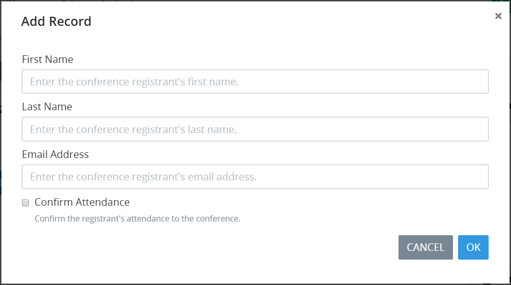
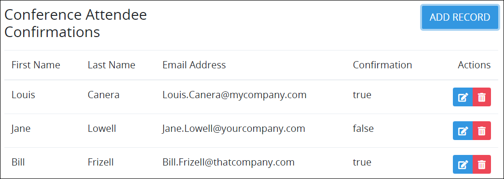
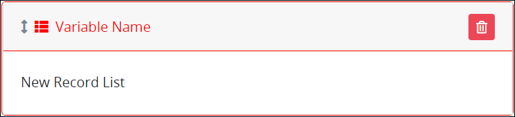
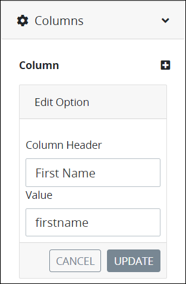
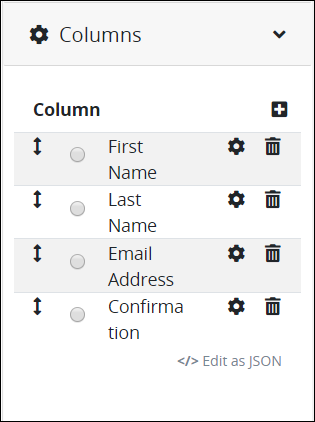
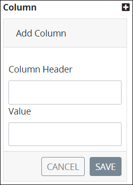
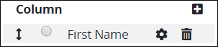
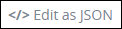
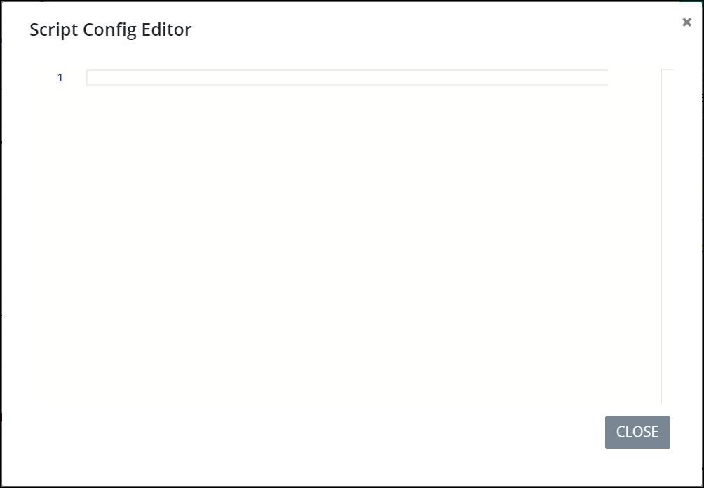

# Record List Control Settings

## Control Description 

The Record List control functions differently in [Form](../types-for-screens.md#form)- and [Display](../types-for-screens.md#display)-type ProcessMaker [Screens](../../what-is-a-form.md):

* [Form-Type Screen Usage](record-list-control-settings.md#form-type-screen-usage)
* [Display-Type Screen Usage](record-list-control-settings.md#display-type-screen-usage)

### Form-Type Screen Usage

#### Configuration Description

In the [Form](../types-for-screens.md#form)-type ProcessMaker Screen, the Record List control records a record list. The record list is composed of multiple records, of which the [Request](../../../../using-processmaker/requests/what-is-a-request.md) participant enters data components for each record. The controls used to record each record's data components are designed in a second page of the same ProcessMaker Screen containing the Record List control. The page that records the data components of each record cannot be on the same page as the Record List control.

When configuring the Record List control, specify how the record list displays information after the control has recorded each record for the list:

* **Column Headers:** Specify each column header that represents the data components for each record. For example, label a column header `First Name` to indicate that this data component displays each person's first name for each record in the list.
* **Values:** For each specified column header, reference the **Variable Name** setting value for the control on the second page that receives a data component for each record corresponding with each column header. For example, use a [Line Input](line-input-control-settings.md) control with a **Variable Name** setting value of `LineInputFirstName` to receive each person's first name for each record in the list, and then associate that `LineInputFirstName` value with the `First Name` column.

After configuring the columns for the record list, sort the order in which they are to display in the record list.

Alternatively, use JSON format to configure the columns and their corresponding **Variable Name** setting values in their respective order to display in the Record List control.

Optionally, values can be edited after the Request participant initially enters the record\(s\) in the record list. However, after the Request participant submits the Screen, the record list cannot be changed.


See [Form-Type Screen Settings](record-list-control-settings.md#form-type-screen-settings).


#### Experience Description

Expect a similar experience as a Request participant when using a properly configured Record List control during a Request as follows:

1. Open the [Task](../../../../using-processmaker/task-management/what-is-a-task.md) with the ProcessMaker Screen using the Record List control. The Record List control displays an empty record list.  
2. Click the **Add Record** button to add a record to the record list. A screen displays to enter data components for one record. In doing so, the Record List control references the controls on the secondary page of the Screen. In this example, enter a record for registrars for a conference.  
3. Enter information for each data component for the record.
4. Click the **OK** button and ignore the Submit control.
5. Repeat Steps 2 through 4 for each record in the record list. As you enter each record, it displays in the record list. If the Record List control is configured to be editable \(as shown below\), then the **Edit** buttonand **Delete** buttondisplay to edit or delete a record, respectively. Otherwise, these buttons do not display and records cannot be changed after they are added.  
6. Submit the Screen to save the record list in the Request. After the Task is submitted, the record list cannot be changed.

### Display-Type Screen Usage

#### Configuration Description

In the [Display](../types-for-screens.md#display)-type ProcessMaker Screen, the Record List control displays a record list previously entered into a [Form](../types-for-screens.md#form)-type Screen in a previous Task of that [Request](../../../../using-processmaker/requests/what-is-a-request.md).

When configuring the Record List control, specify how the record list displays information in the Display-type ProcessMaker Screen:

* **Column Headers:** Specify each column header that represents the data components for each record in the list. For example, if the record list had recorded first names, then label a column header `First Name`.
* **Values:** For each specified column header, reference the **Variable Name** setting value for the control that corresponds with that specified column header's record data component. To do so, open the ProcessMaker Screen that contains the Record List control that recorded the list, then locate the control that corresponds with the specified column header's record data component. For example, if a [Line Input](line-input-control-settings.md) control with a **Variable Name** setting value of `LineInputFirstName` is used to record each person's first name for each record in the list, associate that `LineInputFirstName` with the specified `First Name` column header.
* Repeat this procedure for each column header and its corresponding control that received a record data component for the record list. Make note of each control's **Variable Name** setting value, as you must provide this same value when configuring each column header in the record list.

After configuring the column headers for the record list, sort the order in which they are to display in the record list.

Alternatively, use JSON format to configure the column headers and their corresponding **Variable Name** setting values in their respective order to display in the Record List control.


See [Display-type Screen Settings](record-list-control-settings.md#display-type-screen-settings).


#### Experience Description

After opening a Task or Manual Task with a Display-type ProcessMaker Screen using a Record List control, the record list displays each record as entered in a Form-type Screen in a previous Task of that Request.

## Add the Control to a ProcessMaker Screen 


Your ProcessMaker user account or group membership must have the following permissions to add a control to a ProcessMaker Screen unless your user account has the **Make this user a Super Admin** setting selected:

* Screens: View Screens
* Screens: Edit Screens

See the ProcessMaker [Screens](../../../../processmaker-administration/permission-descriptions-for-users-and-groups.md#screens) permissions or ask your ProcessMaker Administrator for assistance.


Follow these steps to add this control to the ProcessMaker Screen:

1. [Create a new ProcessMaker Screen](../../manage-forms/create-a-new-form.md) or click the **Edit** iconto edit the selected Screen. The ProcessMaker Screen is in [Design mode](../screens-builder-modes.md#editor-mode).
2. View the ProcessMaker Screen page to which to add the control.
3. Locate the **Record List** iconin the panel to the left of the Screen Builder canvas.
4. Drag the **Record List** icon into the Screen Builder canvas. Existing controls on the Screen Builder canvas adjust positioning based on where you drag the control.
5. Place into the Screen Builder canvas where you want the control to display on the ProcessMaker Screen.

   

6. Do one of the following depending on whether you are using the Record List control on a [Form](../types-for-screens.md#form)- or [Display](../types-for-screens.md#display)-type ProcessMaker Screen:

   **Form-type ProcessMaker Screen:**

   1. Create a new page in this ProcessMaker Screen. Use this page to design how the Request participant enters data that the Record List control records. The page that records the submitted records cannot be on the same page as the Record List control. See [Add a New Page to a ProcessMaker Screen](../add-a-new-page-to-a-screen.md#add-a-new-page-to-a-processmaker-screen).
   2. On the new page, design the form using controls from which the Request participant enters the data component that the Record List control receives for each record. In each of the controls that receives a data component for each record, make note of the **Variable Name** setting values for each control; these values correspond with how the Record List control displays the record list in the **Value** parameter for each column. Do not place a [Submit Button](submit-button-control-settings.md#control-description) control on the new page; otherwise, the [Task](../../../../using-processmaker/task-management/what-is-a-task.md) cannot be submitted during a Request.
   3. Return to the page that the Record List control is placed, and then configure the Record List control. See [Settings](record-list-control-settings.md#inspector-settings). Ensure to add a Submit Button or [Page Navigation](page-navigation-button-control-settings.md#control-description) control on the page containing the Record List control so that the Task can be submitted after all records have been added to the record list during a Request.

   **Display-type ProcessMaker Screen:**

   1. Configure the Record List control. See [Settings](record-list-control-settings.md#inspector-settings).

7. Validate that the control is configured correctly. See [Validate Your Screen](../validate-your-screen.md#validate-a-processmaker-screen).

## Example

Consider the following example how to use a Record List control in a [Form](../types-for-screens.md#form)-type ProcessMaker Screen. Configure a Record List control to record the following data components about registrars for a conference. The table below shows how the Record List control displays the record list. Configuring each column and the **Variable Name** setting value for each control that records the data component that displays in that column is the same for both Form- and [Display](../types-for-screens.md#display)-type ProcessMaker Screens.

On a second page in the same ProcessMaker [Screen](../../what-is-a-form.md), use Screen controls for [Request](../../../../using-processmaker/requests/what-is-a-request.md) participants to enter data components for each record. Ensure the following:

* The Record List control references the specified controls on the second page. The controls that receive the record data components cannot be on the same page as the Record List control. 
* In each of the controls that receives a data component for each record, make note of the **Variable Name** setting values for each control; these values correspond with how the Record List control displays the record list in the **Value** parameter for each column. This setting is in the **Columns** panel. See [Settings](record-list-control-settings.md#inspector-settings).

The following table outlines how to configure the **Column Header** and **Value** settings for each column in the Record List control for this example.

| Control Type | Control's "Variable Name" Value | Record List "Column Header" Value | Record List "Value" Value | What It Represents |
| :--- | :--- | :--- | :--- | :--- |
| Line Input | firstname | First Name | firstname | Registrar's first name |
| Line Input | lastname | Last Name | lastname | Registrar's last name |
| Line Input | email | Email Address | email | Registrar's email address |
| Select | confirmation | Confirmation | confirmation | Attendance confirmation |

The following image shows the **Column Header** and **Value** setting values in the Record List control to reference the [Line Input](line-input-control-settings.md) control with the **Variable Name** setting value of `firstname`.

The following image shows the column configuration for the Record List control. See [Settings](record-list-control-settings.md#inspector-settings) for the Record List control setting descriptions.

Below is the secondary page in [Preview mode](../screens-builder-modes.md#preview-mode) for each conference attendee to enter a record.

## Delete the Control from a ProcessMaker Screen


Deleting a control also deletes configuration for that control. If you add another control, it will have default settings.


Click the **Delete** iconfor the control to delete it.

## Form-Type Screen Settings 


### Permissions Required

Your user account or group membership must have the following permissions to edit a ProcessMaker Screen control:

* Screens: View Screens
* Screens: Edit Screens

See the ProcessMaker [Screens](../../../../processmaker-administration/permission-descriptions-for-users-and-groups.md#screens) permissions or ask your ProcessMaker Administrator for assistance.

### Topic Update

This topic is updated for ProcessMaker version 4.0.1. See the [Release Notes](https://processmaker.gitbook.io/processmaker-release-notes/processmaker-4.0.x/processmaker-4.0.1-release-notes#screen-builder-1).


The Record List control has the following panels that contain settings for [Form](../types-for-screens.md#form)-type [ProcessMaker Screens](../../what-is-a-form.md):

* \*\*\*\*[**Variable** panel](record-list-control-settings.md#variable-panel-settings)
* \*\*\*\*[**Configuration** panel](record-list-control-settings.md#configuration-panel-settings)
* \*\*\*\*[**Columns** panel](record-list-control-settings.md#columns-panel-settings)
* \*\*\*\*[**Design** panel](record-list-control-settings.md#design-panel-settings)
* \*\*\*\*[**Advanced** panel](record-list-control-settings.md#advanced-panel-settings)

### Variable Panel Settings

Click the control while in [Design](../screens-builder-modes.md#design-mode) mode, and then click the **Variable** panel that is on the right-side of the Screen Builder canvas.

Below are settings for the Record List control in the **Variable** panel:

* [Variable Name](record-list-control-settings.md#variable-name)
* [List Label](record-list-control-settings.md#list-label)

#### Variable Name

Edit the default **Variable Name** setting value for this control if necessary. The **Variable Name** setting value represents data in this control during [Requests](../../../../using-processmaker/requests/what-is-a-request.md). Ensure that the **Variable Name** setting value is a unique name from other controls in this [ProcessMaker Screen](../../what-is-a-form.md) and contains at least one letter. Use the **Variable Name** setting value in the following ways:

* Reference this control by its **Variable Name** setting's value.
* Reference this control's value in a different Screen Builder control. To do so, use mustache syntax and reference this control's **Variable Name** value in the target control. Example: `{{ RecordListControl }}`.
* Reference this value in [**Visibility Rule** setting expressions](expression-syntax-components-for-show-if-control-settings.md).

This is a required setting.

#### List Label

Edit the default label that displays for this control if necessary. **New Record List** is the default value.

### Configuration Panel Settings

Click the control while in [Design](../screens-builder-modes.md#design-mode) mode, and then click the **Configuration** panel that is on the right-side of the Screen Builder canvas.

Below are settings for the Record List control in the **Configuration** panel:

* [Editable?](record-list-control-settings.md#editable)
* [Record Form](record-list-control-settings.md#record-form)

#### Editable?

Select to indicate that records in the list can be edited or deleted with the **Edit**  and **Delete**  icons, respectively. Otherwise, deselect to indicate that after each record is added to the record list, it cannot be changed. Note that after the [Task](../../../../using-processmaker/task-management/what-is-a-task.md) is submitted, the record list cannot be changed. This setting is not selected by default.

#### Record Form

Select from which ProcessMaker Screen page to reference the controls that receive data components for each record. The page with these controls that receive the data components cannot be on the same page as the Record List control. The following message displays if no additional pages exist in this ProcessMaker Screen from which to reference other controls: **No Data Available.**

### Columns Panel Settings

Click the control while in [Design](../screens-builder-modes.md#design-mode) mode, and then click the **Columns** panel that is on the right-side of the Screen Builder canvas.

See the following procedures how to configure the column header\(s\) that display the record list data and from which control\(s\) on the additional page in this [ProcessMaker Screen](../../what-is-a-form.md) to reference data components of each record for this control.



### Add a Column to This Record List Control

Follow these steps to add a column to this control using the ProcessMaker interface:

1. Access the **Columns** panel for this control while in [Design](../screens-builder-modes.md#design-mode) mode, and then locate the **Column** setting.
2. Ensure that the **Column** list label displays. If the **JSON Data** option displays, click the **Edit as Option List** option.
3. Click the iconbeside the **Column** label. The **Add Column** screen displays.  
4. In the **Column Header** setting, enter the column header label that displays in the record list. This column header represents a data component for each record in the record list.
5. In the **Value** setting, enter the **Variable Name** setting value for the control on the second page of this ProcessMaker Screen that receives a data component for each record that corresponds with this column header. For example, use a [Line Input](line-input-control-settings.md) control with a **Variable Name** setting value of `LineInputFirstName` to receive each person's first name for each record in the list, and then associate that `LineInputFirstName` value with a column header labeled `First Name`.
6. Click **Save**. The column header displays in the **Column** list label. 

### Edit a Column Configuration in This Record List control

Follow these steps to add a column to this control using the ProcessMaker interface:

1. Access the **Columns** panel for this control while in [Design](../screens-builder-modes.md#design-mode) mode, and then locate the **Column** setting.
2. Ensure that the **Column** list label displays. If the **JSON Data** option displays, click the **Edit as Option List** option.
3. Click theicon for a column to change its settings.
4. In the **Column Header** setting, edit the column header label that displays in the record list as necessary. This column header represents a data component for each record in the record list.
5. In the **Value** setting, edit the **Variable Name** setting value for the control on the second page of this ProcessMaker Screen that receives a data component for each record that corresponds with this column header as necessary. For example, use a [Line Input](line-input-control-settings.md) control with a **Variable Name** setting value of `LineInputFirstName` to receive each person's first name for each record in the list, and then associate that `LineInputFirstName` value with a column header labeled `First Name`.
6. Click **Update**. The edited column displays below the **Column** list label.

### Delete a Column from This Record List Control

Follow these steps to delete a column from in this control using the ProcessMaker interface:

1. Access the [**Columns** panel](record-list-control-settings.md#columns-panel-settings) for this control while in [Design](../screens-builder-modes.md#design-mode) mode, and then locate the **Column** setting.
2. Ensure that the **Column** list label displays. If the **JSON Data** option displays, click the **Edit as Option List** option.
3. Click theicon for the column to be deleted from this control. A message displays to confirm deletion of the option.
4. Click **Delete**.

### Sort the Order of the Options

Follow these steps to sort the order of the columns that display in this control using the ProcessMaker interface:

1. Access the [**Columns** panel](record-list-control-settings.md#columns-panel-settings) for this control while in [Design](../screens-builder-modes.md#design-mode) mode, and then locate the **Column** setting.
2. Ensure that the **Column** list label displays. If the **JSON Data** option displays, click the **Edit as Option List** option.
3. Drag theicon for each column up or down to sort the order they display in this control as necessary.



### Add Columns to This Record List Control Using a JSON Schema

Follow these steps to add a column to this control using a JSON schema:

1. Access the **Columns** panel for this control while in [Design](../screens-builder-modes.md#design-mode) mode, and then locate the **Column** setting.
2. Click the **Edit as JSON** option below the **Options** list label. If the **JSON Data** setting displays, skip this step.  
    

   The **JSON Data** setting displays. If a valid JSON schema has been configured previously, the **JSON Data** setting displays the JSON. Otherwise the setting is empty.

3. Click the iconbeside the **JSON Data** option. The **Script Config Editor** displays.  

   

   1. Enter your control columns in the order they are to display in this control using JSON format. Use the scroll panel to the right of the JSON to scroll to different sections of the JSON if necessary. This is useful especially when you are editing a long JSON.
   2. Click **Close** or the **Close** icon. The control columns are saved.



### Design Panel Settings

Click the control while in [Design](../screens-builder-modes.md#design-mode) mode, and then click the **Design** panel that is on the right-side of the Screen Builder canvas.

Below are settings for the Record List control in the **Design** panel:

* [Text Color](record-list-control-settings.md#text-color)
* [Background Color](record-list-control-settings.md#background-color)

#### Text Color

Select the text color that displays for this control. Optionally, click the **Clear Color Selection** option to remove the selected color.

#### Background Color

Select the background color that displays for this control. Optionally, click the **Clear Color Selection** option to remove the selected color.

### Advanced Panel Settings

Click the control while in [Design](../screens-builder-modes.md#design-mode) mode, and then click the **Advanced** panel that is on the right-side of the Screen Builder canvas.

Below are settings for the Record List control in the **Advanced** panel:

* [Visibility Rule](record-list-control-settings.md#visibility-rule)
* [CSS Selector Name](record-list-control-settings.md#css-selector-name)

#### Visibility Rule

Specify an expression that indicates the condition\(s\) under which this control displays. See [Expression Syntax Components for "Visibility Rule" Control Settings](expression-syntax-components-for-show-if-control-settings.md#expression-syntax-components-for-show-if-control-settings). If this setting does not have an expression, then this control displays by default.

#### CSS Selector Name

Enter the value to represent this control in custom CSS syntax when in [Custom CSS](../add-custom-css-to-a-screen.md#add-custom-css-to-a-processmaker-screen) mode. As a best practice, use the same **CSS Selector Name** value on different controls of the same type to apply the same custom CSS style to all those controls.

## Display-Type Screen Settings

The Record List control has the following panels that contain settings for [Display](../types-for-screens.md#display)-type [ProcessMaker Screens](../../what-is-a-form.md):

* \*\*\*\*[**Variable** panel](record-list-control-settings.md#variable-panel-settings-1)
* \*\*\*\*[**Configuration** panel](record-list-control-settings.md#configuration-panel-settings-1)
* \*\*\*\*[**Columns** panel](record-list-control-settings.md#columns-panel-settings-1)
* \*\*\*\*[**Design** panel](record-list-control-settings.md#design-panel-settings-1)
* \*\*\*\*[**Advanced** panel](record-list-control-settings.md#advanced-panel-settings-1)

### Variable Panel Settings

Click the control while in [Design](../screens-builder-modes.md#design-mode) mode, and then click the **Variable** panel that is on the right-side of the Screen Builder canvas.

Below are settings for the Record List control in the **Variable** panel:

* [Variable Name](record-list-control-settings.md#variable-name-1)
* [List Label](record-list-control-settings.md#list-label-1)

#### Variable Name

Edit the default **Variable Name** setting value for this control if necessary. The **Variable Name** setting value represents data in this control during [Requests](../../../../using-processmaker/requests/what-is-a-request.md). Ensure that the **Variable Name** setting value is a unique name from other controls in this [ProcessMaker Screen](../../what-is-a-form.md) and contains at least one letter. Use the **Variable Name** setting value in the following ways:

* Reference this control by its **Variable Name** setting's value.
* Reference this control's value in a different Screen Builder control. To do so, use mustache syntax and reference this control's **Variable Name** value in the target control. Example: `{{ RecordListControl }}`.
* Reference this value in [**Visibility Rule** setting expressions](expression-syntax-components-for-show-if-control-settings.md).

This is a required setting.

#### List Label

Edit the default label that displays for this control if necessary. **New Record List** is the default value.

### Columns Panel Settings


Follow these steps before configuring columns in this Record List control:

1. Save setting configurations in this Record List control if necessary.
2. While in [Design](../screens-builder-modes.md#design-mode) mode, open the ProcessMaker Screen that contains the Record List control that recorded the list.
3. Locate each control that corresponds with each specified column header. Each of these controls received a record data component when the record list was recorded in a Request. Make note of each control's **Variable Name** setting value, as you must provide this same value when configuring each column header in this Record List control.


Click the control while in [Design](../screens-builder-modes.md#design-mode) mode, and then click the **Columns** panel that is on the right-side of the Screen Builder canvas.

See the following procedures how to configure the column header\(s\) that display the record list data and from which control\(s\) on the additional page in this [ProcessMaker Screen](../../what-is-a-form.md) to reference data components of each record for this control.



### Add a Column to This Record List Control

Follow these steps to add a column to this control using the ProcessMaker interface:

1. Access the **Columns** panel for this control while in [Design](../screens-builder-modes.md#design-mode) mode, and then locate the **Column** setting.
2. Ensure that the **Column** list label displays. If the **JSON Data** option displays, click the **Edit as Option List** option.
3. Click the iconbeside the **Column** label. The **Add Column** screen displays.  
4. In the **Column Header** setting, enter the column header label that displays in the record list. This column header represents a data component for each record in the record list.
5. In the **Value** setting, enter the **Variable Name** setting value for the control on the second page of this ProcessMaker Screen that receives a data component for each record that corresponds with this column header. For example, use a [Line Input](line-input-control-settings.md) control with a **Variable Name** setting value of `LineInputFirstName` to receive each person's first name for each record in the list, and then associate that `LineInputFirstName` value with a column header labeled `First Name`.
6. Click **Save**. The column header displays in the **Column** list label. 

### Edit a Column Configuration in This Record List control

Follow these steps to add a column to this control using the ProcessMaker interface:

1. Access the **Columns** panel for this control while in [Design](../screens-builder-modes.md#design-mode) mode, and then locate the **Column** setting.
2. Ensure that the **Column** list label displays. If the **JSON Data** option displays, click the **Edit as Option List** option.
3. Click theicon for a column to change its settings.
4. In the **Column Header** setting, edit the column header label that displays in the record list as necessary. This column header represents a data component for each record in the record list.
5. In the **Value** setting, edit the **Variable Name** setting value for the control on the second page of this ProcessMaker Screen that receives a data component for each record that corresponds with this column header as necessary. For example, use a [Line Input](line-input-control-settings.md) control with a **Variable Name** setting value of `LineInputFirstName` to receive each person's first name for each record in the list, and then associate that `LineInputFirstName` value with a column header labeled `First Name`.
6. Click **Update**. The edited column displays below the **Column** list label.

### Delete a Column from This Record List Control

Follow these steps to delete a column from in this control using the ProcessMaker interface:

1. Access the [**Columns** panel](record-list-control-settings.md#columns-panel-settings) for this control while in [Design](../screens-builder-modes.md#design-mode) mode, and then locate the **Column** setting.
2. Ensure that the **Column** list label displays. If the **JSON Data** option displays, click the **Edit as Option List** option.
3. Click theicon for the column to be deleted from this control. A message displays to confirm deletion of the option.
4. Click **Delete**.

### Sort the Order of the Options

Follow these steps to sort the order of the columns that display in this control using the ProcessMaker interface:

1. Access the [**Columns** panel](record-list-control-settings.md#columns-panel-settings) for this control while in [Design](../screens-builder-modes.md#design-mode) mode, and then locate the **Column** setting.
2. Ensure that the **Column** list label displays. If the **JSON Data** option displays, click the **Edit as Option List** option.
3. Drag theicon for each column up or down to sort the order they display in this control as necessary.



### Add Columns to This Record List Control Using a JSON Schema

Follow these steps to add a column to this control using a JSON schema:

1. Access the **Columns** panel for this control while in [Design](../screens-builder-modes.md#design-mode) mode, and then locate the **Column** setting.
2. Click the **Edit as JSON** option below the **Options** list label. If the **JSON Data** setting displays, skip this step.  
    

   The **JSON Data** setting displays. If a valid JSON schema has been configured previously, the **JSON Data** setting displays the JSON. Otherwise the setting is empty.

3. Click the iconbeside the **JSON Data** option. The **Script Config Editor** displays.  

   

   1. Enter your control columns in the order they are to display in this control using JSON format. Use the scroll panel to the right of the JSON to scroll to different sections of the JSON if necessary. This is useful especially when you are editing a long JSON.
   2. Click **Close** or the **Close** icon. The control columns are saved.



### Design Panel Settings

Click the control while in [Design](../screens-builder-modes.md#design-mode) mode, and then click the **Design** panel that is on the right-side of the Screen Builder canvas.

Below are settings for the Record List control in the **Design** panel:

* [Text Color](record-list-control-settings.md#text-color-1)
* [Background Color](record-list-control-settings.md#background-color-1)

#### Text Color

Select the text color that displays for this control. Optionally, click the **Clear Color Selection** option to remove the selected color.

#### Background Color

Select the background color that displays for this control. Optionally, click the **Clear Color Selection** option to remove the selected color.

### Advanced Panel Settings

Click the control while in [Design](../screens-builder-modes.md#design-mode) mode, and then click the **Advanced** panel that is on the right-side of the Screen Builder canvas.

Below are settings for the Record List control in the **Advanced** panel:

* [Visibility Rule](record-list-control-settings.md#visibility-rule-1)
* [CSS Selector Name](record-list-control-settings.md#css-selector-name-1)

#### Visibility Rule

Specify an expression that indicates the condition\(s\) under which this control displays. See [Expression Syntax Components for "Visibility Rule" Control Settings](expression-syntax-components-for-show-if-control-settings.md#expression-syntax-components-for-show-if-control-settings). If this setting does not have an expression, then this control displays by default.

#### CSS Selector Name

Enter the value to represent this control in custom CSS syntax when in [Custom CSS](../add-custom-css-to-a-screen.md#add-custom-css-to-a-processmaker-screen) mode. As a best practice, use the same **CSS Selector Name** value on different controls of the same type to apply the same custom CSS style to all those controls.

## Related Topics 



































