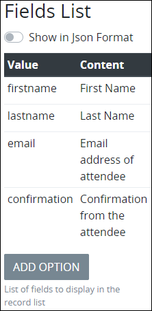
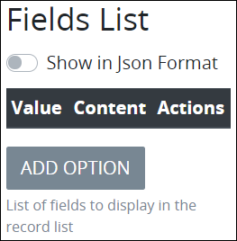
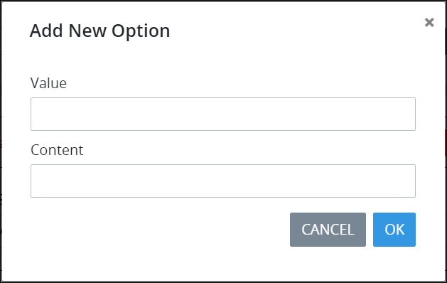

# Record List Control Settings

## Control Description 


Do not confuse the Record List control with the ProcessMaker [Collections controls](processmaker-collection-controls/) that are part of the ProcessMaker [Collections package](../../../../package-development-distribution/package-a-connector/collections.md). ProcessMaker Collections use records in a different context. See [What is a Collection?](../../../../collections/what-is-a-collection.md).


The Record List control functions differently in [Form](../types-for-screens.md#form)- and [Display](../types-for-screens.md#display)-type ProcessMaker [Screens](../../what-is-a-form.md):

* [Form-Type Screen Usage](record-list-control-settings.md#form-type-screen-usage)
* [Display-Type Screen Usage](record-list-control-settings.md#display-type-screen-usage)

### Form-Type Screen Usage

#### Configuration Description

In the [Form](../types-for-screens.md#form)-type ProcessMaker Screen, the Record List control records a record list. The record list is composed of multiple records, of which the [Request](../../../../using-processmaker/requests/what-is-a-request.md) participant enters data components for each record. The controls used to record each record's data components are designed in a secondary page of the same ProcessMaker Screen containing the Record List control. The page that records the data components of each record cannot be on the same page as the Record List control.

When configuring the Record List control, specify how the record list displays information after the control has recorded each record for the list:

* **Columns:** Specify each column that represents the data components for each record. For example, label a column `First Name` to indicate that this data component displays each person's first name for each record in the list.
* **Values:** For each specified column, reference the **Variable Name** setting value for the control on the secondary page that records each record's data component that corresponds with that specified column. For example, use a [Line Input](line-input-control-settings.md) control with a **Variable Name** setting value of `LineInputFirstName` to record each person's first name for each record in the list, and then associate that `LineInputFirstName` value with the `First Name` column.

After configuring the columns for the record list, sort the order in which they are to display in the record list.

Alternatively, use JSON format to configure the columns and their corresponding **Variable Name** setting values in their respective order to display in the Record List control.

Optionally, values can be edited after the Request participant initially enters the record\(s\) in the record list. However, after the Request participant submits the Screen, the record list cannot be changed.

#### Experience Description

Expect a similar experience as a Request participant when using a properly configured Record List control during a Request as follows:

1. Open the [Task](../../../../using-processmaker/task-management/what-is-a-task.md) with the ProcessMaker Screen using the Record List control. The Record List control displays an empty record list.  
2. Click the **Add Record** button to add a record to the record list. A screen displays to enter data components for one record. In doing so, the Record List control references the controls on the secondary page of the Screen. In this example, enter a record for registrars for a conference.  
3. Enter information for each data component for the record.
4. Click the **OK** button and ignore the Submit control.
5. Repeat Steps 2 through 4 for each record in the record list. As you enter each record, it displays in the record list. If the Record List control is configured to be editable \(as shown below\), then the **Edit** buttonand **Delete** buttondisplay to edit or delete a record, respectively. Otherwise, these buttons do not display and records cannot be changed after they are added.  
6. Submit the Screen to save the record list in the Request. After the Screen is submitted, the record list cannot be changed.

### Display-Type Screen Usage

#### Configuration Description

In the [Display](../types-for-screens.md#display)-type ProcessMaker Screen, the Record List control displays a record list previously entered into a [Form](../types-for-screens.md#form)-type Screen in a previous Task of that [Request](../../../../using-processmaker/requests/what-is-a-request.md).

When configuring the Record List control, specify how the record list displays information in the Display-type ProcessMaker Screen:

* **Columns:** Specify each column that represents the data components for each record in the list. For example, if the record list had recorded first names, then label a column `First Name`.
* **Values:** For each specified column, reference the **Variable Name** setting value for the control that corresponds with that specified column's record data component. To do so, open the ProcessMaker Screen that contains the Record List control that recorded the list, then locate the control that corresponds with the specified column's record data component. For example, if a [Line Input](line-input-control-settings.md) control with a **Variable Name** setting value of `LineInputFirstName` is used to record each person's first name for each record in the list, associate that `LineInputFirstName` with the specified `First Name` column.

After configuring the columns for the record list, sort the order in which they are to display in the record list.

Alternatively, use JSON format to configure the columns and their corresponding **Variable Name** setting values in their respective order to display in the Record List control.

#### Experience Description

After opening a Task or Manual Task with a Display-type ProcessMaker Screen using a Record List control, the record list displays each record as entered in a Form-type Screen in a previous Task of that Request.

## Add the Control to a ProcessMaker Screen 


Your ProcessMaker user account or group membership must have the following permissions to add a control to a ProcessMaker Screen unless your user account has the **Make this user a Super Admin** setting selected:

* Screens: View Screens
* Screens: Edit Screens

See the ProcessMaker [Screens](../../../../processmaker-administration/permission-descriptions-for-users-and-groups.md#screens) permissions or ask your ProcessMaker Administrator for assistance.


Follow these steps to add this control to the ProcessMaker Screen:

1. [Create a new ProcessMaker Screen](../../manage-forms/create-a-new-form.md) or click the **Edit** iconto edit the selected Screen. The ProcessMaker Screen is in [Design mode](../screens-builder-modes.md#editor-mode).
2. View the ProcessMaker Screen page to which to add the control.
3. Locate the **Record List** iconin the panel to the left of the Screens Builder canvas.
4. Drag the **Record List** icon into the Screens Builder canvas. Existing controls on the Screens Builder canvas adjust positioning based on where you drag the control.
5. Place into the Screens Builder canvas where you want the control to display on the ProcessMaker Screen.

   

6. Do one of the following depending on whether you are using the Record List control on a [Form](../types-for-screens.md#form)- or [Display](../types-for-screens.md#display)-type ProcessMaker Screen:

   **Form-type ProcessMaker Screen:**

   1. Create a new page in this ProcessMaker Screen. Use this page to design how the Request participant enters data that the Record List control records. The page that records the submitted records cannot be on the same page as the Record List control. See [Add a New Page to a ProcessMaker Screen](../add-a-new-page-to-a-screen.md#add-a-new-page-to-a-processmaker-screen).
   2. On the new page, design the form using controls from which the Request participant enters the data that the Record List control records. In each of the controls that records a data component for each record, make note of the **Variable Name** setting values for each control; these values correspond with how the Record List control displays the record list in the **Value** parameter for each column.
   3. Return to the page that the Record List control is placed, and then configure the Record List control. See [Settings](record-list-control-settings.md#inspector-settings).

   **Display-type ProcessMaker Screen:**

   1. Configure the Record List control. See [Settings](record-list-control-settings.md#inspector-settings).

7. Validate that the control is configured correctly. See [Validate Your Screen](../validate-your-screen.md#validate-a-processmaker-screen).

## Example

Consider the following example how to use a Record List control in a [Form](../types-for-screens.md#form)-type ProcessMaker Screen. Configure a Record List control to record the following data components about registrars for a conference. The table below shows how the Record List control displays the record list. Configuring each column and the **Variable Name** setting value for each control that records the data component that displays in that column is the same for both Form- and [Display](../types-for-screens.md#display)-type ProcessMaker Screens.

| Record List Column Content | Record List Value \(Variable Name setting value for controls\) |
| :--- | :--- |
| First name of registrar | firstname |
| Last name of registrar | lastname |
| Email address for registrar | email |
| Attendance confirmation | confirmation |

The Record List control has the following configuration. See [Settings](record-list-control-settings.md#inspector-settings) for the Record List control setting descriptions.

On a secondary page, use ProcessMaker Screen controls for form users to enter values for each record. Ensure the following:

* The Record List control references the secondary page to record each record from each conference attendee. The page that records the submitted records cannot be on the same page as the Record List control. 
* In each of the controls to record values of the record list, ensure to use the same **Column Header** value as you use in the Record List control's **Variable Name** setting. These values must match for the Record List control to correspond with each control in the secondary page.

Below is the secondary page in [Preview mode](../screens-builder-modes.md#preview-mode) for each conference attendee to enter a record.

| Control Type | "Column Header" Value for Control | Corresponds to Record List Value |
| :--- | :--- | :--- |
| Line Input | firstname | First name of attendee |
| Line Input | lastname | Last name of attendee |
| Line Input | email | Email address of attendee |
| Select | confirmation | Confirmation from the attendee |

## Delete the Control from a ProcessMaker Screen


Deleting a control also deletes configuration for that control. If you add another control, it will have default settings.


Click the **Delete** iconfor the control to delete it.

## Settings 


Your user account or group membership must have the following permissions to edit a ProcessMaker Screen control:

* Screens: View Screens
* Screens: Edit Screens

See the ProcessMaker [Screens](../../../../processmaker-administration/permission-descriptions-for-users-and-groups.md#screens) permissions or ask your ProcessMaker Administrator for assistance.


The Record List control has the following panels that contain settings:

* \*\*\*\*[**Variable** panel](record-list-control-settings.md#variable-panel-settings)
* \*\*\*\*[**Design** panel](record-list-control-settings.md#design-panel-settings)

### Variable Panel Settings

Click the control while in [Design](../screens-builder-modes.md#design-mode) mode, and then click the **Variable** panel that is on the right-side of the Screens Builder canvas.

Below are settings for the Record List control in the **Variable** panel:

* **Variable Name:** Enter a unique name containing at least one letter that represents this control's value. Use the **Variable Name** value in the following ways:

  * Reference this control by its **Variable Name** setting's value.
  * Reference this control's value in a different Screens Builder control. To do so, use mustache syntax and reference this control's **Variable Name** value in the target control. Example: `{{ RecordListControl }}`.
  * Reference this value in [**Visibility Rule** setting expressions](expression-syntax-components-for-show-if-control-settings.md).

  This is a required setting.

* **Editable?:** Select to indicate that the record that the Request participant enters can be edited. Otherwise, deselect to indicate that the form user's record cannot be changed. This setting is not selected by default.
* **Fields List:** Specify the list of options the Record List records from the Request participant. Each option in the **Fields List** setting references a control on a secondary ProcessMaker Screen page that uses the same **Field Name** value as entered into the **Value** parameter. These values must match for the Record List control to correspond with each control in the secondary ProcessMaker Screen page. See the [example](record-list-control-settings.md#example). The following message displays in Preview mode when not all the **Value** parameters match with a control's **Field Name** value on the secondary page: **There is no records in this list or the data is invalid.**  
  Switch the **Show in Json Format** toggle key to display these settings in JSON.   

  

  Each option has the following settings:

  * **Value:** **Value** is the internal data name for the option that only the Process Owner views at design time. Make note of each **Value** parameter you enter here, and then ensure to use the same **Field Name** value for the corresponding control in the secondary page to record that field's value for the record. These values must match for the Record List control to correspond with each control in the secondary ProcessMaker Screen page.
  * **Content:** **Content** is the option label to indicate what content the target control on the secondary ProcessMaker Screen page records. The Process Owner views this at design time and does not display to the Request participant.
  * **Actions:** Click the **Remove**icon to remove the field item.

  Follow these steps to add an option:

  1. Click **Add Option** from below the **Fields List** setting. The **Add New Option** screen displays.

     ​​

  2. In the **Value** field, enter the **Value** option value \(as described above\).
  3. In the **Content** field, enter the **Content** option value \(as described above\).
  4. Click **OK**. The field item displays below the existing items in **Fields List**.

* **Record Form:** Select from which ProcessMaker Screen page to add/edit records. The page that records the submitted records cannot be on the same page as the Record List control. The following message displays in Preview mode when the Record List control references the same page the control is placed: **The add/edit form referencing our own form which is not allowed.**

### Design Panel Settings

Click the control while in [Design](../screens-builder-modes.md#design-mode) mode, and then click the **Design** panel that is on the right-side of the Screens Builder canvas.

Below are settings for the Record List control in the **Design** panel:

* **List Label:** Enter the field label text that displays. **New Record List** is the default value.
* **Element Background Color:** Select to specify the background color of this control.
* **Text Color:** Select to specify the text color that displays in this control.
* **Visibility Rule:** Specify an expression that indicates the condition\(s\) under which this control displays. See [Expression Syntax Components for "Visibility Rule" Control Settings](expression-syntax-components-for-show-if-control-settings.md#expression-syntax-components-for-show-if-control-settings). If this setting does not have an expression, then this control displays by default.
* **CSS Selector Name:** Enter the value to represent this control in custom CSS syntax when in [Custom CSS](../add-custom-css-to-a-screen.md#add-custom-css-to-a-processmaker-screen) mode. As a best practice, use the same **CSS Selector Name** value on different controls of the same type to apply the same custom CSS style to all those controls.

## Related Topics 











































