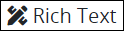
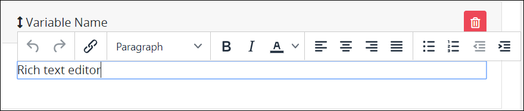
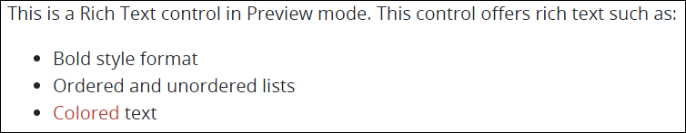

# Rich Text Control Settings

## Control Description

The Rich Text control displays HTML-formatted text and images. Use the What-You-See-Is-What-You-Get \(WYSIWYG\) editor to display a variety of text styles for the [Request](../../../../using-processmaker/requests/what-is-a-request.md) participant. Reference an image to display in the Rich Text control using HTML syntax.

Aside from rich text styles and images, the Rich Text control can display the following information regarding in-progress Requests:

* **Request data:** Display the value of another control in the same or different ProcessMaker [Screen](../../what-is-a-form.md) by referencing that control's **Variable Value** setting value using [mustache syntax](https://mustache.github.io/mustache.5.html).

  Consider the following example. If you have a [Line Input](line-input-control-settings.md) control with a **Variable Name** setting of `FullName` into which Request participants enter their full name in a different ProcessMaker Screen used in the same Request, enter `{{ FullName }}` within the Rich Text control to reference the value of that Line Input control. The `{{` and `}}` represent mustache syntax. During the Request, the Rich Text control references the Request data to locate the value of `FullName`, then displays its value in the Rich text control. This the following is required to reference the value of another control in the same or different ProcessMaker Screen during a Request:

  * **Use mustache syntax:** Encapsulate the Request data in brackets `{{` and `}}`. Spaces surrounding the Request data reference is allowed.
  * **Reference the ProcessMaker Screen control's Variable Name setting value:** Reference the ProcessMaker Screen control from which you want to reference its value by including its **Variable Name** setting.

* **Magic Variable values:** Display the value of a [Magic Variable](../../../reference-global-variables-in-your-processmaker-assets.md) by referencing the Magic Variable using mustache syntax. Example: `{{ _user.fullname }}`.

## Add the Control to a ProcessMaker Screen


Your ProcessMaker user account or group membership must have the following permissions to add a control to a ProcessMaker Screen unless your user account has the **Make this user a Super Admin** setting selected:

* Screens: View Screens
* Screens: Edit Screens

See the ProcessMaker [Screens](../../../../processmaker-administration/permission-descriptions-for-users-and-groups.md#screens) permissions or ask your ProcessMaker Administrator for assistance.


Follow these steps to add this control to the ProcessMaker Screen:

1. [Create a new ProcessMaker Screen](../../manage-forms/create-a-new-form.md) or click the **Edit** iconto edit the selected Screen. The ProcessMaker Screen is in [Design mode](../screens-builder-modes.md#editor-mode).
2. View the ProcessMaker Screen page to which to add the control.
3. Locate the **Rich Text** iconin the panel to the left of the Screen Builder canvas.
4. Drag the **Rich Text** icon into the Screen Builder canvas. Existing controls on the Screen Builder canvas adjust positioning based on where you drag the control.
5. Place into the Screen Builder canvas where you want the control to display on the ProcessMaker Screen.  

   

6. Configure the Rich Text control. See [Settings](rich-text-control-settings.md#settings).
7. Validate that the control is configured correctly. See [Validate Your Screen](../validate-your-screen.md#validate-a-processmaker-screen).

Below is a Rich Text control in [Preview mode](../screens-builder-modes.md#preview-mode).

## Delete the Control from a ProcessMaker Screen


Deleting a control also deletes configuration for that control. If you add another control, it will have default settings.


Click the **Delete** iconfor the control to delete it.

## Settings


Your user account or group membership must have the following permissions to edit a ProcessMaker Screen control:

* Screens: View Screens
* Screens: Edit Screens

See the ProcessMaker [Screens](../../../../processmaker-administration/permission-descriptions-for-users-and-groups.md#screens) permissions or ask your ProcessMaker Administrator for assistance.


The Rich Text control has the following panels that contain settings:

* \*\*\*\*[**Configuration** panel](rich-text-control-settings.md#configuration-panel-settings)
* \*\*\*\*[**Advanced** panel](rich-text-control-settings.md#advanced-panel-settings)

### Configuration Panel Settings

Click the control while in [Design](../screens-builder-modes.md#design-mode) mode, and then click the **Configuration** panel that is on the right-side of the Screen Builder canvas.

Below are settings for the Select control in the **Configuration** panel:

* **Content:** Enter the text and/or image to display in the Rich Text control using HTML syntax and/or [mustache syntax](https://mustache.github.io/mustache.5.html). Alternatively, use the What-You-See-Is-What-You-Get \(WYSIWYG\) rich text editor to enter your text. Reference your image using HTML syntax. Your text and/or images display in the **Content** setting using HTML syntax. **Rich text editor** is the default value. See this [control's description](rich-text-control-settings.md#control-description) for information how to use mustache syntax.

### Advanced Panel Settings

Click the control while in [Design](../screens-builder-modes.md#design-mode) mode, and then click the **Advanced** panel that is on the right-side of the Screen Builder canvas.

Below are settings for the Select control in the **Advanced** panel:

* **Visibility Rule:** Enter an expression that indicates the condition\(s\) under which this control displays. See [Expression Syntax Components for "Visibility Rule" Control Settings](expression-syntax-components-for-show-if-control-settings.md#expression-syntax-components-for-show-if-control-settings). If this setting does not have an expression, then this control displays by default.
* **CSS Selector Name:** Enter the value to represent this control in custom CSS syntax when in [Custom CSS](../add-custom-css-to-a-screen.md#add-custom-css-to-a-processmaker-screen) mode. As a best practice, use the same **CSS Selector Name** value on different controls of the same type to apply the same custom CSS style to all those controls.


Below are some ways to render [Request](../../../../using-processmaker/requests/what-is-a-request.md) data to display as text in a Rich Text control:

* Use [mustache syntax](https://mustache.github.io/mustache.5.html) to reference the Request data. Ensure to precede the Request data reference with `data.`. Example: `Customer First Name: {{ data.CustomerName }}`
* Include your own HTML syntax in the Rich Text control along with Request data references. Example: `Customer First Name: <strong>{{ data.CustomerName }}</strong>`

See the [Rich Text control's description](rich-text-control-settings.md#control-description) for a detailed example.



Do you need to export this ProcessMaker Screen? Click the **Export Screen** button. See [Export a Screen](../../manage-forms/export-a-screen.md#overview) for more information.


## Related Topics



































