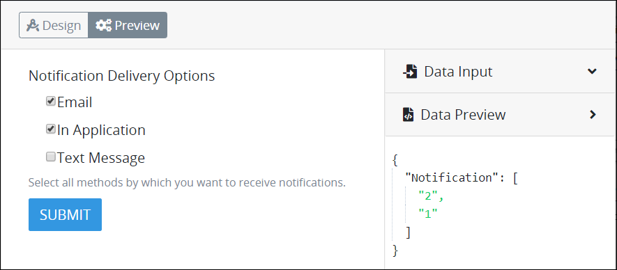
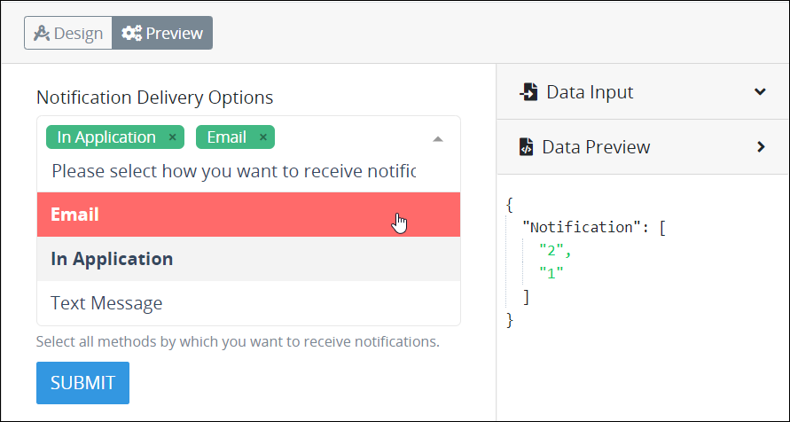
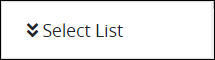
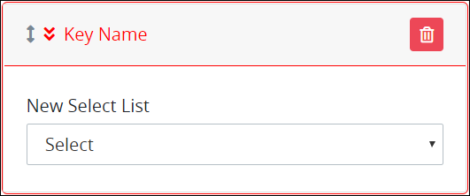
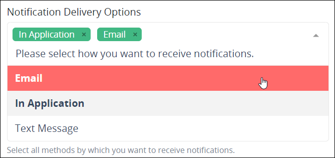
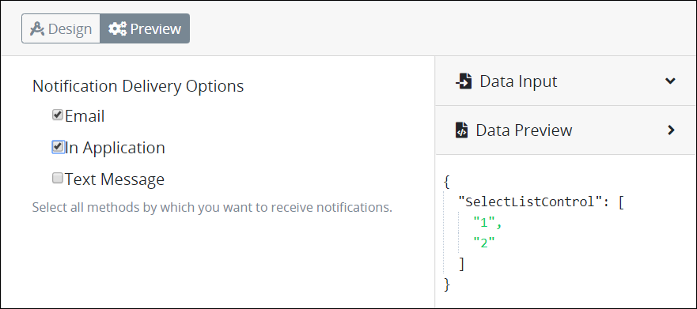

# Select List Control Settings

## Control Description

The Select List control provides either a checkbox- or multi-select drop-down menu-style control from which the [Request](../../../../using-processmaker/requests/what-is-a-request.md) participant selects one or more options.

Set options that display in this control in one of the following ways:

* **Provide each option:** For each option, enter an internal value, then enter the text that displays in the control. The internal value becomes part of the JSON data model during in-progress Requests for [Processes](../../../viewing-processes/what-is-a-process.md) that use this ProcessMaker [Screen](../../what-is-a-form.md). Optionally, organize the order in which the options display in the control.
* **Reference a data source in the JSON data model:** Reference data from the JSON data model during in-progress Requests by specifying the data name, value, and content from the JSON data model as options that display in the control during the Request. Optionally, use a [PMQL](../../../../using-processmaker/search-processmaker-data-using-pmql.md) expression to limit which data to use as options based on the PMQL expression's criteria. The order that data sources present in the JSON data model determines the order these options display in the control; options cannot be manually reordered.


This control is not available for [Display](../types-for-screens.md#display)-type ProcessMaker Screens. See [Screen Types](../types-for-screens.md).


### Checkbox Functional Description

When using the Select List control with checkboxes, the control functions similarly to multiple [Checkbox](checkbox-control-settings.md#control-description) controls whereby multiple options may be selected. Unlike using multiple Checkbox controls, the Select List control includes all selected options as an array in the order that options are selected. This array becomes part of the JSON data model as shown in the example below in [Preview mode](../screens-builder-modes.md#preview-mode).

### Drop-Down Menu Functional Description

When using the Select List control as the drop-down menu, the control functions similarly to a [Select](select-control-settings.md#control-description) control, except multiple options may be selected one at a time. Selected options have the following attributes:

* Each selected option displays in the control.
* Each selected option displays in bold-style text in the drop-down menu. Furthermore, a red-colored highlight displays when mouse-hovering over a selected option, rather than the default green-colored highlight.

Follow these guidelines to deselect an item from the Select List control when using the drop-down menu style:

* Click the imagefor the option to be removed.
* Select the option again from the drop-down menu.

The Select List control includes all selected options as an array in the order that options are selected. ****This array becomes part of the JSON data model as shown in the example below in [Preview mode](../screens-builder-modes.md#preview-mode).

## Add the Control to a ProcessMaker Screen


Your ProcessMaker user account or group membership must have the following permissions to add a control to a ProcessMaker Screen unless your user account has the **Make this user a Super Admin** setting selected:

* Screens: View Screens
* Screens: Edit Screens

See the ProcessMaker [Screens](../../../../processmaker-administration/permission-descriptions-for-users-and-groups.md#screens) permissions or ask your ProcessMaker Administrator for assistance.


Follow these steps to add this control to the ProcessMaker Screen:

1. [Create a new ProcessMaker Screen](../../manage-forms/create-a-new-form.md) or click the **Edit** iconto edit the selected Screen. The ProcessMaker Screen is in [Design mode](../screens-builder-modes.md#editor-mode).
2. View the ProcessMaker Screen page to which to add the control.
3. Locate the **Select List** iconin the panel to the left of the Screens Builder canvas.
4. Drag the **Select List** icon into the Screens Builder canvas. Existing controls on the Screens Builder canvas adjust positioning based on where you drag the control.
5. Place into the Screens Builder canvas where you want the control to display on the ProcessMaker Screen.  
6. Configure the Select List control. See [Settings](select-list-control-settings.md#inspector-settings).
7. Validate that the control is configured correctly. See [Validate Your Screen](../validate-your-screen.md#validate-a-processmaker-screen).

Below is a Select List control in [Preview mode](../screens-builder-modes.md#preview-mode).

## Delete the Control from a ProcessMaker Screen


Deleting a control also deletes configuration for that control. If you add another control, it will have default settings.


Click the **Delete** iconfor the control to delete it.

## Settings 


Your user account or group membership must have the following permissions to edit a ProcessMaker Screen control:

* Screens: View Screens
* Screens: Edit Screens

See the ProcessMaker [Screens](../../../../processmaker-administration/permission-descriptions-for-users-and-groups.md#screens) permissions or ask your ProcessMaker Administrator for assistance.


The Select List control has the following panels that contain settings:

* \*\*\*\*[**Variable** panel](select-list-control-settings.md#variable-panel-settings)
* \*\*\*\*[**Configuration** panel](select-list-control-settings.md#configuration-panel-settings)
* \*\*\*\*[**Data Source** panel](select-list-control-settings.md#data-source-panel-settings)
* \*\*\*\*[**Design** panel](select-list-control-settings.md#design-panel-settings)
* \*\*\*\*[**Advanced** panel](select-list-control-settings.md#advanced-panel-settings)

### Variable Panel Settings

Click the control while in [Design](../screens-builder-modes.md#design-mode) mode, and then click the **Variable** panel that is on the right-side of the Screens Builder canvas.

Below are settings for the Select List control in the **Variable** panel:

* **Variable Name:** Enter a unique name that represents this control's value. Use the **Variable Name** value in the following ways:
  * Reference this control by its **Variable Name** setting's value. The **Data Preview** panel in [Preview mode](../screens-builder-modes.md#preview-mode) corresponds the option\(s\) the form user selects in the Select List control with that Select List control's **Variable Name** value. The **Variable Name** setting contains the selected option\(s\) as an array. In the example below, `SelectListControl` is the **Variable Name** setting's value.  
  * Reference this control's value in a different Screens Builder control. To do so, use mustache syntax and reference this control's **Variable Name** value in the target control. Example: `{{ SelectListControl }}`.
  * Reference this value in [**Visibility Rule** setting expressions](expression-syntax-components-for-show-if-control-settings.md).
* **Validation:** Enter the validation rules the form user must comply with to properly enter a valid value into this field. This setting has no default value. See [Validation Rules for "Validation" Control Settings](validation-rules-for-validation-control-settings.md).

### Configuration Panel Settings

Click the control while in [Design](../screens-builder-modes.md#design-mode) mode, and then click the **Configuration** panel that is on the right-side of the Screens Builder canvas.

Below are settings for the Select List control in the **Configuration** panel:

* **Label:** Enter the field label text that displays. **New Select List** is the default value.
* **Placeholder Text:** Enter the placeholder text that displays in the field when no value has been provided. This setting has no default value.
* **Helper Text:** Enter text that provides additional guidance on the field's use. This setting has no default value.

### Data Source Panel Settings

Click the control while in [Design](../screens-builder-modes.md#design-mode) mode, and then click the **Data Source** panel that is on the right-side of the Screens Builder canvas.

From the **Data Source** panel, select one of the following methods to specify options that display in the Select List control:

* [Provide options](select-list-control-settings.md#provide-options): Enter an internal value, then enter the text that displays in the control.
* [Reference a data source](select-list-control-settings.md#reference-a-data-source): Reference data from the JSON data model during in-progress Requests.

#### Provide Options

#### Reference a Data Source

### Design Panel Settings

Click the control while in [Design](../screens-builder-modes.md#design-mode) mode, and then click the **Design** panel that is on the right-side of the Screens Builder canvas.

Below are settings for the Select List control in the **Design** panel:

* **Text Color:** Select to specify the text color that displays in this control.
* **Background Color:** Select to specify the background color of this control.

### Advanced Panel Settings

Click the control while in [Design](../screens-builder-modes.md#design-mode) mode, and then click the **Advanced** panel that is on the right-side of the Screens Builder canvas.

Below are settings for the Select List in the **Advanced** panel:

* **Visibility Rule:** Specify an expression that indicates the condition\(s\) under which this control displays. See [Expression Syntax Components for "Visibility Rule" Control Settings](expression-syntax-components-for-show-if-control-settings.md#expression-syntax-components-for-show-if-control-settings). If this setting does not have an expression, then this control displays by default.
* **CSS Selector Name:** Enter the value to represent this control in custom CSS syntax when in [Custom CSS](../add-custom-css-to-a-screen.md#add-custom-css-to-a-processmaker-screen) mode. As a best practice, use the same **CSS Selector Name** value on different controls of the same type to apply the same custom CSS style to all those controls.



