# Select List Control Settings

## Control Description

The Select List control provides either a checkbox- or multi-select drop-down menu-style control from which the [Request](../../../../using-processmaker/requests/what-is-a-request.md) participant selects one or more options.

Set options that display in this control in one of the following ways:

* **Provide each option:** For each option, enter a unique value that represents the option, and then enter the text that displays as the option. After your options are configured, sort the order in which they are to display in the control. Alternatively, provide options in the control in JSON format.
* **Reference a data source in the JSON data model:** Reference data from a [ProcessMaker Data Connector](../../../data-connector-management/what-is-a-data-connector.md) that displays in this control as its options. Specify the data name, value, and content from the Data Connector. Optionally, use a [PMQL](../../../../using-processmaker/search-processmaker-data-using-pmql.md) expression to limit which data to use as options based on the PMQL expression's criteria. The order that data objects present in the data object determines the order these options display in the control; options cannot be manually reordered.


This control is not available for [Display](../types-for-screens.md#display)-type ProcessMaker Screens. See [Screen Types](../types-for-screens.md).


### Checkbox Functional Description

When using the Select List control with checkboxes, the control functions similarly to multiple [Checkbox](checkbox-control-settings.md#control-description) controls whereby multiple options may be selected. Unlike using multiple Checkbox controls, the Select List control includes all selected options as an array in the order that options are selected. This array becomes part of the JSON data model as shown in the example below in [Preview mode](../screens-builder-modes.md#preview-mode).


### Drop-Down Menu Functional Description

When using the Select List control as the drop-down menu, multiple options may be selected one at a time. Selected options have the following attributes:

* Each selected option displays in the control.
* Each selected option displays in bold-style text in the drop-down menu. Furthermore, a red-colored highlight displays when mouse-hovering over a selected option, rather than the default green-colored highlight for deselected options.

Follow these guidelines to deselect an item from the Select List control when using the drop-down menu style:

* Click the imagefor the option to be removed.
* Select the option again from the drop-down menu.

The Select List control includes all selected options as an array in the order that options are selected. ****This array becomes part of the JSON data model as shown in the example below in [Preview mode](../screens-builder-modes.md#preview-mode).


## Add the Control to a ProcessMaker Screen


Your ProcessMaker user account or group membership must have the following permissions to add a control to a ProcessMaker Screen unless your user account has the **Make this user a Super Admin** setting selected:

* Screens: View Screens
* Screens: Edit Screens

See the ProcessMaker [Screens](../../../../processmaker-administration/permission-descriptions-for-users-and-groups.md#screens) permissions or ask your ProcessMaker Administrator for assistance.


Follow these steps to add this control to the [ProcessMaker Screen](../../what-is-a-form.md):

1. [Create a new ProcessMaker Screen](../../manage-forms/create-a-new-form.md) or click the **Edit** iconto edit the selected Screen. The ProcessMaker Screen is in [Design mode](../screens-builder-modes.md#editor-mode).
2. View the ProcessMaker Screen page to which to add the control.
3. Locate the **Select List** iconin the panel to the left of the Screen Builder canvas.
4. Drag the **Select List** icon into the Screen Builder canvas. Existing controls on the Screen Builder canvas adjust positioning based on where you drag the control.
5. Place into the Screen Builder canvas where you want the control to display on the ProcessMaker Screen.  
6. Configure the Select List control. See [Settings](select-list-control-settings.md#inspector-settings).
7. Validate that the control is configured correctly. See [Validate Your Screen](../validate-your-screen.md#validate-a-processmaker-screen).

Below is a Select List control in [Preview mode](../screens-builder-modes.md#preview-mode).


## Move the Control on the Page


Your ProcessMaker user account or group membership must have the following permissions to move a control in a ProcessMaker Screen page unless your user account has the **Make this user a Super Admin** setting selected:

* Screens: Edit Screens
* Screens: View Screens

See the ProcessMaker [Screens](../../../../processmaker-administration/permission-descriptions-for-users-and-groups.md#screens) permissions or ask your ProcessMaker Administrator for assistance.


After [adding a control to a ProcessMaker Screen page](select-list-control-settings.md#add-the-control-to-a-processmaker-screen), you may move it to another location on that page such that it is above or below other controls placed on that page. A control cannot be moved to another [ProcessMaker Screen](../../what-is-a-form.md) page.

Follow these steps to move a control to another location on that ProcessMaker Screen page:

1. Place your cursor anywhere on the control not displaying the **Duplicate Control**or **Delete Control**buttons.
2. Hold your cursor, then drag the control above or below other controls on that ProcessMaker Screen page. Screen Builder previews where the control would display on the page based on how you position the control above or below other controls. If the control cannot be placed in a location because your cursor is above an existing control or too far to the left or right of the page, theicon displays in the preview.
3. Place the control at the location on the page you want it. The other control\(s\) on the page automatically adjust position.

## Copy the Control with its Settings


Your ProcessMaker user account or group membership must have the following permissions to copy a control in a ProcessMaker Screen unless your user account has the **Make this user a Super Admin** setting selected:

* Screens: Edit Screens
* Screens: View Screens

See the ProcessMaker [Screens](../../../../processmaker-administration/permission-descriptions-for-users-and-groups.md#screens) permissions or ask your ProcessMaker Administrator for assistance.


Copying a control also copies the current settings of that control. The copied control displays below other controls placed on that [ProcessMaker Screen](../../what-is-a-form.md) page.


As a best practice, after copying a control, change the [**Variable Name** setting](select-list-control-settings.md#variable-name) value for the copied control to its own unique variable value. Otherwise, in-progress [Requests](../../../../using-processmaker/requests/what-is-a-request.md) that use this ProcessMaker Screen read from and send data to both controls.


Follow these steps to copy a control:

1. Select the control to be copied.
2. Click the **Duplicate Control** button. The control copies with its current settings, and then displays below other controls placed on that page.

## Delete the Control from a ProcessMaker Screen


Your ProcessMaker user account or group membership must have the following permissions to delete a control from a ProcessMaker Screen unless your user account has the **Make this user a Super Admin** setting selected:

* Screens: Edit Screens
* Screens: View Screens

See the ProcessMaker [Screens](../../../../processmaker-administration/permission-descriptions-for-users-and-groups.md#screens) permissions or ask your ProcessMaker Administrator for assistance.



Deleting a control also deletes configuration for that control. If you add another control, it will have default settings.


Follow these steps to delete a control from a [ProcessMaker Screen](../../what-is-a-form.md) page:

1. Select the control to be deleted.
2. Click the **Delete** button. The control deletes. Other controls on that ProcessMaker Screen page adjust their locations automatically.

## Settings <a id="inspector-settings"></a>


### Permissions Required

Your user account or group membership must have the following permissions to edit a ProcessMaker Screen control:

* Screens: Edit Screens
* Screens: View Screens

See the ProcessMaker [Screens](../../../../processmaker-administration/permission-descriptions-for-users-and-groups.md#screens) permissions or ask your ProcessMaker Administrator for assistance.

### Topic Update

This topic is updated for ProcessMaker version 4.0.1. See the [Release Notes](https://processmaker.gitbook.io/processmaker-release-notes/processmaker-4.0.x/processmaker-4.0.1-release-notes#screen-builder-1).


The Select List control has the following panels that contain settings:

* \*\*\*\*[**Variable** panel](select-list-control-settings.md#variable-panel-settings)
* \*\*\*\*[**Configuration** panel](select-list-control-settings.md#configuration-panel-settings)
* \*\*\*\*[**Data Source** panel](select-list-control-settings.md#data-source-panel-settings)
* \*\*\*\*[**Design** panel](select-list-control-settings.md#design-panel-settings)
* \*\*\*\*[**Advanced** panel](select-list-control-settings.md#advanced-panel-settings)

### Variable Panel Settings

Click the control while in [Design](../screens-builder-modes.md#design-mode) mode, and then click the **Variable** panel that is on the right-side of the Screen Builder canvas.

Below are settings for the Select List control in the **Variable** panel:

* [Variable Name](select-list-control-settings.md#variable-name)
* [Label](select-list-control-settings.md#label)
* [Validation Rules](select-list-control-settings.md#validation-rules)

#### Variable Name

Edit the default **Variable Name** setting value for this control if necessary. The **Variable Name** setting value represents data in this control during [Requests](../../../../using-processmaker/requests/what-is-a-request.md). Ensure that the **Variable Name** setting value is a unique name from other controls in this [ProcessMaker Screen](../../what-is-a-form.md) and contains at least one letter. This is a required setting.  
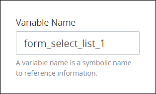 

Use the **Variable Name** setting value in the following ways:

* Reference this control by its **Variable Name** setting's value. The **Data Preview** panel in [Preview mode](../screens-builder-modes.md#preview-mode) corresponds the option\(s\) the Request participant selects in the Select List control with that Select List control's **Variable Name** value. The **Variable Name** setting contains the selected option\(s\) as an array. In the example below, `SelectListControl` is the **Variable Name** setting's value.  
* Reference this control's value in a different Screen Builder control. To do so, use [mustache syntax](https://mustache.github.io/mustache.5.html) and reference this control's **Variable Name** value in the target control. Example: `{{ SelectListControl }}`.
* Reference this value in [**Visibility Rule** setting expressions](expression-syntax-components-for-show-if-control-settings.md).

#### Label

Edit the default label that displays for this control if necessary. **New Select List** is the default value.  
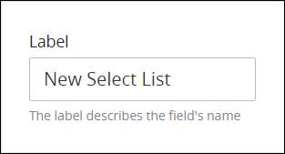 

#### Validation Rules

Enter the validation rule\(s\) the Request participant must comply with to properly enter a valid value into this control. This setting has no default value. If there are no configured validation rules the following message displays: **No validation rule\(s\)**. See [Validation Rules for "Validation" Control Settings](validation-rules-for-validation-control-settings.md).  
 

Follow these steps to add a validation rule to this control:

1. Access the [**Variable** panel for this control](select-list-control-settings.md#variable-panel-settings) while in [Design](../screens-builder-modes.md#design-mode) mode, and then locate the **Validation Rules** setting.
2. Click the **Add Rule** button. The **Select** drop-down menu displays.  
3. Select the rule that this control validates against.
4. Click **Save**. Parameters for the selected rule display. Parameter settings display which ones are required to properly configure the rule.
5. Enter the parameter settings that this control uses to validate against. See [Validation Rule Settings](validation-rules-for-validation-control-settings.md#validation-rule-settings), and then locate the validation rule for its parameters.

Follow these steps to edit a validation rule for this control:

1. Access the [**Variable** panel for this control](select-list-control-settings.md#variable-panel-settings) while in [Design](../screens-builder-modes.md#design-mode) mode, and then locate the **Validation Rules** setting.
2. Click the **Edit** iconfor the validation rule to edit if that rule can be edited. Validation rules that do not have parameters cannot be edited. The parameter settings for that validation rule displays.
3. Edit the parameter settings that this control uses to validate against. See [Validation Rule Settings](validation-rules-for-validation-control-settings.md#validation-rule-settings), and then locate the validation rule for its parameters.

Follow these steps to delete a validation rule for this control:

1. Access the [**Variable** panel for this control](select-list-control-settings.md#variable-panel-settings) while in [Design](../screens-builder-modes.md#design-mode) mode, and then locate the **Validation Rules** setting.
2. Click the **Delete** iconfor the validation rule to delete. A message displays to confirm deletion of the validation rule.
3. Click **Delete**.

### Configuration Panel Settings

Click the control while in [Design](../screens-builder-modes.md#design-mode) mode, and then click the **Configuration** panel that is on the right-side of the Screen Builder canvas.

Below are settings for the Select List control in the **Configuration** panel:

* [Placeholder Text](select-list-control-settings.md#placeholder-text)
* [Helper Text](select-list-control-settings.md#helper-text)

#### Placeholder Text

Enter the placeholder text that displays in this control when no value has been provided. This setting has no default value.  
 

#### Helper Text

Enter text that provides additional guidance on this control's use. This setting has no default value.  
 

### Data Source Panel Settings

Click the control while in [Design](../screens-builder-modes.md#design-mode) mode, and then click the **Data Source** panel that is on the right-side of the Screen Builder canvas.

From the **Data Source** panel, select one of the following methods to specify options that display in the Select List control:

* [Provide options](select-list-control-settings.md#provide-options): Enter a unique value that represents each option, and then enter the text that displays as the option. After your options are configured, sort the order in which they are to display in this control. Alternatively, provide options in this control in JSON format.
* [Request data](select-list-control-settings.md#reference-request-data): Reference data from the in-progress Request as options in this control. This data object must be part of the Request's JSON data model. During the in-progress Request, the Select List control references a specified data array and object in the Request's JSON data model to display its values as options in that control. The order that data objects are in the Request's JSON data model determines the order these options display in the control; options cannot be manually reordered.
* [ProcessMaker Data Connector](select-list-control-settings.md#reference-a-data-connector): Reference the data from a ProcessMaker Data Connector's [Endpoint](../../../data-connector-management/what-is-a-data-connector.md#what-is-an-endpoint) as options in this control. Note that the [ProcessMaker Data Connector](../../../../package-development-distribution/package-a-connector/data-connector-package.md) package must be installed to your ProcessMaker instance for this option to be available.

  These Endpoints a [ProcessMaker Data Connector](../../../data-connector-management/what-is-a-data-connector.md) references may be Application Program Interface \(API\) endpoints, ProcessMaker Collection records, or other data source endpoints. During the in-progress Request, when the Select List control references data from the ProcessMaker Data Connector, the control maps the ProcessMaker Data Connector data to a specified JSON data array, variable or key name, or data object to become part of that Request's data. Data maps to the JSON data array in the same order it is retrieved from the ProcessMaker Data Connector. Optionally, use a [PMQL](../../../../using-processmaker/search-processmaker-data-using-pmql.md) expression to limit which data to use as options based on the PMQL expression's criteria. The order that data objects return from the ProcessMaker Data Connector determines the order these options display in the control; options cannot be manually reordered.

#### Provide Options

See the following procedures how to provide options for a Select List control.



### Add an Option to This Select List Control

Follow these steps to add an option that displays in this control using the ProcessMaker interface:

1. Access the [**Data Source** panel for this control](select-list-control-settings.md#data-source-panel-settings) while in [Design](../screens-builder-modes.md#design-mode) mode, and then locate the **Data Source** setting.
2. From the **Data Source** drop-down menu, select **Provide Values** if this setting is not selected. This is the default setting. 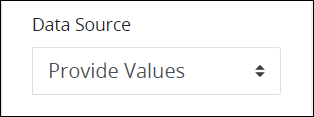 
3. Ensure that the **Options** list label displays. If the **JSON Data** option displays, click the **Edit as Option List** option. 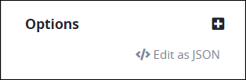 
4. Click the iconbeside the **Options** list label. The **Add Option** screen displays.  
5. In the **Value** setting, enter a value to represent the option in the [Request](../../../../using-processmaker/requests/what-is-a-request.md) data. This value must be unique from other values in this control. If the value is not unique to other **Value** settings in this control, the following message displays: **An item with the same key already exists**.
6. In the **Content** setting, enter the option that displays in this control.
7. Click **Save**. The option displays below the **Options** list label.  

### Edit an Option for This Select List Control

Follow these steps to edit an option that displays in this control using the ProcessMaker interface:

1. Access the [**Data Source** panel for this control](select-list-control-settings.md#data-source-panel-settings) while in [Design](../screens-builder-modes.md#design-mode) mode, and then ensure that the **Data Source** setting uses the **Provide Values** option.  
2. Ensure that the **Options** list label displays. If the **JSON Data** option displays, click the **Edit as Option List** option. 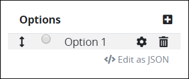 
3. Click theicon for an option to edit its settings. The **Edit Option** screen displays. 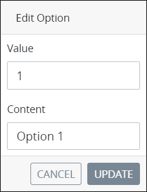 
4. In the **Value** setting, edit the value to represent the option in the JSON data model during in-progress Requests for Processes that use this ProcessMaker Screen as necessary. This value must be unique from other values in this control. If the value is not unique to other **Value** settings in this control, the following message displays: **An item with the same key already exists**.
5. In the **Content** setting, edit the option that displays in this control as necessary.
6. Click **Update**. The edited option displays below the **Options** list label.

### Delete an Option from This Select List Control

Follow these steps to delete an option from in this control using the ProcessMaker interface:

1. Access the [**Data Source** panel for this control](select-list-control-settings.md#data-source-panel-settings) while in [Design](../screens-builder-modes.md#design-mode) mode, and then ensure that the **Data Source** setting uses the **Provide Values** option.  
2. Ensure that the **Options** list label displays. If the **JSON Data** option displays, click the **Edit as Option List** option.  
3. Click theicon for the option to be deleted from this control. A message displays to confirm deletion of the option.
4. Click **Delete**.

### Sort the Order of the Options

Follow these steps to sort the order of the options that display in this control using the ProcessMaker interface:

1. Access the [**Data Source** panel for this control](select-list-control-settings.md#data-source-panel-settings) while in [Design](../screens-builder-modes.md#design-mode) mode, and then ensure that the **Data Source** setting uses the **Provide Values** option.  
2. Ensure that the **Options** list label displays. If the **JSON Data** option displays, click the **Edit as Option List** option.  
3. Drag theicon for each option up or down to sort the order they display in this control as necessary.

### Set to Allow Multiple Selections and How Options Display

Follow these steps to set whether multiple selections can be selected from this control and how the options display:

1. Access the [**Data Source** panel for this control](select-list-control-settings.md#data-source-panel-settings) while in [Design](../screens-builder-modes.md#design-mode) mode, and then ensure that the **Data Source** setting uses the **Provide Values** option.  
2. Click the **Allow multiple selections** setting to allow multiple options be selected from this control. Otherwise, only one option can be selected. 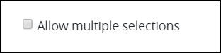 
3. From the **Render Options As** drop-down menu, select one of the following options:
   * **Dropdown/Multiselect:** Select the **Dropdown/Multiselect** option to display the control as a drop-down menu.
   * **Radio/Checkbox Group:** Select the **Radio/Checkbox Group** option to display the control as a group of checkboxes. 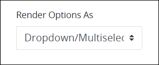 



### Provide Options Using a JSON Schema to This Select List Control

Follow these steps to provide options that display in this control using a JSON schema:

1. Access the [**Data Source** panel for this control](select-list-control-settings.md#data-source-panel-settings) while in [Design](../screens-builder-modes.md#design-mode) mode, and then locate the **Data Source** setting.
2. From the **Data Source** drop-down menu, select **Provide Values** if this setting is not selected. This is the default setting.  
3. Click the **Edit as JSON** option below the **Options** list label. If the **JSON Data** setting displays, skip this step.  
    

   The **JSON Data** setting displays. If a valid JSON schema has been configured previously, the **JSON Data** setting displays the JSON. Otherwise the setting is empty.

4. Click the iconbeside the **JSON Data** option. The **Script Config Editor** displays.  

   

5. Enter your control options in the order they are to display in this control using JSON format. Use the scroll panel to the right of the JSON to scroll to different sections of the JSON if necessary. This is useful especially when you are editing a long JSON.
6. Click **Close** or the **Close** icon. The control options are saved.

### Set to Allow Multiple Selections and How Options Display

Follow these steps to set whether multiple selections can be selected from this control and how the options display:

1. Access the [**Data Source** panel for this control](select-list-control-settings.md#data-source-panel-settings) while in [Design](../screens-builder-modes.md#design-mode) mode, and then ensure that the **Data Source** setting uses the **Provide Values** option.  
2. Click the **Allow multiple selections** setting to allow multiple options be selected from this control. Otherwise, only one option can be selected.  
3. From the **Render Options As** drop-down menu, select one of the following options:
   * **Dropdown/Multiselect:** Select the **Dropdown/Multiselect** option to display the control as a drop-down menu.
   * **Radio/Checkbox Group:** Select the **Radio/Checkbox Group** option to display the control as a group of checkboxes.  



#### Reference Request Data

Follow these steps to reference data from the in-progress Request as options in this control:

1. Access the [**Data Source** panel for this control](select-list-control-settings.md#data-source-panel-settings) while in [Design](../screens-builder-modes.md#design-mode) mode.
2. From the **Data Source** drop-down menu, select **Request Data**. 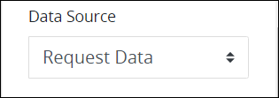 
3. Select the **Allow multiple selections** option to allow multiple selections from this control. Otherwise, only one option can be selected.  
4. From the **Render Options As** drop-down menu, select one of the following options:
   * **Dropdown/Multiselect:** Select the **Dropdown/Multiselect** option to display the control as a drop-down menu.
   * **Radio/Checkbox Group:** Select the **Radio/Checkbox Group** option to display the control as a group of checkboxes.  
5. In the **Element Name** setting, enter the name of the JSON data array within the Request data from which to reference its objects as options that display in this control. Use JSON dot notation as necessary. **response** is the default value. Example: `data.response`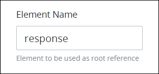 
6. In the **Value** setting, enter the JSON key name from within the JSON data array selected from the  **Element Name** setting to reference its objects as options that display in this control. Use JSON dot notation as necessary. **value** is the default value. Example: `data.response.value`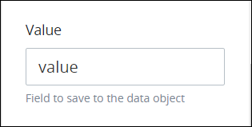 
7. In the **Content** setting, enter the JSON object name that corresponds with the JSON key name selected from the **Value** setting's JSON key name to display its content as options in this control. Use JSON dot notation as necessary. **content** is the default value. Example: `data.response.value.content` 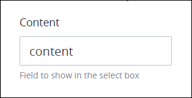 

#### Reference a ProcessMaker Data Connector

Follow these steps to reference data from a [ProcessMaker Data Connector](../../../data-connector-management/what-is-a-data-connector.md) as options in this control:

1. Access the [**Data Source** panel for this control](select-list-control-settings.md#data-source-panel-settings) while in [Design](../screens-builder-modes.md#design-mode) mode.
2. From the **Data Source** drop-down menu, select **Data Connector**. 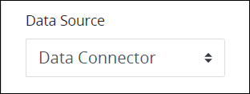 
3. Select the **Allow multiple selections** option to allow multiple selections from this control. Otherwise, only one option can be selected.  
4. From the **Render Options As** drop-down menu, select one of the following options:
   * **Dropdown/Multiselect:** Select the **Dropdown/Multiselect** option to display the control as a drop-down menu.
   * **Radio/Checkbox Group:** Select the **Radio/Checkbox Group** option to display the control as a group of checkboxes.  
5. From the **Data Connector** drop-down menu, select from which ProcessMaker Data Connector to reference as a data source. If a ProcessMaker Data Connector does not exist, this setting has no options. 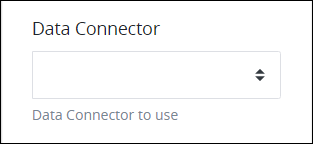 
6. From the **Endpoint** drop-down menu, select which [Endpoint](../../../data-connector-management/what-is-a-data-connector.md#what-is-an-endpoint) to reference from the selected ProcessMaker Data Connector. These Endpoints are configured from the ProcessMaker Data Connector itself. Depending on the ProcessMaker Data Connector selected from the **Data Connector Name** drop-down menu, these Endpoints may reference API endpoints, ProcessMaker Collection records, or other data source endpoints. 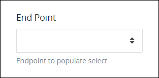 
7. In the **Element Name** setting, enter the name of the JSON data array within the selected ProcessMaker Data Connector from which to reference its objects as options that display in this control. This JSON data array and its content becomes part of that Request's data. Use JSON dot notation as necessary. **response** is the default value.  
8. In the **Value** setting, enter the JSON key name from within the JSON data array selected from the  **Element Name** setting to reference its objects as options that display in this control. Use JSON dot notation as necessary. **value** is the default value.  
9. In the **Content** setting, enter the JSON object name that corresponds with the JSON key name selected from the **Value** setting's JSON key name to display its content as options in this control. Use JSON dot notation as necessary. **content** is the default value.  
10. In the **PMQL** setting, optionally enter a [PMQL](../../../../using-processmaker/search-processmaker-data-using-pmql.md#overview) expression to filter which data in the JSON data array to display as options in this control based on which objects in that array meet the PMQL expression's criteria. 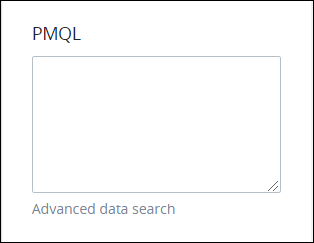 

Consider the following example of doctors who work in a clinic. 

```javascript
doctors = [
    {id: 1, name: 'Adam Ardin', gender: 'male'},
    {id: 2, name: 'Amanda Creek', gender: 'female'},
    {id: 3, name: 'Lucy Morales', gender: 'female'},
    {id: 4, name: 'Mindy Smith', gender: 'female'},
    {id: 5, name: 'Toby Tomlinson', gender: 'male'}
]
```

Use the following settings to reference this data array as options for this control:

* **Element Name:** `doctors`
* **Value:** `id`
* **Content:** `name`

Suppose that a new patient at the clinic indicates that she wants to see a female doctor. To filter doctors from this JSON data array who are female in the clinic so that only those objects display as options in a Select List control, use the following PMQL expression in the **PMQL** setting of that control:

`gender = "female"`

### Design Panel Settings

Click the control while in [Design](../screens-builder-modes.md#design-mode) mode, and then click the **Design** panel that is on the right-side of the Screen Builder canvas.

Below are settings for the Select List control in the **Design** panel:

* [Text Color](select-list-control-settings.md#text-color)
* [Background Color](select-list-control-settings.md#background-color)

#### Text Color

Select the text color that displays for this control. Optionally, click the **Clear Color Selection** option to remove the selected color.  
 

#### Background Color

Select the background color that displays for this control. Optionally, click the **Clear Color Selection** option to remove the selected color.  
 

### Advanced Panel Settings

Click the control while in [Design](../screens-builder-modes.md#design-mode) mode, and then click the **Advanced** panel that is on the right-side of the Screen Builder canvas.

Below are settings for the Select List in the **Advanced** panel:

* [Default Value](select-list-control-settings.md#default-value)
* [Visibility Rule](select-list-control-settings.md#visibility-rule)
* [CSS Selector Name](select-list-control-settings.md#css-selector-name)

#### Default Value

Enter the default value this control displays. If the **Default Value** setting has no value, then this control does not display a value when the ProcessMaker Screen displays. When the ProcessMaker Screen submits, the Request uses this control's default value unless the Request participant changed it.  
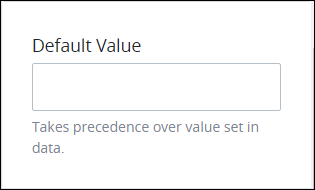 

#### Visibility Rule

Specify an expression that indicates the condition\(s\) under which this control displays. See [Expression Syntax Components for "Visibility Rule" Control Settings](expression-syntax-components-for-show-if-control-settings.md#expression-syntax-components-for-show-if-control-settings). If this setting does not have an expression, then this control displays by default.  
 


To make this control hidden until another control contains a value, enter the **Variable Name** setting value of that control to this control's **Visibility Rule** setting.


#### CSS Selector Name

Enter the value to represent this control in custom CSS syntax when in [Custom CSS](../add-custom-css-to-a-screen.md#add-custom-css-to-a-processmaker-screen) mode. As a best practice, use the same **CSS Selector Name** value on different controls of the same type to apply the same custom CSS style to all those controls.  
 

## Related Topics <a id="related-topics"></a>





































