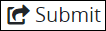
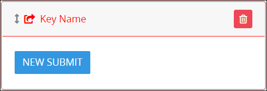
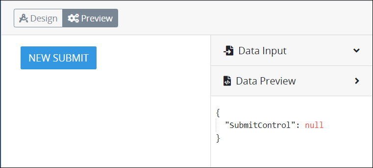

# Submit Button Control Settings

## Control Description

The Submit Button control adds a button from which the [Request](../../../../using-processmaker/requests/what-is-a-request.md) participant submits the ProcessMaker [Screen](../../what-is-a-form.md). After using the Submit Button control, the Request participant cannot revise that form.


This control is not available for [Display](../types-for-screens.md#display)-type ProcessMaker Screens. See [Screen Types](../types-for-screens.md).


## Add the Control to a ProcessMaker Screen 


Your ProcessMaker user account or group membership must have the following permissions to add a control to a ProcessMaker Screen unless your user account has the **Make this user a Super Admin** setting selected:

* Screens: View Screens
* Screens: Edit Screens

See the ProcessMaker [Screens](../../../../processmaker-administration/permission-descriptions-for-users-and-groups.md#screens) permissions or ask your ProcessMaker Administrator for assistance.


Follow these steps to add this control to the ProcessMaker Screen:

1. [Create a new ProcessMaker Screen](../../manage-forms/create-a-new-form.md) or click the **Edit** iconto edit the selected Screen. The ProcessMaker Screen is in [Design mode](../screens-builder-modes.md#editor-mode).
2. View the ProcessMaker Screen page to which to add the control.
3. Locate the **Submit Button** iconin the panel to the left of the Screen Builder canvas.
4. Drag the **Submit Button** icon into the Screen Builder canvas. Existing controls on the Screen Builder canvas adjust positioning based on where you drag the control.
5. Place into the Screen Builder canvas where you want the control to display on the ProcessMaker Screen.  

   

6. Configure the Submit Button control. See [Settings](submit-button-control-settings.md#inspector-settings).
7. Validate that the control is configured correctly. See [Validate Your Screen](../validate-your-screen.md#validate-a-processmaker-screen).

Below is a Submit Button control in [Preview mode](../screens-builder-modes.md#preview-mode).

## Delete the Control from a ProcessMaker Screen


Deleting a control also deletes configuration for that control. If you add another control, it will have default settings.


Click the **Delete** iconfor the control to delete it.

## Settings 


### Permissions Required

Your user account or group membership must have the following permissions to edit a ProcessMaker Screen control:

* Screens: View Screens
* Screens: Edit Screens

See the ProcessMaker [Screens](../../../../processmaker-administration/permission-descriptions-for-users-and-groups.md#screens) permissions or ask your ProcessMaker Administrator for assistance.

### Topic Update

This topic is updated for ProcessMaker version 4.0.1. See the [Release Notes](https://processmaker.gitbook.io/processmaker-release-notes/processmaker-4.0.x/processmaker-4.0.1-release-notes#screen-builder-1).


The Submit Button control has the following panels that contain settings:

* \*\*\*\*[**Variable** panel](submit-button-control-settings.md#variable-panel-settings)
* \*\*\*\*[**Configuration** panel](submit-button-control-settings.md#configuration-panel-settings)
* \*\*\*\*[**Design** panel](submit-button-control-settings.md#design-panel-settings)
* \*\*\*\*[**Advanced** panel](submit-button-control-settings.md#advanced-panel-settings)

### Variable Panel Settings

Click the control while in [Design](../screens-builder-modes.md#design-mode) mode, and then click the **Variable** panel that is on the right-side of the Screen Builder canvas.

Below are settings for the Submit Button control in the **Variable** panel:

* [Variable Name](submit-button-control-settings.md#variable-name)
* [Label](submit-button-control-settings.md#label)
* [Value](submit-button-control-settings.md#value)

#### Variable Name

Edit the default **Variable Name** setting value for this control if necessary. The **Variable Name** setting value represents data in this control during [Requests](../../../../using-processmaker/requests/what-is-a-request.md). Ensure that the **Variable Name** setting value is a unique name from other controls in this [ProcessMaker Screen](../../what-is-a-form.md) and contains at least one letter. Use the **Variable Name** setting value in the following ways:

* Reference this control by its **Variable Name** setting's value. The **Data Preview** panel in [Preview mode](../screens-builder-modes.md#preview-mode) corresponds the Submit Button control's **Variable Name** value. In the example below, `SubmitButtonControl` is the **Variable Name** setting's value when the button is clicked.  
* Reference this control's value in a different Screen Builder control. To do so, use [mustache syntax](https://mustache.github.io/mustache.5.html) and reference this control's **Variable Name** value in the target control. Example: `{{ SubmitButtonControl }}`.
* Reference this value in [**Visibility Rule** setting expressions](expression-syntax-components-for-show-if-control-settings.md).

This is a required setting.

#### Label

Edit the default label that displays for this control if necessary. **New Submit** is the default value.

#### Value

Enter any alphanumeric value that represents data when the [Request](../../../../using-processmaker/requests/what-is-a-request.md) participant selects the Submit Button control. This value can be evaluated in a [**Visibility Rule** setting expression](expression-syntax-components-for-show-if-control-settings.md) or in a [Sequence Flow element's condition\(s\) to trigger](../../../process-design/model-your-process/the-quick-toolbar.md#configure-an-outgoing-sequence-flow-element-from-an-exclusive-gateway-or-inclusive-gateway-element).

### Design Panel Settings

Click the control while in [Design](../screens-builder-modes.md#design-mode) mode, and then click the **Design** panel that is on the right-side of the Screen Builder canvas.

Below is the setting for the Submit Button control in the **Design** panel:

* [Button Variant Style](submit-button-control-settings.md#button-variant-style)

#### Button Variant Style

Select the style for the Submit Button control. The style changes the control's appearance but otherwise has no functional difference. Select from the following options:

* **Primary:** Blue-colored background with white-colored **Label** text. This is the default option.
* **Secondary:** Gray-colored background with white-colored **Label** text.
* **Success:** Green-colored background with white-colored **Label** text.
* **Danger:** Red-colored background with white-colored **Label** text.
* **Warning:** Yellow-colored background with black-colored **Label** text.
* **Info:** Teal-colored background with white-colored **Label** text.
* **Light:** White-colored background with black-colored **Label** text.
* **Dark:** Black-colored background with white-colored **Label** text.
* **Link:** White-colored background with blue-colored **Label** text.

### Advanced Panel Settings

Click the control while in [Design](../screens-builder-modes.md#design-mode) mode, and then click the **Advanced** panel that is on the right-side of the Screen Builder canvas.

Below are settings for the Submit Button control in the **Advanced** panel:

* [Visibility Rule](submit-button-control-settings.md#visibility-rule)
* [CSS Selector Name](submit-button-control-settings.md#css-selector-name)

#### Visibility Rule

Specify an expression that indicates the condition\(s\) under which this control displays. See [Expression Syntax Components for "Visibility Rule" Control Settings](expression-syntax-components-for-show-if-control-settings.md#expression-syntax-components-for-show-if-control-settings). If this setting does not have an expression, then this control displays by default.

#### CSS Selector Name

Enter the value to represent this control in custom CSS syntax when in [Custom CSS](../add-custom-css-to-a-screen.md#add-custom-css-to-a-processmaker-screen) mode. As a best practice, use the same **CSS Selector Name** value on different controls of the same type to apply the same custom CSS style to all those controls.

## Related Topics 









































