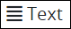
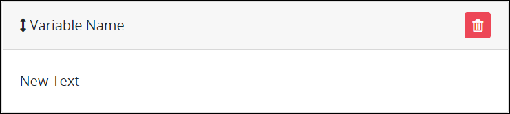
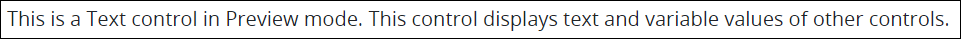

# Text Control Settings

## Control Description

The Text control adds a text field that displays plain or bold-formatted text. This control can display the value of another control by referencing that control's **Variable Value** field setting using mustache syntax. Example: `{{FullName}}`.

## Add the Control to a ProcessMaker Screen


Your user account or group membership must have the following permissions to add a control to a ProcessMaker Screen:

* Screens: View Screens
* Screens: Edit Screens

See the ProcessMaker [Screens](../../../../processmaker-administration/permission-descriptions-for-users-and-groups.md#screens) permissions or ask your ProcessMaker Administrator for assistance.


Follow these steps to add this control to the ProcessMaker Screen:

1. [Create a new ProcessMaker Screen](../../manage-forms/create-a-new-form.md) or click the **Edit** iconto edit the selected Screen. The ProcessMaker Screen is in [Design mode](../screens-builder-modes.md#editor-mode).
2. View the ProcessMaker Screen page to which to add the control.
3. Go to the **Controls** panel on the left side of the ProcessMaker Screen.
4. Drag the **Text** icon  from the left-side panel anywhere within the ProcessMaker Screen canvas. Existing controls on the ProcessMaker Screen canvas adjust positioning based on where you drag the control.
5. Place into the ProcessMaker Screen canvas where you want the control to display on the page.   

   

6. Configure the Text control. See [Design Settings](text-control-settings.md#inspector-settings).
7. Validate that the control is configured correctly. See [Validate Your Screen](../validate-your-screen.md#validate-a-processmaker-screen).

Below is a Text control in [Preview mode](../screens-builder-modes.md#preview-mode).

## Delete the Control from a ProcessMaker Screen


Deleting a control also deletes configuration for that control. If you add another control, it will have default settings.


Click the **Delete** iconfor the control to delete it.

## Settings


Your user account or group membership must have the following permissions to edit a ProcessMaker Screen control:

* Screens: View Screens
* Screens: Edit Screens

See the ProcessMaker [Screens](../../../../processmaker-administration/permission-descriptions-for-users-and-groups.md#screens) permissions or ask your ProcessMaker Administrator for assistance.


Click the control to view its settings in the **Design** panel that is on the right-side of the Screens Builder canvas. Below are settings for the Text control:

* **Text Content:** Enter what text displays for the Text control. **New Text** is the default value. You can change what text will display.

  Also use the Text control to display the variable value of another control in the same or another ProcessMaker Screen. To do so, use mustache syntax and reference the **Variable Value** setting value for the control from which you want to display its value. Example: `{{FullName}}`.

* **Font Weight:** Sets the weight of the text specified in the **Text Content** setting. **Normal** is the default option. You can change to **Bold**.
* **Text Horizontal Alignment:** Sets the text horizontal alignment. **Left** is the default option. Select one of the following options:
  * Center
  * Left
  * Right
  * Justify
* **Text Vertical Alignment:** Sets the text vertical alignment. **Top** is the default option. Select one of the following options:
  * Top
  * Middle
  * Bottom
* **Font Size:** Sets the size of the **Text Label** text in em units. **1** is the default option. Select one of the following options:
  * 1
  * 1.5
  * 2
* **Element Background Color:** Select to specify the background color of this control.
* **Text Color:** Select to specify the text color specified in the **Text Content** setting.
* **Visibility Rule:** Specify an expression that indicates the condition\(s\) under which this control displays. See [Expression Syntax Components for "Visibility Rule" Control Settings](expression-syntax-components-for-show-if-control-settings.md#expression-syntax-components-for-show-if-control-settings). If this setting does not have an expression, then this control displays by default.
* **CSS Selector Name:** Enter the value to represent this control in custom CSS syntax when in [Custom CSS](../add-custom-css-to-a-screen.md#add-custom-css-to-a-processmaker-screen) mode. As a best practice, use the same **CSS Selector Name** value on different controls of the same type to apply the same custom CSS style to all those controls.


Below are some ways to render Request data to display as text in a Text control:

* Use mustache template syntax to reference the Request data. Example: `Customer First Order Name: {{customer.orders.0.name}}`
* Include your own HTML syntax in the Text control along with template references. Example: `Customer First Name: <strong>{{customer.firstname}}</strong>`


## Related Topics







































