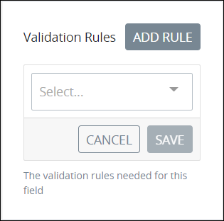
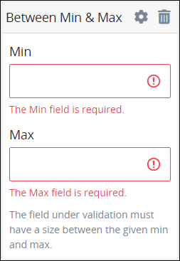
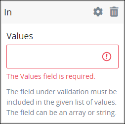
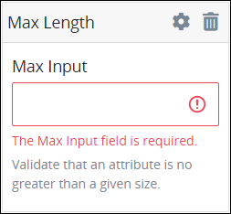
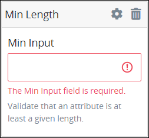
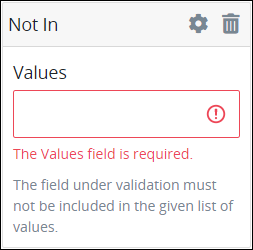

# Validation Rules for "Validation Rules" Control Settings

## Overview

Use validation rules in a control to constitute what is a valid value entered for that control.

If a control that has a **Validation Rules** setting but does not contain any value or properly structured validation rule, that control automatically passes validation.

### Controls That Provide Validation

The following Screen Builder controls use the validation rules:

* [Line Input](line-input-control-settings.md) control
* [Textarea](textarea-control-settings.md) control
* [Select List](select-list-control-settings.md) control
* [Checkbox](checkbox-control-settings.md) control
* [Date Picker](date-picker-control-settings.md) control

### Create a Validation Rule

Follow these steps to add a validation rule to a Screen Builder control that provides validation:

1. Access the **Variable** panel for the control while in [Design](../screens-builder-modes.md#design-mode) mode, and then locate the **Validation Rules** setting.
2. Click the **Add Rule** button. The **Select** drop-down menu displays.  
3. Select the rule that this control validates against.
4. Click **Save**. Parameters for the selected rule display. Parameter settings display which ones are required to properly configure the rule.
5. Enter the parameter settings that this control uses to validate against. See [Validation Rule Settings](validation-rules-for-validation-control-settings.md#validation-rule-settings), and then locate the validation rule for its parameters.


### Ensure Validation Fails for an Undefined Setting

If you want a validation to fail for undefined or `''`, use the [required](validation-rules-for-validation-control-settings.md#required) rule.


## Validation Rule Settings

### Accepted

Use the `Accepted` validation rule to validate acknowledgement of that control. This is useful to validate "Terms of Service" acceptance.

Follow these steps to configure the parameter\(s\) for an `Accepted` validation rule:

1. [Create a validation rule for the control](validation-rules-for-validation-control-settings.md#create-a-validation-rule).
2. From the **Select** drop-down menu in the **Validation Rules** setting, select **Accepted**. The `Accepted` validation rule has no parameters.

### Alpha

Use the `Alpha` validation rule to validate that the value entered into that control must be contain only alphabetic characters.

Follow these steps to configure the parameter\(s\) for an `Alpha` validation rule:

1. [Create a validation rule for the control](validation-rules-for-validation-control-settings.md#create-a-validation-rule).
2. From the **Select** drop-down menu in the **Validation Rules** setting, select **Alpha**. The `Alpha` validation rule has no parameters.

### Alpha-Numeric

Use the `Alpha-Numeric` validation rule to validate that the value entered into that control must contain only alphanumeric characters.

Follow these steps to configure the parameter\(s\) for an `Alpha-Numeric` validation rule:

1. [Create a validation rule for the control](validation-rules-for-validation-control-settings.md#create-a-validation-rule).
2. From the **Select** drop-down menu in the **Validation Rules** setting, select **Alpha-Numeric**. The `Alpha-Numeric` validation rule has no parameters.

### Between Min & Max

Use the `Between Min & Max` validation rule to validate that the value entered into that control must be equal to or between a minimum value and a maximum value.

The `Between Min & Max` validation rule evaluates the following:

* the number of characters in a string
* integers
* file sizes

The `Between Min & Max` validation rule does not evaluate calendar dates, such as when an entered value in that control is between two dates.

Follow these steps to configure the parameter\(s\) for a `Between Min & Max` validation rule:

1. [Create a validation rule for the control](validation-rules-for-validation-control-settings.md#create-a-validation-rule).
2. From the **Select** drop-down menu in the **Validation Rules** setting, select **Between Min & Max**. The **Min** and **Max** parameter settings display.  
3. In the **Min** parameter setting, enter the numeric value that this control's value must be equal to or no lower than. This is a required setting.
4. In the **Max** parameter setting, enter the numeric value that this control's value must be equal to or no greater than. This is a required setting.

### Email

Use the `Email` validation rule to validate that the value entered into that control is formatted as an email address.

Follow these steps to configure the parameter\(s\) for an `Email` validation rule:

1. [Create a validation rule for the control](validation-rules-for-validation-control-settings.md#create-a-validation-rule).
2. From the **Select** drop-down menu in the **Validation Rules** setting, select **Email**. The `EMail` validation rule has no parameters.

### In

Use the `In` validation rule to validate that the value entered into that control is included in the given parameter setting. The control's scope of evaluation may be within an array or a string. See [Examples](validation-rules-for-validation-control-settings.md#examples).

Follow these steps to configure the parameter\(s\) for an `In` validation rule:

1. [Create a validation rule for the control](validation-rules-for-validation-control-settings.md#create-a-validation-rule).
2. From the **Select** drop-down menu in the **Validation Rules** setting, select **In**. The **Values** parameter setting displays.  
3. In the **Values** parameter setting, enter the value to evaluate if it is within the control's selected or entered value. This is a required setting.

#### Examples



The following JSON Request data represents the JSON array for a Select List control under evaluation.

```javascript
doctors = [
    {id: 1, name: 'Adam Ardin', gender: 'male'},
    {id: 2, name: 'Amanda Creek', gender: 'female'},
    {id: 3, name: 'Lucy Morales', gender: 'female'},
    {id: 4, name: 'Mindy Smith', gender: 'female'},
    {id: 5, name: 'Toby Tomlinson', gender: 'male'}
]
```

The Select List control contains the following settings:

* This control is configured to return the value of the property `name`.
* This control has an `In` validation rule to evaluate if `Mindy Smith` is included in that control's selection.

If the Request participant selects the **Mindy Smith** option from that Select List control, then that control passes validation.



A Textarea control under evaluation contains the following text entered by the Request participant.

```text
My name is Louis Canera.
```

If the Textarea control with an `In` validation rule evaluates that `Canera` is included in that control's entered value, that control passes validation.



### Max Length

Use the `Max Length` validation rule to validate that the value entered into that control is equal to or no longer than a maximum value.

The `Max Length` validation rule evaluates the following:

* a maximum number of characters in a string
* a maximum integer value
* a maximum file size

The `Max Length` validation rule does not evaluate calendar dates, such as when an entered value in that control is no later than a particular date.

Follow these steps to configure the parameter\(s\) for a `Max Length` validation rule:

1. [Create a validation rule for the control](validation-rules-for-validation-control-settings.md#create-a-validation-rule).
2. From the **Select** drop-down menu in the **Validation Rules** setting, select **Max Length**. The **Max Input** parameter setting displays.  
3. In the **Max Input** parameter setting, enter the numeric value that this control's value must be equal to or no greater than. This is a required setting.

### Min Length

Use the `Min Length` validation rule to validate that the value entered into that control is equal to or no less than a minimum value.

The `Min Length` validation rule evaluates the following:

* a minimum number of characters in a string
* a minimum integer value
* a maximum file size

The `Min Length` validation rule does not evaluate calendar dates, such as when an entered value in that control is no earlier than a particular date.

Follow these steps to configure the parameter\(s\) for a `Min Length` validation rule:

1. [Create a validation rule for the control](validation-rules-for-validation-control-settings.md#create-a-validation-rule).
2. From the **Select** drop-down menu in the **Validation Rules** setting, select **Min Length**. The **Min Input** parameter setting displays.  
3. In the **Min Input** parameter setting, enter the numeric value that this control's value must be equal to or no less than. This is a required setting.

### Not In

Use the `Not In` validation rule to validate that the value entered into that control is not included in the given parameter setting. The control's scope of evaluation may be within an array or a string. See [Examples](validation-rules-for-validation-control-settings.md#examples-1).

Follow these steps to configure the parameter\(s\) for a `Not In` validation rule:

1. [Create a validation rule for the control](validation-rules-for-validation-control-settings.md#create-a-validation-rule).
2. From the **Select** drop-down menu in the **Validation Rules** setting, select **Not In**. The **Values** parameter setting displays.  
3. In the **Values** parameter setting, enter the value to evaluate if it is not within the control's selected or entered value. This is a required setting.

#### Examples



The following JSON Request data represents the JSON array for a Select List control under evaluation.

```javascript
doctors = [
    {id: 1, name: 'Adam Ardin', gender: 'male'},
    {id: 2, name: 'Amanda Creek', gender: 'female'},
    {id: 3, name: 'Lucy Morales', gender: 'female'},
    {id: 4, name: 'Mindy Smith', gender: 'female'},
    {id: 5, name: 'Toby Tomlinson', gender: 'male'}
]
```

The Select List control contains the following settings:

* This control is configured to return the value of the property `name`.
* This control is configured to allow multiple selections.
* This control has a `Not In` validation rule to evaluate if `Mindy Smith` is not included in that control's selection.

If the Request participant selects multiple options from that Select List control, but the **Mindy Smith** option is not among them, then that control passes validation.



A Textarea control under evaluation contains the following text entered by the Request participant.

```text
My name is Louis Canera.
```

If the Textarea control with a `Not In` validation rule evaluates that `Mindy` is not included in that control's entered value, that control passes validation.



### Required

Use the `Required` validation rule to validate that that control has a value and is not empty.

A control fails the `Required` validation rule in the following circumstances:

* The value is `null`.
* The value is an empty string that contains no characters.
* The value is an empty JSON array or empty JSON object.
* The value is an uploaded file with no path.

Follow these steps to configure the parameter\(s\) for a `Required` validation rule:

1. [Create a validation rule for the control](validation-rules-for-validation-control-settings.md#create-a-validation-rule).
2. From the **Select** drop-down menu in the **Validation Rules** setting, select **Required**. The `Required` validation rule has no parameters.

### **accepted**

The control under validation must be `yes`, `on`, `1` or true. This is useful for validating "Terms of Service" acceptance.

### **after:date**

The control under validation must be after the given date.

### **after\_or\_equal:date**

The control under validation must be after or equal to the given control.

### **alpha**

The control under validation must be entirely alphabetic characters.

### **alpha\_dash**

The control under validation may have alphanumeric characters as well as dashes and underscores.

### **alpha\_num**

The control under validation must contain entirely alphanumeric characters.

### **array**

The control under validation must be an array.

### **before:date**

The control under validation must be before the given date.

### **before\_or\_equal:date**

The control under validation must be before or equal to the given date.

### **between:min,max**

The control under validation must have a size between the given `min` and `max`. [Strings](validation-rules-for-validation-control-settings.md#string), [numerics](validation-rules-for-validation-control-settings.md#numeric), and files are evaluated in the same fashion as the size rule.

### **Boolean**

The control under validation must be a Boolean value of the form `true`, `false`, `0`, `1`, `'true'`, `'false'`, `'0'`, `'1'`,

### **confirmed**

The control under validation must have a matching control of `foo_confirmation`. For example, if the control under validation is password, a matching `password_confirmation` control must be present in the input.

### **date**

The control under validation must be a valid date format which is acceptable by JavaScript's `Date` object.

### **digits:value**

The control under validation must be numeric and must have an exact length of value.

### **different:attribute**

The given control must be different than the control under validation.

### **email**

The control under validation must be formatted as an email address.

### **hex**

The control under validation should be a hexadecimal format. Useful in combination with other rules, like `hex|size:6` for hex color code validation.

### **in:foo,bar,...**

The control under validation must be included in the given list of values. The control can be an array or string.

### **integer**

The control under validation must have an integer value.

### **max:value**

Validate that an attribute is no greater than a given size.


Maximum checks are inclusive.


### **min:value**

Validate that an attribute is at least a given size.


Minimum checks are inclusive.


### **not\_in:foo,bar,...**

The control under validation must not be included in the given list of values.

### **numeric**

Validate that an attribute is numeric. The string representation of a number passes.

### **present**

The control under validation must be present in the input data but can be empty.

### **regex:pattern**

The control under validation must match the given regular expression.

### **required**

Checks if the length of the String representation of the value complies with the validation described with the following `required` rules.

#### **required\_if:anotherfield,value**

The control under validation must be present and not empty if the `anotherfield` control is equal to any value.

#### **required\_unless:anotherfield,value**

The control under validation must be present and not empty unless the `anotherfield` control is equal to any value.

#### **required\_with:foo,bar,...**

The control under validation must be present and not empty only if any of the other specified controls are present.

#### **required\_with\_all:foo,bar,...**

The control under validation must be present and not empty only if all of the other specified control are present.

#### **required\_without:foo,bar,...**

The control under validation must be present and not empty only when any of the other specified control are not present.

#### **required\_without\_all:foo,bar,...**

The control under validation must be present and not empty only when all of the other specified controls are not present.

### **same:attribute**

The given control must match the control under validation.

### **size:value**

The control under validation must have a size matching the given value. For string data, value corresponds to the number of characters. For numeric data, value corresponds to a given integer value.

### **string**

The control under validation must be a string.

### **url**

Validate that an attribute has a valid URL format.

## Related Topics









































