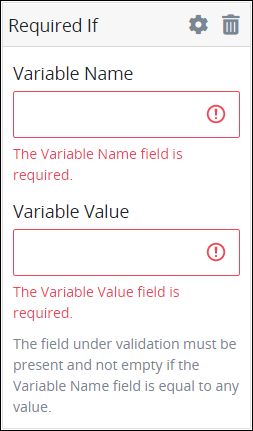
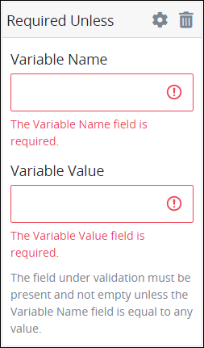
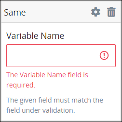

# Validation Rules for "Validation Rules" Control Settings

## Overview

Use validation rules in a control to constitute what is a valid value entered for that control.

If a control that has a **Validation Rules** setting but does not contain any value or properly structured validation rule, that control automatically passes validation.

### Controls That Provide Validation

The following Screen Builder controls use the validation rules:

* [Line Input](line-input-control-settings.md) control
* [Textarea](textarea-control-settings.md) control
* [Select List](select-list-control-settings.md) control
* [Checkbox](checkbox-control-settings.md) control
* [Date Picker](date-picker-control-settings.md) control

### Create a Validation Rule

Follow these steps to add a validation rule to a Screen Builder control that provides validation:

1. Access the **Variable** panel for the control while in [Design](../screens-builder-modes.md#design-mode) mode, and then locate the **Validation Rules** setting.
2. Click the **Add Rule** button. The **Select** drop-down menu displays.  
3. Select the rule that this control validates against.
4. Click **Save**. Parameters for the selected rule display. Parameter settings display which ones are required to properly configure the rule.
5. Enter the parameter settings that this control uses to validate against. See [Validation Rule Settings](validation-rules-for-validation-control-settings.md#validation-rule-settings), and then locate the validation rule for its parameters.


### Ensure Validation Fails for an Undefined Setting

If you want a validation to fail for undefined or `''`, use the [required](validation-rules-for-validation-control-settings.md#required) rule.


## Validation Rule Settings

### Accepted

Use the `Accepted` validation rule to validate acknowledgement of this control. This is useful to validate "Terms of Service" acceptance.

Follow these steps to configure the parameter\(s\) for an `Accepted` validation rule:

1. [Create a validation rule for the control](validation-rules-for-validation-control-settings.md#create-a-validation-rule).
2. From the **Select** drop-down menu in the **Validation Rules** setting, select **Accepted**. The `Accepted` validation rule has no parameters.

### Alpha

Use the `Alpha` validation rule to validate that the value entered into this control must be contain only alphabetic characters.

Follow these steps to configure the parameter\(s\) for an `Alpha` validation rule:

1. [Create a validation rule for the control](validation-rules-for-validation-control-settings.md#create-a-validation-rule).
2. From the **Select** drop-down menu in the **Validation Rules** setting, select **Alpha**. The `Alpha` validation rule has no parameters.

### Alpha-Numeric

Use the `Alpha-Numeric` validation rule to validate that the value entered into this control must contain only alphanumeric characters.

Follow these steps to configure the parameter\(s\) for an `Alpha-Numeric` validation rule:

1. [Create a validation rule for the control](validation-rules-for-validation-control-settings.md#create-a-validation-rule).
2. From the **Select** drop-down menu in the **Validation Rules** setting, select **Alpha-Numeric**. The `Alpha-Numeric` validation rule has no parameters.

### Between Min & Max

Use the `Between Min & Max` validation rule to validate that the value entered into this control must be equal to or between a minimum value and a maximum value.

The `Between Min & Max` validation rule evaluates the following:

* the number of characters in a string
* integers
* file sizes

The `Between Min & Max` validation rule does not evaluate calendar dates, such as when an entered value in that control is between two dates.

Follow these steps to configure the parameter\(s\) for a `Between Min & Max` validation rule:

1. [Create a validation rule for the control](validation-rules-for-validation-control-settings.md#create-a-validation-rule).
2. From the **Select** drop-down menu in the **Validation Rules** setting, select **Between Min & Max**. The **Min** and **Max** parameter settings display.  
3. In the **Min** parameter setting, enter the numeric value that this control's value must be equal to or no lower than. This is a required setting.
4. In the **Max** parameter setting, enter the numeric value that this control's value must be equal to or no greater than. This is a required setting.

### Email

Use the `Email` validation rule to validate that the value entered into this control is formatted as an email address.

Follow these steps to configure the parameter\(s\) for an `Email` validation rule:

1. [Create a validation rule for the control](validation-rules-for-validation-control-settings.md#create-a-validation-rule).
2. From the **Select** drop-down menu in the **Validation Rules** setting, select **Email**. The `EMail` validation rule has no parameters.

### In

Use the `In` validation rule to validate that the value entered into this control is included in the given parameter setting. The control's scope of evaluation may be within an array or a string. See [`In` Validation Rule Examples](validation-rules-for-validation-control-settings.md#in-validation-rule-examples).

Follow these steps to configure the parameter\(s\) for an `In` validation rule:

1. [Create a validation rule for the control](validation-rules-for-validation-control-settings.md#create-a-validation-rule).
2. From the **Select** drop-down menu in the **Validation Rules** setting, select **In**. The **Values** parameter setting displays.  
3. In the **Values** parameter setting, enter the value to evaluate if it is within the control's selected or entered value. This is a required setting.

#### `In` Validation Rule Examples



The following JSON Request data represents the JSON array for a [Select List](select-list-control-settings.md) control under evaluation.

```javascript
doctors = [
    {id: 1, name: 'Adam Ardin', gender: 'male'},
    {id: 2, name: 'Amanda Creek', gender: 'female'},
    {id: 3, name: 'Lucy Morales', gender: 'female'},
    {id: 4, name: 'Mindy Smith', gender: 'female'},
    {id: 5, name: 'Toby Tomlinson', gender: 'male'}
]
```

The Select List control contains the following settings:

* This control is configured to return the value of the property `name`. Therefore, the doctors' names display as options in the Select List control.
* This control has an `In` validation rule to evaluate if `Mindy Smith` is included in that control's selection.

If the Request participant selects the **Mindy Smith** option from that Select List control, then that control passes validation.



A [Textarea](textarea-control-settings.md) control under evaluation contains the following text entered by the Request participant.

```text
My name is Louis Canera.
```

If the Textarea control with an `In` validation rule evaluates that `Canera` is included in that control's entered value, that control passes validation.



### Max Length

Use the `Max Length` validation rule to validate that the value entered into this control is equal to or no longer than a maximum value.

The `Max Length` validation rule evaluates the following:

* a maximum number of characters in a string
* a maximum integer value
* a maximum file size

The `Max Length` validation rule does not evaluate calendar dates, such as when an entered value in that control is no later than a particular date.

Follow these steps to configure the parameter\(s\) for a `Max Length` validation rule:

1. [Create a validation rule for the control](validation-rules-for-validation-control-settings.md#create-a-validation-rule).
2. From the **Select** drop-down menu in the **Validation Rules** setting, select **Max Length**. The **Max Input** parameter setting displays.  
3. In the **Max Input** parameter setting, enter the numeric value that this control's value must be equal to or no greater than. This is a required setting.

### Min Length

Use the `Min Length` validation rule to validate that the value entered into this control is equal to or no less than a minimum value.

The `Min Length` validation rule evaluates the following:

* a minimum number of characters in a string
* a minimum integer value
* a maximum file size

The `Min Length` validation rule does not evaluate calendar dates, such as when an entered value in that control is no earlier than a particular date.

Follow these steps to configure the parameter\(s\) for a `Min Length` validation rule:

1. [Create a validation rule for the control](validation-rules-for-validation-control-settings.md#create-a-validation-rule).
2. From the **Select** drop-down menu in the **Validation Rules** setting, select **Min Length**. The **Min Input** parameter setting displays.  
3. In the **Min Input** parameter setting, enter the numeric value that this control's value must be equal to or no less than. This is a required setting.

### Not In

Use the `Not In` validation rule to validate that the value entered into this control is not included in the given parameter setting. The control's scope of evaluation may be within an array or a string. See [`Not In` Validation Rule Examples](validation-rules-for-validation-control-settings.md#not-in-validation-rule-examples).

Follow these steps to configure the parameter\(s\) for a `Not In` validation rule:

1. [Create a validation rule for the control](validation-rules-for-validation-control-settings.md#create-a-validation-rule).
2. From the **Select** drop-down menu in the **Validation Rules** setting, select **Not In**. The **Values** parameter setting displays.  
3. In the **Values** parameter setting, enter the value to evaluate if it is not within the control's selected or entered value. This is a required setting.

#### `Not In` Validation Rule Examples



The following JSON Request data represents the JSON array for a [Select List](select-list-control-settings.md) control under evaluation.

```javascript
doctors = [
    {id: 1, name: 'Adam Ardin', gender: 'male'},
    {id: 2, name: 'Amanda Creek', gender: 'female'},
    {id: 3, name: 'Lucy Morales', gender: 'female'},
    {id: 4, name: 'Mindy Smith', gender: 'female'},
    {id: 5, name: 'Toby Tomlinson', gender: 'male'}
]
```

The Select List control contains the following settings:

* This control is configured to return the value of the property `name`. Therefore, the doctors' names display as options in the Select List control.
* This control is configured to allow multiple selections.
* This control has a `Not In` validation rule to evaluate if `Mindy Smith` is not included in that control's selection.

If the Request participant selects multiple options from that Select List control, but the **Mindy Smith** option is not among them, then that control passes validation.



A [Textarea](textarea-control-settings.md) control under evaluation contains the following text entered by the Request participant.

```text
My name is Louis Canera.
```

If the Textarea control with a `Not In` validation rule evaluates that `Mindy` is not included in that control's entered value, that control passes validation.



### Required

Use the `Required` validation rule to validate that this control has a value and is not empty.

A control constitutes as having no value in the following circumstances:

* The value is `null`.
* The value is an empty string that contains no characters.
* The value is an empty JSON array or empty JSON object.
* The value is an uploaded file with no path.

Follow these steps to configure the parameter\(s\) for a `Required` validation rule:

1. [Create a validation rule for the control](validation-rules-for-validation-control-settings.md#create-a-validation-rule).
2. From the **Select** drop-down menu in the **Validation Rules** setting, select **Required**. The `Required` validation rule has no parameters.

### Required If

Use the `Required If` validation rule to validate that this control has a value and is not empty if another control in that [ProcessMaker Screen](../../what-is-a-form.md) page contains a specific value. If the control being monitored contains a specific value, then the control under evaluation is required. See [`Required If` Validation Rule Examples](validation-rules-for-validation-control-settings.md#required-if).

The `Required If` validation rule is the inverse of the [`Required Unless` rule](validation-rules-for-validation-control-settings.md#required-unless).

A control constitutes as having no value in the following circumstances:

* The value is `null`.
* The value is an empty string that contains no characters.
* The value is an empty JSON array or empty JSON object.
* The value is an uploaded file with no path.

Follow these steps to configure the parameter\(s\) for a `Required If` validation rule:

1. [Create a validation rule for the control](validation-rules-for-validation-control-settings.md#create-a-validation-rule).
2. From the **Select** drop-down menu in the **Validation Rules** setting, select **Required If**. The **Variable Name** and **Variable Value** parameter settings display.  
3. In the **Variable Name** parameter setting, enter the **Variable Name** setting value to monitor for its value. This is a required setting.
4. In the **Variable Value** parameter setting, enter the value that must be entered into that control to make this control required. This is a required setting.

#### `Required If` Validation Rule Examples



A [Request](../../../../using-processmaker/requests/what-is-a-request.md) participant enters information into a [Task](../../../../using-processmaker/task-management/what-is-a-task.md) for a job application. If that Task assignee selects from a [Select List](select-list-control-settings.md) control in which country that person lives. If the Task assignee selects the option **United States** \(US\), then another Select List control becomes required to select from which US state that person lives.

This example demonstrates depending controls: one control depends on another to be required. This example also demonstrates how a control depends on the specific value of another.

See the following `.json` files below for this example:

* **List of countries in JSON format:** Countries for Select List Control "Required If" Validation Example
* **List of US states and territories in JSON format:** US States for Select List Control "Required If" Validation Example

Follow these steps to implement this example:

1. Add a [Select List control to your ProcessMaker Screen](select-list-control-settings.md#add-the-control-to-a-processmaker-screen), and then [configure its settings](select-list-control-settings.md#inspector-settings). Make note of its **Variable Name** setting value you set for that control. This control displays the list of countries as its options.
2. [Provide the options for this Select List control](select-list-control-settings.md#provide-options). In doing so, edit options as JSON:
   1. Download the file below **Countries for Select List Control "Required If" Validation Example**.
   2. Review the JSON data. Notice that each JSON object contains the following:
      * **content:** A property called `content` represents the label for each option \(in this example, a country name\). The label for each Select List option may contain any string as long as it is in the `content` property of each JSON object.
      * **value:** A property called `value` that contains a numeric value that corresponds with each label option. The `value` property may contain any string as long as it is in the `value` property of each JSON object. Notice that the JSON object that contains the `content` property value of `United States` has a value property of `232`.  In this example, if the option corresponding with the `232` value is selected, then the second Select List control is required.
   3. Copy this file's JSON data.
   4. Paste it into the **JSON Data** setting.
3. Add a second Select List control to the same ProcessMaker Screen page, and then configure its settings. This control displays the list of US states and territories as its options, and represents the required control if a specific setting in the first Select List control contains a specific value.
4. [Provide the options for this Select List control](select-list-control-settings.md#provide-options). In doing so, edit options as JSON:
   1. Download the file below **US States for Select List Control "Required If" Validation Example**.
   2. Copy this file's JSON data.
   3. Paste it into the **JSON Data** setting.
5. Add a `Required If` [validation rule](textarea-control-settings.md#validation-rules) to the second Select List control that displays the list of US states and territories.
6. In the **Variable Name** setting of the `Required If` validation rule, enter the **Variable Name** setting value for the first Select List control that displays the list of countries as its options.
7. In the **Variable Value** setting of the `Required If` validation rule, enter `232`, which is the `value` property value that corresponds with the `content` property value `United States`.
8. [Add a Submit Button control](submit-button-control-settings.md#add-the-control-to-a-processmaker-screen) to the same ProcessMaker Screen page, and then [configure its settings](submit-button-control-settings.md#inspector-settings).







A [Request](../../../../using-processmaker/requests/what-is-a-request.md) participant enters information into a [Task](../../../../using-processmaker/task-management/what-is-a-task.md) for a job application. If that Task assignee selects the **Yes** option from a [Select List](select-list-control-settings.md) control labeled **Have you been convicted of a felony within the past 10 years?**, a [Textarea](textarea-control-settings.md) control labeled **Describe your felony conviction.** becomes required. The Task assignee cannot submit the form without describing the felony conviction\(s\).

This example demonstrates depending controls: one control depends on another to be required. This example also demonstrates how a control depends on the specific value of another.

Follow these steps to implement this example:

1. Add a [Select List control to your ProcessMaker Screen](select-list-control-settings.md#add-the-control-to-a-processmaker-screen), and then [configure its settings](checkbox-control-settings.md#inspector-settings). Make note of its **Variable Name** setting value you set for that control.
2. [Provide the options for this Select List control](select-list-control-settings.md#provide-options). In doing so, provide the following values:

   * **No:**
     * **Value:** 0
     * **Content:** No, I do not have a felony conviction within the past 10 years.
   * **Yes:**
     * **Value:** 1
     * **Content:** Yes, I have a felony conviction within the past 10 years.

   The **Value** settings represent the values the Textarea control evaluates to determine if that control is required; these settings may contain any value, not necessarily Boolean values. The **Content** settings represent the label for each option. In this example, if the option corresponding with the `1` value is selected, then the Textarea control is required.

3. [Add a Textarea control](textarea-control-settings.md#add-the-control-to-a-processmaker-screen) to the same ProcessMaker Screen page, and then [configure its settings](textarea-control-settings.md#inspector-settings).
4. Add a `Required If` [validation rule](textarea-control-settings.md#validation-rules) to the Textarea control.
5. In the **Variable Name** setting of the `Required If` validation rule, enter the **Variable Name** setting value for the Select List control.
6. In the **Variable Value** setting of the `Required If` validation rule, enter `1`.
7. [Add a Submit Button control](submit-button-control-settings.md#add-the-control-to-a-processmaker-screen) to the same ProcessMaker Screen page, and then [configure its settings](submit-button-control-settings.md#inspector-settings).



### Required Unless

Use the `Required Unless` validation rule to validate that this control has a value and is not empty unless another control in that [ProcessMaker Screen](../../what-is-a-form.md) page contains a specific value. If the control being monitored for its value has a specific value, then the control under evaluation is not required. See [Required Unless Validation Rule Examples](validation-rules-for-validation-control-settings.md#required-unless-validation-rule-examples).

The `Required Unless` validation rule is the inverse of the [`Required If` rule](validation-rules-for-validation-control-settings.md#required-if).

A control constitutes as having no value in the following circumstances:

* The value is `null`.
* The value is an empty string that contains no characters.
* The value is an empty JSON array or empty JSON object.
* The value is an uploaded file with no path.

Follow these steps to configure the parameter\(s\) for a `Required Unless` validation rule:

1. [Create a validation rule for the control](validation-rules-for-validation-control-settings.md#create-a-validation-rule).
2. From the **Select** drop-down menu in the **Validation Rules** setting, select **Required Unless**. The **Variable Name** and **Variable Value** parameter settings display.  
3. In the **Variable Name** parameter setting, enter the **Variable Name** setting value to monitor for its value. This is a required setting.
4. In the **Variable Value** parameter setting, enter the value that must be entered into that control to exempt this control from being required. This is a required setting.

#### `Required Unless` Validation Rule Examples



A [Request](../../../../using-processmaker/requests/what-is-a-request.md) participant enters information for a [Task](../../../../using-processmaker/task-management/what-is-a-task.md) regarding United States \(US\) federal taxes. If that Task assignee selects from a [Select List](select-list-control-settings.md) control that person lives in California, then that person is exempt from a federal tax credit. If the Task assignee selects the option **California**, then a [Line Input](line-input-control-settings.md) control becomes required to enter tax information. If any other option is selected, then the Line Input control is not required.

This example demonstrates depending controls: one control depends on another to be required. This example also demonstrates how a control depends on the specific value of another.

See the following `.json` file below for this example: **US States for Select List Control "Required Unless" Validation Example**.

Follow these steps to implement this example:

1. Add a [Select List control to your ProcessMaker Screen](select-list-control-settings.md#add-the-control-to-a-processmaker-screen), and then [configure its settings](select-list-control-settings.md#inspector-settings). Make note of its **Variable Name** setting value you set for that control. This control displays the list of US states and territories as its options.
2. [Provide the options for this Select List control](select-list-control-settings.md#provide-options). In doing so, edit options as JSON:
   1. Download the file below **US States for Select List Control "Required Unless" Validation Example**.
   2. Review the JSON data. Notice that each JSON object contains the following:
      * **content:** A property called `content` represents the label for each option \(in this example, a US state or territory\). The label for each Select List option may contain any string as long as it is in the `content` property of each JSON object.
      * **value:** A property called `value` that contains a numeric value that corresponds with each label option. The `value` property may contain any string as long as it is in the `value` property of each JSON object. Notice that the JSON object that contains the `content` property value of `California` has a value property of `6`. In this example, if the option corresponding with the `6` value is selected, then the Line Input control is not required.
   3. Copy this file's JSON data.
   4. Paste it into the **JSON Data** setting.
3. Add a Line Input control to the same ProcessMaker Screen page, and then configure its settings. The Request participant enters into this control required information unless a specific setting in the Select List control contains a specific value.
4. Add a `Required Unless` [validation rule](line-input-control-settings.md#validation-rules) to the Line Input control control.
5. In the **Variable Name** setting of the `Required Unless` validation rule, enter the **Variable Name** setting value for the Select List control that displays the list of US states and territories as its options.
6. In the **Variable Value** setting of the `Required Unless` validation rule, enter `6`, which is the `value` property value that corresponds with the `content` property value `California`.
7. [Add a Submit Button control](submit-button-control-settings.md#add-the-control-to-a-processmaker-screen) to the same ProcessMaker Screen page, and then [configure its settings](submit-button-control-settings.md#inspector-settings).





A [Request](../../../../using-processmaker/requests/what-is-a-request.md) participant enters information for a [Task](../../../../using-processmaker/task-management/what-is-a-task.md) that solicits viewer feedback for a streaming video. The organization soliciting viewer feedback is particularly interested in viewer feedback for a particular demographic: if that viewer indicates that she or he is in a specific age group, then that person does is not required to provide feedback on a particular question.

If that Task assignee selects from a [Select List](select-list-control-settings.md) control the option **65 years old or older**, then a [Textarea](textarea-control-settings.md) control is not required. If any other option is selected, then the Textarea control is required.

This example demonstrates depending controls: one control depends on another to be required. This example also demonstrates how a control depends on the specific value of another.

Follow these steps to implement this example:

1. Add a [Select List control to your ProcessMaker Screen](select-list-control-settings.md#add-the-control-to-a-processmaker-screen), and then [configure its settings](checkbox-control-settings.md#inspector-settings). Make note of its **Variable Name** setting value you set for that control.
2. [Provide the options for this Select List control](select-list-control-settings.md#provide-options). In doing so, provide the following values that represent demographic age groups:

   * **Option 1:**
     * **Value:** 1
     * **Content:** 18 years old or younger
   * **Option 2:**
     * **Value:** 2
     * **Content:** 19 to 35 years old
   * **Option 3:**
     * **Value:** 3
     * **Content:** 36 to 64 years old
   * **Option 4:**
     * **Value:** 4
     * **Content:** 65 years old or older

   The **Value** settings represent the values the Textarea control evaluates to determine if that control is required; these settings may contain any value, not necessarily Boolean values. The **Content** settings represent the label for each option. In this example, if the option corresponding with the `4` value is selected, then the Textarea control is not required.

3. [Add a Textarea control](textarea-control-settings.md#add-the-control-to-a-processmaker-screen) to the same ProcessMaker Screen page, and then [configure its settings](textarea-control-settings.md#inspector-settings).
4. Add a `Required Unless` [validation rule](textarea-control-settings.md#validation-rules) to the Textarea control.
5. In the **Variable Name** setting of the `Required Unless` validation rule, enter the **Variable Name** setting value for the Select List control.
6. In the **Variable Value** setting of the `Required Unless` validation rule, enter `4`.
7. [Add a Submit Button control](submit-button-control-settings.md#add-the-control-to-a-processmaker-screen) to the same ProcessMaker Screen page, and then [configure its settings](submit-button-control-settings.md#inspector-settings).



### Same

Use the `Same` validation rule to validate that the value entered into this control matches the value of a specified control.

Follow these steps to configure the parameter\(s\) for a `Same` validation rule:

1. [Create a validation rule for the control](validation-rules-for-validation-control-settings.md#create-a-validation-rule).
2. From the **Select** drop-down menu in the **Validation Rules** setting, select **Same**. The **Values** parameter setting displays.  
3. In the **Variable Name** parameter setting, enter the **Variable Name** setting value to evaluate if the control under evaluation matches its value. This is a required setting.

### URL

Use the `URL` validation rule to validate that the value entered into this control is formatted as a Uniform Resource Locator \(URL\).

Follow these steps to configure the parameter\(s\) for a `URL` validation rule:

1. [Create a validation rule for the control](validation-rules-for-validation-control-settings.md#create-a-validation-rule).
2. From the **Select** drop-down menu in the **Validation Rules** setting, select **URL**. The `URL` validation rule has no parameters.

## Related Topics









































