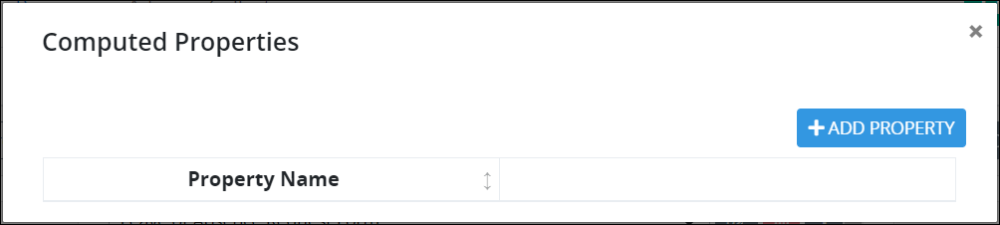
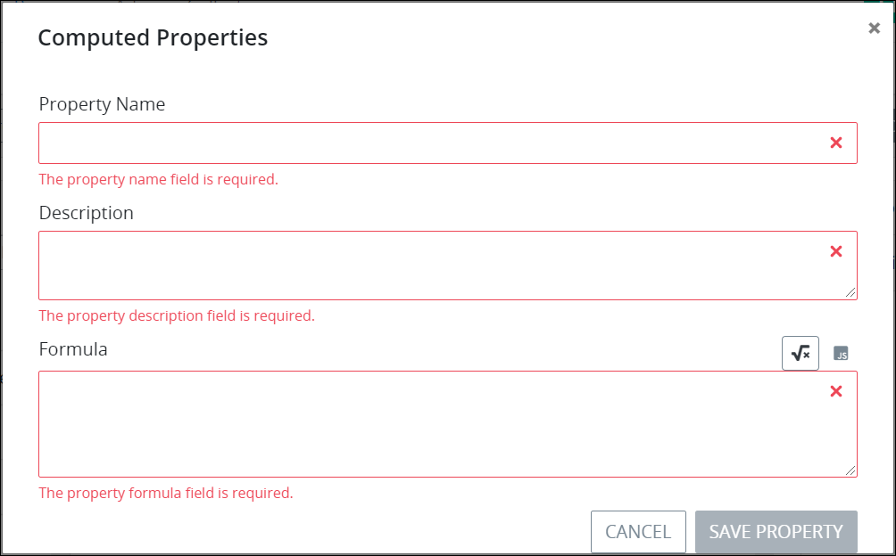

# Manage Computed Properties

## Overview

Use Computed Properties mode to add Properties to a [ProcessMaker Screen's](../what-is-a-form.md) JSON data model. A Property represents any value, mathematical calculation, or formula that calculates a value. A Property's computation can be determined either through a mathematical formula or valid JavaScript, and may include [ProcessMaker Screen control](control-descriptions/) values during a [Request](../../../using-processmaker/requests/what-is-a-request.md). Likewise, a computed Property's value can be displayed in a ProcessMaker Screen control. Computed Properties can only be used within and only affect the currently opened ProcessMaker Screen.

Below are a few uses for computed Properties that can be calculated mathematically or through JavaScript:

* Perform simple mathematics. Example: `1+1`
* Calculate the final cost of a purchase based on a sales tax. Example: $`60` \(item cost\) x `.075` \(sales tax\)
* Calculate the minimum credit card payment. Example: $`1000` \(amount owed\) x `.03` \(interest rate\)

Computed Properties display as the second key-value pair in the ProcessMaker Screen's JSON data model from the [**Data Preview** section of the **Inspector** panel when previewing the Screen](preview-a-screen.md).

## Add a Computed Property


Your ProcessMaker user account or group membership must have the following permissions to add a computed Property to a ProcessMaker Screen unless your user account has the **Make this user a Super Admin** setting selected:

* Screens: View Screens
* Screens: Edit Screens

See the ProcessMaker [Screens](../../../processmaker-administration/permission-descriptions-for-users-and-groups.md#screens) permissions or ask your ProcessMaker Administrator for assistance.


Follow these steps to add a computed Property to a ProcessMaker Screen:

1. [Open](../manage-forms/view-all-forms.md) the ProcessMaker Screen in which to add a computed Property. The ProcessMaker Screen is in [Design mode](screens-builder-modes.md#editor-mode).
2. Click the **Calcs** button. The **Computed Properties** screen displays all Properties configured for this ProcessMaker Screen. If no Properties have been configured for this ProcessMaker Screen, **No Data Available** displays.  

   

   The following information displays about each Property:

   * **Property name:** The **Property Name** column displays the name of the Property.
   * **Description:** The Description column displays the description of the Property.

3. Click the **+Property** button. The **Computed Properties** screen displays settings to configure a Property.  

   

4. In the **Property Name** setting, enter the name of the Property. This Property name displays both in the **Computed Properties** screen and in the JSON data model when previewing the ProcessMaker Screen. This is a required setting.
5. In the **Description** setting, enter the description of the Property. This is a required field.
6. Above the **Formula** setting, select one of the following ways to compute the Property:
   * **Mathematical calculation:** Click the **Formula** iconto enter the value, mathematical calculation, or formula that computes the Property. The **Formula** icon is selected by default.
   * **JavaScript:** Click the **JavaScript** iconto compute the Property using valid JavaScript. By computing the Property using JavaScript, you can reference the values for ProcessMaker Screen controls and ProcessMaker [Magic Variables](../../reference-global-variables-in-your-processmaker-assets.md). Ensure to use valid JavaScript to compute the Property by using a `return` statement to return the result of an expression \(the value\). Furthermore, ensure to use `this.` preceding the ProcessMaker Screen/Magic Variable reference. Example: `return this.FullName`. Follow these guidelines for each:
     * **Screen control value:** Reference a ProcessMaker Screen control's value by referencing that control's **Variable Value** setting. Example: `return  this.FullName` when `FullName` is the **Variable Value** setting.
     * **Magic Variable value:** Reference a ProcessMaker Magic Variable's value. ProcessMaker uses a set of Magic Variables that become part of the JSON data model for all Requests. ProcessMaker uses these Magic Variables to store ProcessMaker user, Process, and Request related data for all Requests. During an in-progress Request, these ProcessMaker Magic Variables are updated. All ProcessMaker Magic Variables are preceded by an underscore \(`_`\) character in the JSON data model. Reference the ProcessMaker Magic Variable after `this.`. Example: `return  this._user.fullname` when you want to reference the ProcessMaker user's full name from the in-progress Request. See [Magic Variable Descriptions](../../reference-global-variables-in-your-processmaker-assets.md#global-variable-descriptions). Note that there is no ProcessMaker Magic Variable that stores the ProcessMaker user that starts a Request \(also known as the requester\). To address this, use a computed Property to reference the `_user.fullname` Magic Variable's value in the ProcessMaker Screen referenced in the first Task element of a Process; since many Processes are designed such that the requester is the ProcessMaker user assigned the first Task in a Request, this is a helpful way of storing  who the requester is. This computed Property stores this Magic Variable's value, which you may reference elsewhere.
7. In the **Formula** setting, enter the mathematical calculation/JavaScript that computes the Property. This is a required setting.
8. Click **Save**. The Property displays in the **Computed Properties** screen. The following message displays: **Property Saved**.

## Edit a Computed Property


Your user account or group membership must have the following permissions to edit a computed Property:

* Screens: View Screens
* Screens: Edit Screens

See the ProcessMaker [Screens](../../../processmaker-administration/permission-descriptions-for-users-and-groups.md#screens) permissions or ask your ProcessMaker Administrator for assistance.


Follow these steps to edit a computed Property:

1. [Open](../manage-forms/view-all-forms.md) the ProcessMaker Screen in which to add a computed Property. The ProcessMaker Screen is in [Design mode](screens-builder-modes.md#editor-mode).
2. Click the **Calcs** button. The **Computer Properties** screen displays all computed Properties for this ProcessMaker Screen.  
    

   The following information displays about each Property:

   * **Property name:** The **Property Name** column displays the name of each Property.
   * **Description:** The Description column displays the description of each Property.

3. Click the **Edit** iconfor the computed Property to edit. The **Computed Properties** screen displays that Property's name, description, and how it is computed.  

   

4. Edit the following settings about the Property as necessary:
   * In the **Property Name** setting, enter the name of the Property. This Property name displays both in the **Computer Properties** screen and in the JSON data model when previewing the ProcessMaker Screen. This is a required setting.
   * In the **Description** setting, enter the description of the Property. This is a required field.
   * Above the **Formula** setting, select one of the following ways to compute the Property:
     * **Mathematical calculation:** Click the **Formula** iconto enter the value, mathematical calculation, or formula that computes the Property. The **Formula** icon is selected by default.
     * **JavaScript:** Click the **JavaScript** iconto compute the Property using valid JavaScript. By computing the Property using JavaScript, you can reference the values for ProcessMaker Screen controls and ProcessMaker [Magic Variables](../../reference-global-variables-in-your-processmaker-assets.md). Ensure to use valid JavaScript to compute the Property by using a `return` statement to return the result of an expression \(the value\). Furthermore, ensure to use `this.` preceding the ProcessMaker Screen/Magic Variable reference. Example: `return this.FullName`. Follow these guidelines for each:
       * **Screen control value:** Reference a ProcessMaker Screen control's value by referencing that control's **Variable Value** setting. Example: `return  this.FullName` when `FullName` is the **Variable Value** setting.
       * **Magic Variable value:** Reference a ProcessMaker Magic Variable's value. ProcessMaker uses a set of Magic Variables that become part of the JSON data model for all Requests. ProcessMaker uses these Magic Variables to store ProcessMaker user, Process, and Request related data for all Requests. During an in-progress Request, these ProcessMaker Magic Variables are updated. All ProcessMaker Magic Variables are preceded by an underscore \(`_`\) character in the JSON data model. Reference the ProcessMaker Magic Variable after `this.`. Example: `return  this._user.fullname` when you want to reference the ProcessMaker user's full name from the in-progress Request. See [Magic Variable Descriptions](../../reference-global-variables-in-your-processmaker-assets.md#global-variable-descriptions). Note that there is no ProcessMaker Magic Variable that stores the ProcessMaker user that starts a Request \(also known as the requester\). To address this, use a computed Property to reference the `_user.fullname` Magic Variable's value in the ProcessMaker Screen referenced in the first Task element of a Process; since many Processes are designed such that the requester is the ProcessMaker user assigned the first Task in a Request, this is a helpful way of storing  who the requester is. This computed Property stores this Magic Variable's value, which you may reference elsewhere.
   * In the **Formula** setting, edit the computed Property. This is a required setting.
5. Click **Save**.

## Delete a Computed Property


Your user account or group membership must have the following permissions to delete a computed Property from a ProcessMaker Screen:

* Screens: View Screens
* Screens: Edit Screens

See the ProcessMaker [Screens](../../../processmaker-administration/permission-descriptions-for-users-and-groups.md#screens) permissions or ask your ProcessMaker Administrator for assistance.


Follow these steps to delete a computed Property:

1. [Open](../manage-forms/view-all-forms.md) the ProcessMaker Screen in which to delete a computed Property. The ProcessMaker Screen is in [Design mode](screens-builder-modes.md#editor-mode).
2. Click the **Calcs** button. The **Computer Properties** screen displays all computed Properties for this ProcessMaker Screen. 
3. Click the **Delete** icon for the computed Property to delete. The Property is deleted, and the following message displays: **Property deleted**.

## Related Topics



























