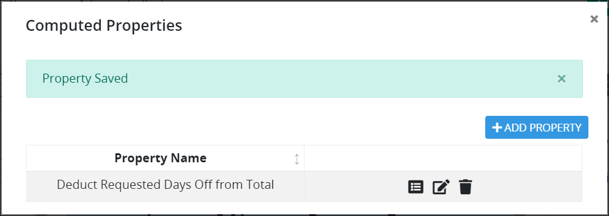

# Delete a Computed Property from a Screen

## Delete a Computed Property


Your user account or group membership must have the following permissions to delete a computed Property from a ProcessMaker Screen:

* Screens: View Screens
* Screens: Edit Screens

See the ProcessMaker [Screens](../../../../processmaker-administration/permission-descriptions-for-users-and-groups.md#screens) permissions or ask your ProcessMaker Administrator for assistance.



Deleting a computed Property from a ProcessMaker Screen cannot be undone.


Follow these steps to delete a computed Property from a ProcessMaker Screen:

1. [Open](../../manage-forms/view-all-forms.md) the ProcessMaker Screen in which to delete a computed Property. The ProcessMaker Screen is in [Design mode](../screens-builder-modes.md#editor-mode).
2. Click the **Calcs** button. The **Computer Properties** screen displays all computed Properties for this ProcessMaker Screen. 
3. Click the **Delete** icon for the computed Property to delete. The Property is deleted, and the following message displays: **Property deleted**.

## Related Topics































