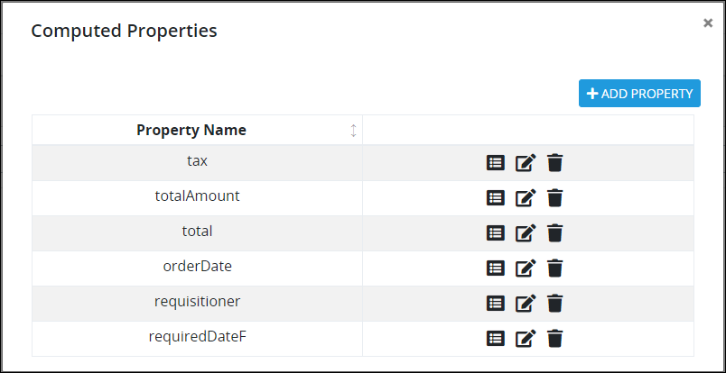
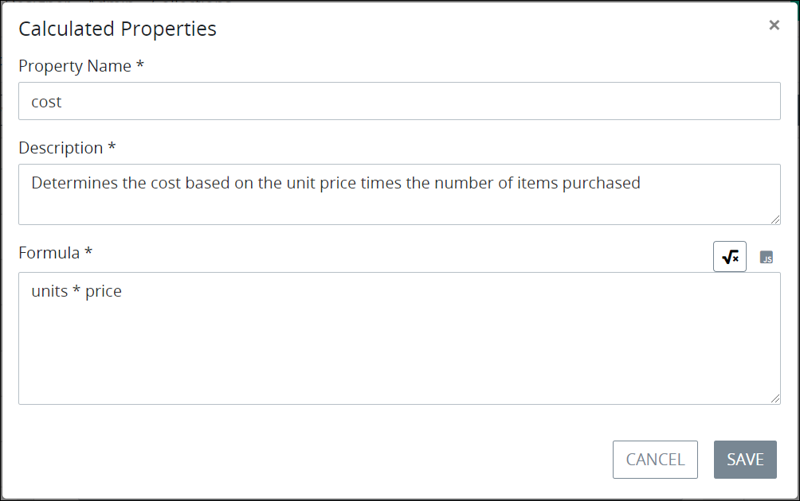
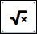

# Edit a Computed Property for a Screen

## Edit a Computed Property for a ProcessMaker Screen


Your user account or group membership must have the following permissions to edit a computed Property for a ProcesMaker Screen:

* Screens: View Screens
* Screens: Edit Screens

See the ProcessMaker [Screens](../../../../processmaker-administration/permission-descriptions-for-users-and-groups.md#screens) permissions or ask your ProcessMaker Administrator for assistance.


Follow these steps to edit a computed Property for a ProcessMaker Screen:

1. [Open](../../manage-forms/view-all-forms.md) the ProcessMaker Screen in which to add a computed Property. The ProcessMaker Screen is in [Design mode](../screens-builder-modes.md#editor-mode).
2. [View the computed Properties for that ProcessMaker Screen](view-computed-properties-for-a-screen.md#view-the-computed-properties-for-a-processmaker-screen). The **Computer Properties** screen displays all computed Properties for this ProcessMaker Screen. 
3. Click the **Edit** iconfor the computed Property to edit. The **Computed Properties** screen displays that Property's name, description, and how it is computed.  

   

4. Edit the following settings about the Property as necessary:
   * In the **Property Name** setting, enter the name of the Property. This Property name displays both in the **Computer Properties** screen and in the JSON data model when previewing the ProcessMaker Screen. This is a required setting.
   * In the **Description** setting, enter the description of the Property. This is a required setting.
   * Above the **Formula** setting, select one of the following ways to compute the Property:
     * **Mathematical calculation:** Click the **Formula** iconto enter the value, mathematical calculation, or formula that computes the Property. The **Formula** icon is selected by default.
     * **JavaScript:** Click the **JavaScript** iconto compute the Property using valid JavaScript. By computing the Property using JavaScript, you can reference the values for ProcessMaker Screen controls and ProcessMaker [Magic Variables](../../../reference-global-variables-in-your-processmaker-assets.md). Ensure to use valid JavaScript to compute the Property by using a `return` statement to return the result of an expression \(the value\). Furthermore, ensure to use `this.` preceding the ProcessMaker Screen/Magic Variable reference. Example: `return this.FullName`. Follow these guidelines for each:
       * **Screen control value:** Reference a ProcessMaker Screen control's value by referencing that control's **Variable Value** setting. Example: `return  this.FullName` when `FullName` is the **Variable Value** setting.
       * **Magic Variable value:** Reference a ProcessMaker Magic Variable's value. ProcessMaker uses a set of Magic Variables that become part of the JSON data model for all Requests. ProcessMaker uses these Magic Variables to store ProcessMaker user, Process, and Request related data for all Requests. During an in-progress Request, these ProcessMaker Magic Variables are updated. All ProcessMaker Magic Variables are preceded by an underscore \(`_`\) character in the JSON data model. Reference the ProcessMaker Magic Variable after `this.`. Example: `return  this._user.fullname` when you want to reference the ProcessMaker user's full name from the in-progress Request. See [Magic Variable Descriptions](../../../reference-global-variables-in-your-processmaker-assets.md#global-variable-descriptions). Note that there is no ProcessMaker Magic Variable that stores the ProcessMaker user that starts a Request \(also known as the requester\). To address this, use a computed Property to reference the `_user.fullname` Magic Variable's value in the ProcessMaker Screen referenced in the first Task element of a Process; since many Processes are designed such that the requester is the ProcessMaker user assigned the first Task in a Request, this is a helpful way of storing  who the requester is. This computed Property stores this Magic Variable's value, which you may reference elsewhere.
   * In the **Formula** setting, edit the computed Property. This is a required setting.
5. Click **Save**.


Ensure to [save your ProcessMaker Screen](../save-a-screen.md#save-a-processmaker-screen). The computer Property is not edited until you save it. Doing so will save your work if that your [session expires](../../../../using-processmaker/session-timeout-warning.md#session-timeout-warning).


## Related Topics































