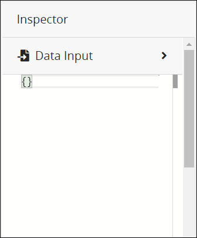
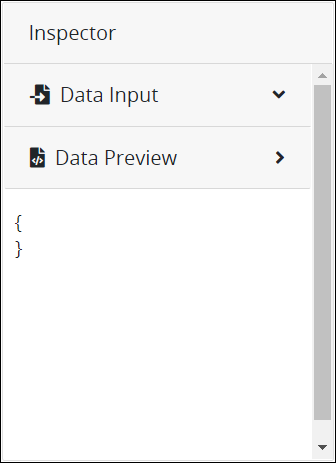
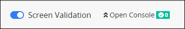
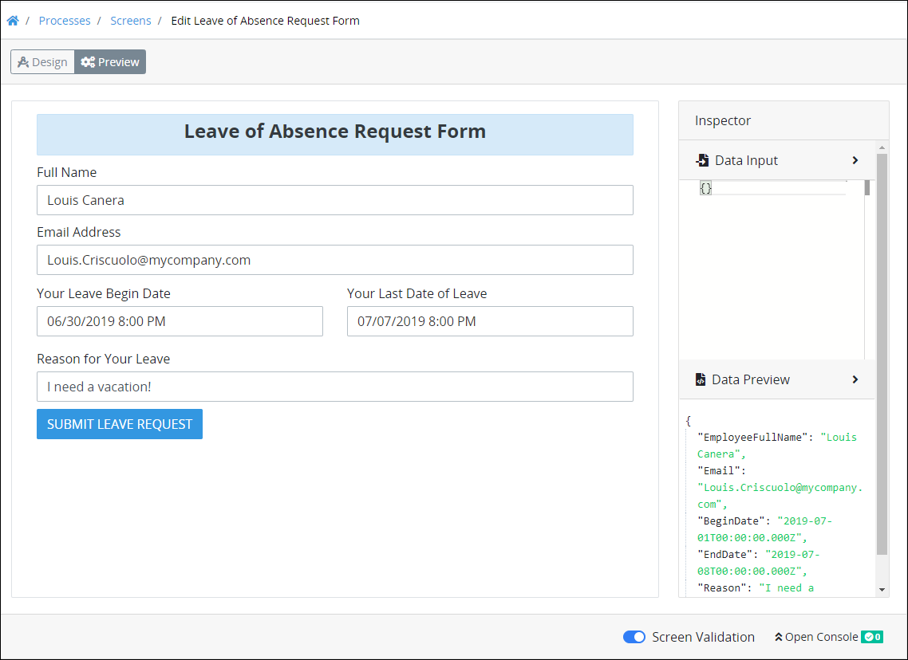

# Preview a Screen and Its JSON Data Model

## Overview

To allow ProcessMaker Screens to be used among any [Process](../../viewing-processes/what-is-a-process.md), they are represented in JSON format. Processes are also represented as JSON data models that pass [Request](../../../using-processmaker/requests/what-is-a-request.md) data to [Tasks](../../process-design/model-your-process/process-modeling-element-descriptions.md#user-task) defined in the [Process model](../../process-design/what-is-process-modeling.md). Preview how data in your ProcessMaker Screen is passed to JSON data models.

Use [Preview mode](screens-builder-modes.md#preview-mode) in the following ways:

* In the **Data Input** section of the **Inspector** panel, experiment with how JSON data models for different Processes interact with the JSON data model for your ProcessMaker Screen. In the **Data Input** section, enter a JSON data model as your ProcessMaker Screen's data input.  

  

* In the **Data Preview** section of the **Inspector** panel, view how the ProcessMaker Screen's controls you configured in [Design mode](screens-builder-modes.md#editor-mode) use data in a JSON data model. In the **Data Preview** section, view the JSON data model as you enter information into your previewed ProcessMaker Screen. Viewing the JSON data model can be helpful to see how values are entered into the ProcessMaker Screen and how that data may affect other JSON data models.  

  

* Understand how different JSON data models may affect [ProcessMaker Scripts](../../scripts/what-is-a-script.md). ProcessMaker Developers can use a ProcessMaker Screen's JSON data model as variable input to a ProcessMaker Script. The JSON data model from a ProcessMaker Screen becomes the variables that ProcessMaker Developers can use to capture what Request participants enter into or view from a Screen.


Are you a ProcessMaker Developer developing ProcessMaker Scripts? See [Scripts Editor](../../scripts/scripts-editor.md).


## Preview JSON Data Models in a ProcessMaker Screen


Your ProcessMaker user account or group membership must have the following permissions to preview a ProcessMaker Screen unless your user account has the **Make this user a Super Admin** setting selected:

* Screens: View Screens
* Screens: Edit Screens

See the ProcessMaker [Screens](../../../processmaker-administration/permission-descriptions-for-users-and-groups.md#screens) permissions or ask your ProcessMaker Administrator for assistance.


Follow these guidelines to preview a ProcessMaker Screen and how JSON data models interact with your Screen:

1. [Open](../manage-forms/view-all-forms.md) the ProcessMaker Screen. The ProcessMaker Screen is in [Design mode](screens-builder-modes.md#editor-mode).
2. Click the **Preview** button.
3. Optionally, in the **Data Input** section of the **Inspector** panel, enter a JSON data model. This JSON data model may come from a Process's Request data or another ProcessMaker Screen. As you enter a JSON data model, the **Screen Validation** indicator displays if your JSON schema has any errors that prevents validation.  

   

4. Enter values into the controls as if you were using the ProcessMaker Screen in a Request. In the **Data Preview** section of the **Inspector** panel, the JSON data model displays the key-value pairs. The key's values are those you enter in the ProcessMaker Screen preview.


Computed properties also display in the **Data Preview** section as part of the JSON data model. See [Manage Computed Properties](manage-computed-properties/).


## Related Topics

































