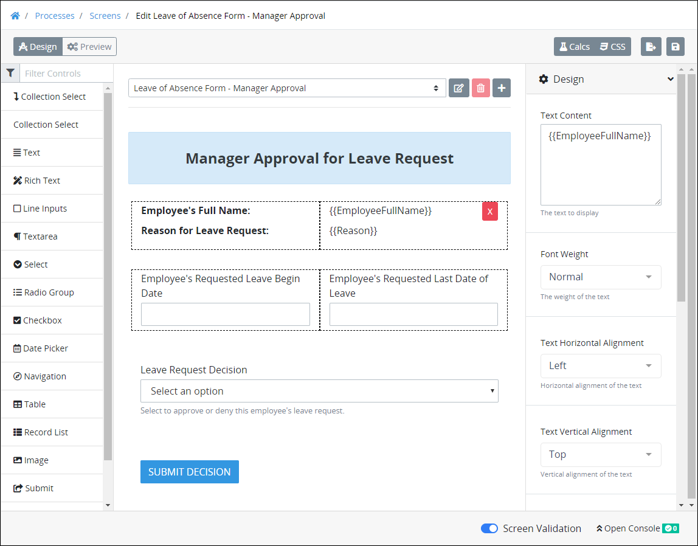
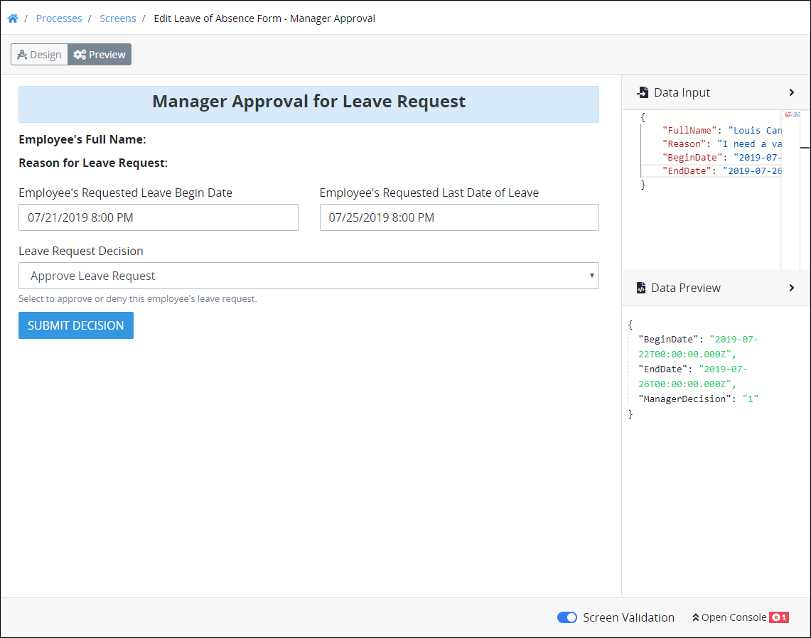

# Screen Builder Modes

## Design Mode2

Use Design mode to design your ProcessMaker Screen. Design mode is the default mode when a ProcessMaker Screen is created or edited. While in Design mode, use the **Design** setting section to configure [controls](control-descriptions/) that you place into your Screen Builder canvas.


### Learn How to Configure Controls

See [Control Descriptions and Inspector Settings](control-descriptions/).

### Learn How to Create a Multi-Page ProcessMaker Screen

See [Add a New Page to a Screen](add-a-new-page-to-a-screen.md).


## Preview Mode

Use Preview mode to view and test your ProcessMaker Screen. Test how your controls function as a form user would experience your Screen during a [Request](../../../using-processmaker/requests/what-is-a-request.md).

Furthermore, test how the ProcessMaker Screen's controls you configured in Design mode interact with JSON data models. ProcessMaker represents ProcessMaker Screens as JSON data models. You can view any JSON data model in Preview mode to test how a [Process's](../../viewing-processes/what-is-a-process.md) JSON data model or another ProcessMaker Screen's data model interacts with your Screen. Viewing the JSON data model can be helpful to see how values are entered into the ProcessMaker Screen as well as to use that JSON data model in your [ProcessMaker Scripts](../../scripts/what-is-a-script.md).


 See [Preview a Screen and Its JSON Data Model](preview-a-screen.md).


## Computed Properties Mode

Use Computed Properties mode to add Properties to a ProcessMaker Screen's JSON data model. A Property represents any value, mathematical calculation, or formula that computes a value. A Property's computation can be determined either through a mathematical formula or valid JavaScript, and may include values from [ProcessMaker Screen control](control-descriptions/) values during a Request. Likewise, a computed Property's value can be displayed in a ProcessMaker Screen control. Computed Properties can only be used within and only affect the ProcessMaker Screen in which the Property is defined.


See [Manage Computed Properties](manage-computed-properties.md).


## Custom CSS Mode

Use the Custom CSS mode to add custom CSS styles to a ProcessMaker Screen.


See [Add Custom CSS to a Screen](add-custom-css-to-a-screen.md).


## Watchers Mode

## Related Topics































