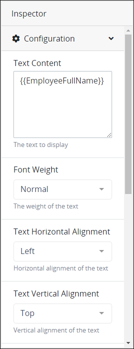

# View the Inspector Panel

## Overview

The **Inspector** panel in Screens Builder displays information in both [Design](screens-builder-modes.md#design-mode) and [Preview](screens-builder-modes.md#preview-mode) modes.

### Design Mode Function

In Design mode, use the **Inspector** panel to [configure control settings](control-descriptions/) you place into a ProcessMaker Screen. Design mode is the default mode when a ProcessMaker Screen is edited. The **Inspector** panel displays to the right of a displayed ProcessMaker Screen.


Your user account or group membership must have the following permissions to view the **Inspector** panel in Screens Builder:

* Screens: View Screens
* Screens: Edit Screens

See the ProcessMaker [Screens](../../../processmaker-administration/permission-descriptions-for-users-and-groups.md#screens) permissions or ask your ProcessMaker Administrator for assistance.


Follow these steps to view the **Inspector** panel in Design mode:

1. [Create a new ProcessMaker Screen](../manage-forms/create-a-new-form.md) or click the **Edit** iconto edit the selected Screen. The ProcessMaker Screen is in [Design mode](screens-builder-modes.md#editor-mode).
2. Select the control in which to view its settings. The **Inspector** panel displays the settings for that control.


See [Edit a Screen](control-descriptions/) for ProcessMaker Screen control topics.


### Preview Mode Function

Use the Inspector Panel in Preview mode in the following ways:

* Use the **Data Input** section of the **Inspector** panel, to experiment with how JSON data models for different Processes interact with the JSON data model for your ProcessMaker Screen.  

  

* Use the **Data Preview** section of the **Inspector** panel, to view how the ProcessMaker Screen's controls you configured in Design mode use data in a JSON data model. In the **Data Preview** section, view the JSON data model as you enter information into your previewed ProcessMaker Screen. Viewing the JSON data model can be helpful to see how values are entered into the ProcessMaker Screen and how that data may affect other JSON data models.  

  

* Understand how different JSON data models may affect [ProcessMaker Scripts](../../scripts/what-is-a-script.md). ProcessMaker Developers can use a ProcessMaker Screen's JSON data model as variable input to a ProcessMaker Script. The JSON data model from a ProcessMaker Screen becomes the variables that ProcessMaker Developers can use to capture what Request participants enter into or view from a Screen.


Your user account or group membership must have the following permissions to view the **Inspector** panel in Screens Builder:

* Screens: View Screens
* Screens: Edit Screens

See the ProcessMaker [Screens](../../../processmaker-administration/permission-descriptions-for-users-and-groups.md#screens) permissions or ask your ProcessMaker Administrator for assistance.


Follow these guidelines to view the Inspector panel in Preview mode:

1. [Create a new ProcessMaker Screen](../manage-forms/create-a-new-form.md) or click the **Edit** iconto edit the selected Screen. The ProcessMaker Screen is in [Design mode](screens-builder-modes.md#editor-mode).
2. Click the **Preview** button.


See [Preview a Screen and Its JSON Data Model](preview-a-screen.md).


## Related Topics























